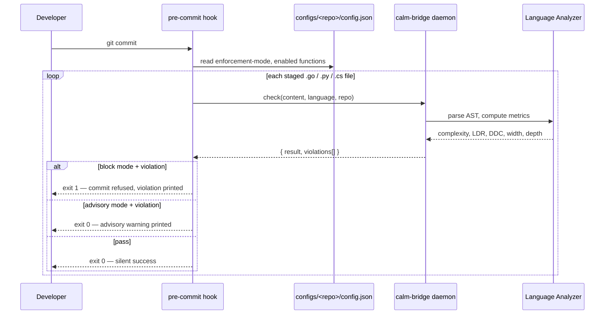
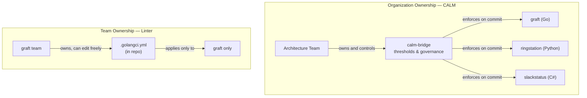

# CALM PoC — How It Works

This document answers the questions most likely to arise when someone encounters this proof of concept for the first time. It follows the conversation that shaped the implementation.

---

## How does CALM actually work?

When a developer runs `git commit` in a governed repository (`graft`, `ringstation`, `slackstatus`), a pre-commit hook fires. The hook identifies the logical repo name, finds every staged source file it recognizes (`.go`, `.py`, `.cs`), and sends each file's content to a running `calm-bridge` daemon. In container mode, the daemon resolves governance from mounted `configs/<repo>/config.json`; in local developer mode, the hook can still use the repository's `.calm/config.json` as a sandbox. The daemon analyzes the file, evaluates the enabled fitness functions against calibrated thresholds, and returns a JSON verdict. In block mode, a failing verdict aborts the commit. In advisory mode, the commit proceeds but the developer sees a warning.

The daemon is the authority. The hook is the enforcement point. The governed repository cannot change thresholds — only which functions are active and what enforcement mode to use.

---

## Can a developer bypass the hook?

Yes. Git hooks are local and unversioned. A developer can delete `.git/hooks/pre-commit` or modify a local `.calm/config.json`. The hook is a **shift-left convenience**, not a security boundary.

A governed repository **cannot weaken enforcement** via a local `.calm/config.json` file. When the hook connects to the containerized bridge, governance is resolved exclusively from the mounted `configs/<repo>/config.json` inside the container. The local `.calm/config.json` file has no effect on the container layer; it is only consulted when the bridge is running in local developer sandbox mode (loopback address, no remote flag).

The real enforcement layer sits further right:

- **CI/CD** — the same `calm-bridge check` runs against every pull request and can fail the build
- **Deploy gate** — a deployment can require CALM attestation or reject builds with outstanding violations in the bridge's audit log
- **Audit trail** — the daemon logs every check, so the *absence* of a check on a commit is itself a signal

Removing the hook is detectable. The local hook saves the round-trip to CI; it does not replace CI.

---

## How is this different from a linter?

A linter such as `golangci-lint` also checks cyclomatic complexity. For a single repository, the difference is subtle. At the organizational level, it is significant.

| Concern | Linter | CALM |
|---|---|---|
| Who owns the rules | The team (rules live in the repo) | The organization (thresholds live in the bridge server) |
| Who can raise the bar | Any developer with a config edit | The architecture team, explicitly |
| Cross-language consistency | Separate tool per language, separate config per repo | One server, one set of thresholds, Go + Python + C# |
| Audit trail | None — linting leaves no organizational record | Bridge daemon logs every check with pass/fail |
| What the rules represent | Code style and common bugs | Architectural principles the organization has committed to |

The practical consequence: a team cannot quietly relax a threshold when their code fails. Any threshold change requires an explicit decision from whoever owns the bridge server. CALM forces the conversation; a linter config edit avoids it.

---

## Does CALM need to clone the repository to check a file?

No. All five fitness functions are intra-file metrics. The bridge receives raw file content, parses the AST in memory, and returns scores. It never touches the repository on disk.

| Fitness Function | What it measures | Needs cross-file context? |
|---|---|---|
| Cyclomatic Complexity | Branching points within each function body | No |
| Interface Width | Exported method count on types in this file | No |
| Implementation Depth | Average lines of logic per public method | No |
| Logic Density Ratio | Logic lines as a fraction of total lines | No |
| Dependency Discipline | Declared imports actually referenced in this file | No |

The fitness functions were chosen because each is detectable at the file boundary. A function with cyclomatic complexity 15 is too complex regardless of what it calls. An interface with 30 methods is too wide regardless of its implementors.

What these metrics cannot catch: a function that is simple in isolation but orchestrates deep complexity through call chains, or an import that is referenced but architecturally redundant. The design accepts that tradeoff in exchange for speed and simplicity — analysis fast enough for a pre-commit hook.

---

## Quick reference

| Component | Location | Purpose |
|---|---|---|
| `calm-bridge` binary | `/app/calm-bridge` (built from `cmd/calm-bridge`) | Daemon and CLI for all checks |
| Container service | `docker compose up` via `bin/calm-serve` (Docker Desktop) | **Primary runtime** — serves the bridge on `localhost:7890` |
| Governance rules | `internal/bridge/checker.go`, `governance.json` | Thresholds and enabled functions |
| Pre-commit hook | `hooks/pre-commit.sh` (installed via `scripts/install-hooks.sh`) | Commit-time enforcement in governed repos |
| `configs/<repo>/config.json` | Mounted into the container | Governance config for the logical repo |
| `.calm/config.json` | Optional local repository sandbox | Developer sandbox only — **has no effect on container governance**; container always resolves from `configs/<repo>/config.json` |
| `calm-test` | `~/.local/bin/calm-test` | Ad-hoc file check without committing |

---

*Authored By Peter O'Connor with Assistance from Claude Code (claude-sonnet-4-6) · 2026-05-24 · CALM PoC Context & FAQ*
