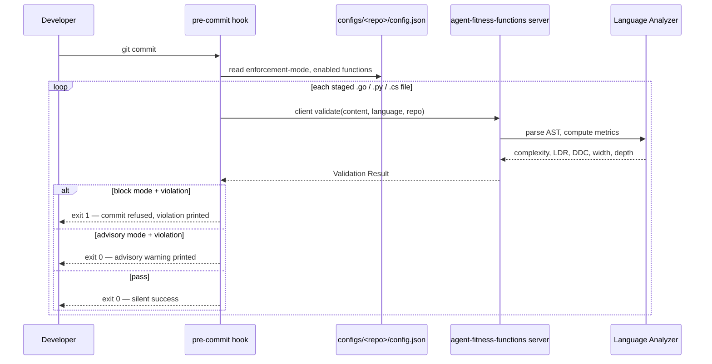
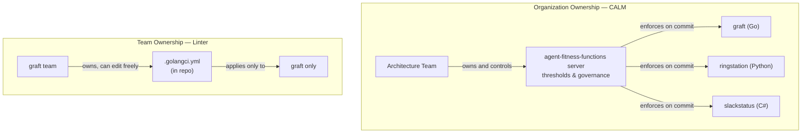

# Agent Fitness Functions — How It Works

This document answers the questions most likely to arise when someone encounters this proof of concept for the first time. It follows the conversation that shaped the implementation.

---

## Language

**agent-fitness-functions**:
The product and binary. The single tool that validates source against architecture fitness functions, in both client and server roles.
_Avoid_: bridge as a product name.

**client validate**:
The command that checks one file's fitness functions against the running server. Invoked by hooks at commit time.
_Avoid_: check.

**server start**:
The command that runs the authoritative governance service (container or k8s) that resolves config and runs analyzers.
_Avoid_: serve.

**baseline**:
The offline calibration command that bulk-analyzes a repository to derive thresholds. Belongs to neither client nor server — it is a top-level calibration concern.

**CALM**:
The FINOS Common Architecture Language Model — the external **standard** this tool enforces. Survives in `.calm/config.json`, `configs/`, and the FINOS `calm` CLI dependency. The source repository and Go module are `github.com/AvogadroSG1/agent-fitness-functions`, and since ADR-0009 the logical governance key is `agent-fitness-functions` too. Distinct from the product.
_Avoid_: using CALM to name our product or binary.

**Fitness Function**:
A single architectural check detectable at the file boundary. Five are continuous metrics (cyclomatic complexity, interface width, implementation depth, logic density ratio, dependency discipline); four are generalized, config-driven pattern counts (layer sovereignty, temporal purity, SQL composition safety, deterministic ordering) that enforce zero occurrences per file rather than a calibrated threshold.

**Validation Request / Validation Result**:
The wire contract spoken by both client and server — the request a client sends and the verdict the server returns. Lives in `internal/fitness`, owned by neither side.
_Avoid_: CheckRequest, CheckResponse.

**Listen mode**:
Which trust model a running server serves under. `mtls` (the default) is HTTPS with required client certificates, callers identified by certificate CN and authorized in `caller-repos.json` — the container/remote/production path. `local-http` is plain HTTP bound to loopback only, where every loopback peer is the implicit caller `local` — the machine-local developer daemon. Selected by `server start --listen-mode`; see [ADR-0010](docs/adr/0010-plain-http-local-governance.md).
_Avoid_: calling local-http "insecure mode" or mtls "production mode" — the mode names the transport and caller model, not the environment.

**Dry run**:
A Validation Request flagged `dry_run` because the proposal is speculative — an agent's pre-write Edit that may never land, or a `doctor` probe for a file that never existed. The verdict is computed and returned exactly as for a real check; it simply never persists into the repository's outstanding-violation state. The commit-path hooks are deliberately *not* dry runs.
_Avoid_: treating dry run as an enforcement mode — it changes persistence, never the verdict.

**Naming rule**:
Always spell the product out — `agent-fitness-functions`. No abbreviations. Env vars use the derived prefix `AGENT_FITNESS_FUNCTIONS_*`; bin helpers use the full name (`agent-fitness-functions-serve`, `agent-fitness-functions-test`). Descriptive over short.

## Relationships

- The **client** sends a **Validation Request** to the **server**; the **server** returns a **Validation Result**.
- Both **client** and **server** depend on the shared **fitness** contract; the contract depends on neither.
- **baseline** calibrates the thresholds the **server** later enforces.

---

## How does CALM actually work?

When a developer runs `git commit` in a governed repository (`graft`, `ringstation`, `slackstatus`), a pre-commit hook fires. The hook identifies the logical repo name, finds every staged source file it recognizes (`.go`, `.py`, `.cs`), and sends each file's content to a running **server** started with `server start`. In container mode, the server resolves governance from mounted `configs/<repo>/config.json`; in local developer mode, the hook can still use the repository's `.calm/config.json` as a sandbox. The server analyzes the file, evaluates the enabled fitness functions against calibrated thresholds, and returns a JSON verdict. In block mode, a failing verdict aborts the commit. In advisory mode, the commit proceeds but the developer sees a warning.

The **server** is the authority. The hook is the enforcement point. The governed repository cannot change thresholds — only which functions are active and what enforcement mode to use.

The server boots with **zero configs** — an empty `configs/` directory is a valid steady state ("awaiting registration"), not a deployment error. Two unprivileged/self-service endpoints exist for that state: `GET /functions` is an unprivileged, repo-agnostic catalog of all nine fitness functions (description, threshold, operator, unit, default-enabled) that any authenticated caller can read before any repo is registered; `POST /register` lets an authenticated caller self-service-create `configs/<repo>/config.json` and bind their own certificate CN in `caller-repos.json` in one call — idempotent for a matching replay (`created: false`), 409 (admin CN required) when the repo already exists with a different configuration, and disabled entirely by the kill switch `AGENT_FITNESS_FUNCTIONS_DISABLE_REGISTRATION=1`.

---

## Does local development need certificates?

No. Since [ADR-0010](docs/adr/0010-plain-http-local-governance.md) the machine-local daemon runs in the `local-http` listen mode: **plain HTTP bound to loopback**, refusing to bind any non-loopback address, refusing explicit TLS material, refusing managed certificate roots, and refusing trusted-proxy mode. A request from a loopback peer carries the implicit caller identity `local`, which is authorized for every repo and counts as an admin; `caller-repos.json` is never consulted. A repo becomes governed by having a config, nothing more.

This was a deliberate narrowing of the trust boundary, not an oversight. Every recurring local failure the system produced was certificate plumbing rather than governance — orphaned CAs, rotation requiring an unmanaged restart, clients presenting the wrong CA's material. A developer validating their own edits on their own machine gains nothing from mutual TLS, and paid for it in onboarding friction and a standing class of outages. The accepted residual risks (any local process is indistinguishable from the developer; a tunnel that re-originates a connection locally looks like loopback) are recorded in the ADR. Multi-user machines should use mTLS mode.

The **remote/container path is unchanged**: HTTPS with mutual TLS, callers identified by client-certificate CN and authorized in `caller-repos.json`, admins gating `/configs` and `/shutdown`. `scripts/generate-dev-certs.sh`, `client onboard --certificates-only`, and `caller-repos.json` all belong to that path now.

One consequence worth knowing: `GET /health` is unauthenticated and returns the daemon's identity — build revision, listen mode, configs directory, pid, start time. That is deliberate, because staleness detection has to work precisely when transport security is broken. It is what lets `client onboard` notice that the daemon on the port is a stale binary, or is still serving mTLS, and gracefully restart it via `POST /shutdown` rather than killing a process.

---

## Can a developer bypass the hook?

Yes. Git hooks are local and unversioned. A developer can delete `.git/hooks/pre-commit` or modify a local `.calm/config.json`. The hook is a **shift-left convenience**, not a security boundary.

A governed repository **cannot weaken enforcement** via a local `.calm/config.json` file. When the hook connects to the containerized server, governance is resolved exclusively from the mounted `configs/<repo>/config.json` inside the container. The local `.calm/config.json` file has no effect on the container layer; it is only consulted when the server is running in local developer sandbox mode (loopback address, no remote flag).

The real enforcement layer sits further right:

- **CI/CD** — the same `client validate` flow runs against every pull request and can fail the build
- **Deploy gate** — a deployment can require CALM attestation or reject builds with outstanding violations in the server's audit log
- **Audit trail** — the server logs every validation, so the *absence* of a validation on a commit is itself a signal

Removing the hook is detectable. The local hook saves the round-trip to CI; it does not replace CI.

---

## How is this different from a linter?

A linter such as `golangci-lint` also checks cyclomatic complexity. For a single repository, the difference is subtle. At the organizational level, it is significant.

| Concern | Linter | CALM |
|---|---|---|
| Who owns the rules | The team (rules live in the repo) | The organization (thresholds live in the agent-fitness-functions server) |
| Who can raise the bar | Any developer with a config edit | The architecture team, explicitly |
| Cross-language consistency | Separate tool per language, separate config per repo | One server, one set of thresholds, Go + Python + C# |
| Audit trail | None — linting leaves no organizational record | Server logs every Validation Result |
| What the rules represent | Code style and common bugs | Architectural principles the organization has committed to |

The practical consequence: a team cannot quietly relax a threshold when their code fails. Any threshold change requires an explicit decision from whoever owns the agent-fitness-functions server. CALM forces the conversation; a linter config edit avoids it.

---

## Does CALM need to clone the repository to validate a file?

No. All nine fitness functions are intra-file: the server receives raw file content, resolves scores from that content or its parsed AST alone, and never touches the repository on disk. The five metric functions are scored by a language analyzer computing a number against a calibrated threshold; the four generalized functions (layer sovereignty, temporal purity, SQL composition safety, deterministic ordering) are scored instead from the file's content text or the analyzer's structured findings against a fixed zero-occurrences rule — still one file, still no repository checkout, just a different scoring mechanism. Two of the four (layer sovereignty, deterministic ordering) are syntax-blind pattern/text scans, but a request must still declare a supported language, so today every function — these two included — runs only against `.go`/`.py`/`.cs` files.

| Fitness Function | What it measures | Needs cross-file context? |
|---|---|---|
| Cyclomatic Complexity | Branching points within each function body | No |
| Interface Width | Exported method count on types in this file | No |
| Implementation Depth | Average lines of logic per public method | No |
| Logic Density Ratio | Logic lines as a fraction of total lines | No |
| Dependency Discipline | Declared imports actually referenced in this file | No |
| Layer Sovereignty | Forbidden cross-layer references in this file's content (any language) | No |
| Temporal Purity | Naive (no-timezone) timestamp construction (Python today) | No |
| SQL Composition Safety | SQL built via string interpolation passed to `.execute()` (Python today) | No |
| Deterministic Ordering | Window-function `ORDER BY` clauses missing a tie-breaker (any language) | No |

The fitness functions were chosen because each is detectable at the file boundary. A function with cyclomatic complexity 15 is too complex regardless of what it calls. An interface with 30 methods is too wide regardless of its implementors.

What these metrics cannot catch: a function that is simple in isolation but orchestrates deep complexity through call chains, or an import that is referenced but architecturally redundant. The design accepts that tradeoff in exchange for speed and simplicity — analysis fast enough for a pre-commit hook.

---

## Quick reference

| Component | Location | Purpose |
|---|---|---|
| `agent-fitness-functions` binary | `/app/agent-fitness-functions` (built from `cmd/agent-fitness-functions`) | CLI for `client validate`, `client install-hooks`, `client onboard`, `server start`, `baseline`, and `doctor` |
| Container service | `docker compose up` via `bin/agent-fitness-functions-serve` (Docker Desktop) | **Primary production runtime** — HTTPS + mTLS on `localhost:7890`. Not the local development path |
| Machine-local daemon | Auto-started and kept current by `agent-fitness-functions client onboard` | The local development runtime — plain HTTP on `127.0.0.1:7890`, no certificates (ADR-0010) |
| Governance rules | `internal/server/checker.go`, `patterns/governance.json` | Thresholds and enabled functions |
| Pre-commit and agent Edit/Write hooks | Embedded by `agent-fitness-functions client install-hooks` (or `client onboard`) | Commit-time and pre-write enforcement in governed repos; both `PreToolUse` entries are registered in `.claude/settings.json` automatically |
| `configs/<repo>/config.json` | Mounted into the container | Governance config for the logical repo |
| `.calm/config.json` | Optional local repository sandbox | Developer sandbox only — **has no effect on container governance**; container always resolves from `configs/<repo>/config.json` |
| `agent-fitness-functions-test` | `~/.local/bin/agent-fitness-functions-test` | Ad-hoc file validation without committing |

---

---

## C# Dependency Discipline — calibration status (calm-poc-oeu)

The `client validate` path now resolves project-local namespaces with `--project <csproj>` when a `.csproj` is discoverable from the file being validated. This fixes the root cause of DDC = 0 on files that only imported project-local namespaces (unresolvable without compilation context).

**Baseline command limitation:** The top-level `baseline` command uses `AnalyzeRepository`, which invokes the Roslyn CLI without `--project`. The SlackStatus baseline was regenerated (153 files, 2026-06-04) but still shows P10 DDC = 0 because single-file analysis cannot resolve project-local namespaces during bulk scanning. The distribution shape will improve once `baseline` is updated to pass the nearest `.csproj` for each file — tracked separately.

**Current DDC threshold in `patterns/governance.json`:** `0.8` (unchanged — real calibration requires a project-aware baseline).

**Why `0.8` is still advisory-safe:** The validation path uses project context at runtime, so individual commits that use project-local namespaces will no longer be misclassified as DDC violations. The threshold of `0.8` is strict enough to catch genuinely unused imports; it will not false-positive on project-local namespace usage.

**Next calibration step:** Extend `AnalyzeRepository` to pass `--project <nearest-csproj>` to the Roslyn CLI for each `.cs` file, regenerate baselines, read the resulting P10 DDC distribution, and update the `minimum` in `patterns/governance.json` accordingly.

*Authored By Peter O'Connor with Assistance from Claude Code (claude-sonnet-4-6) · 2026-06-04 · agent-fitness-functions Context & FAQ*
*Revised with Assistance from Claude Code (claude-opus-5[1m]) · 2026-09-06 · listen-mode and dry-run vocabulary, ADR-0010 local trust model*
