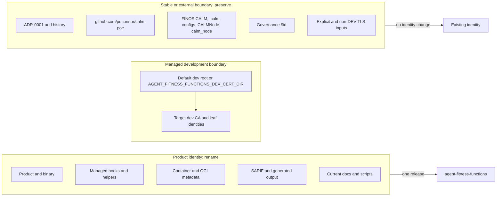
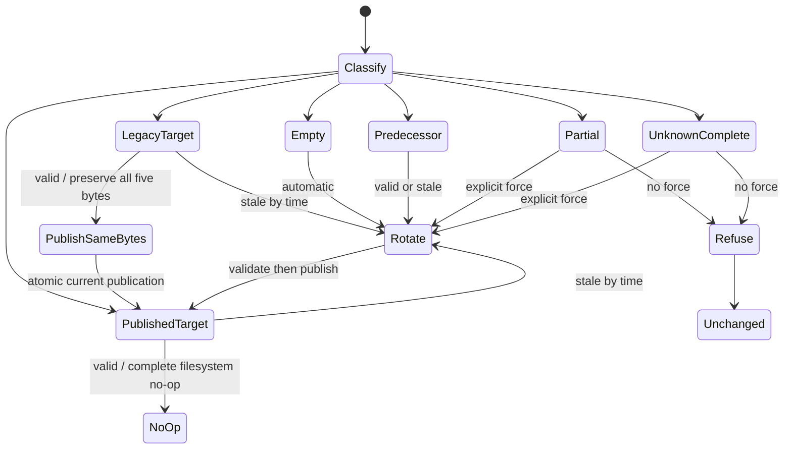
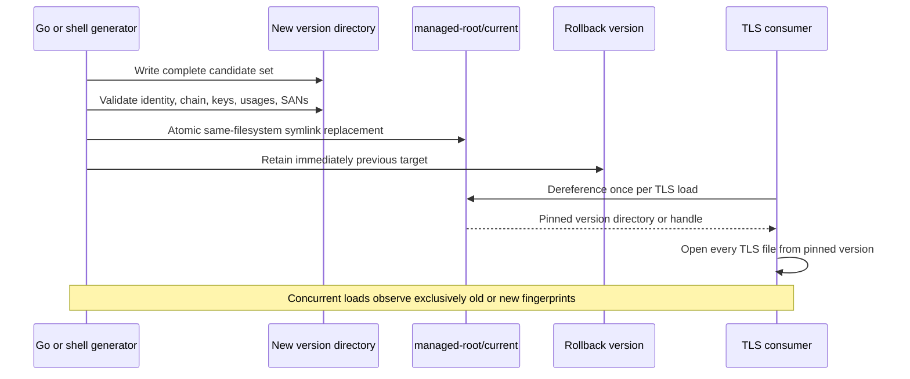

# Rename stack-fitness-functions to agent-fitness-functions

## Metadata

| Field | Value |
|---|---|
| Date | 2026-08-20 |
| Status | Accepted |
| Scope | Team |
| Authors | Peter O'Connor with OpenCode assistance |
| Type | Decision |

## Problem Statement

The current product identity describes its organizational origin rather than the agents whose changes it governs, creating ambiguity across the binary, automation, containers, generated output, and documentation. This ambiguity affects maintainers and consumers, while an incomplete rename can also corrupt intentionally stable FINOS CALM, governance, historical, hook-ownership, and TLS trust boundaries unless those boundaries and migration behavior are decided together.

## Decision Drivers

- One unambiguous product identity across every current product-facing surface.
- No predecessor runtime compatibility surface after the release.
- Preservation of stable protocol, governance, FINOS CALM, and historical identities.
- Safe, exact migration of artifacts the product owns without claiming unmanaged files.
- Atomic development-certificate rotation without mixed-version TLS loads.

## Considered Options

### Option 1: Status quo - retain stack-fitness-functions

**Benefits**

- Avoids implementation and migration work.
- Keeps every current command, image, hook, and development certificate unchanged.

**Costs**

- Preserves a product name that does not describe the governed actor.
- Leaves product identity inconsistent with the intended long-term positioning and future documentation.

- Rejected because it does not resolve the identity problem.
- Rejected because it leaves product identity inconsistent with future guidance.
- Rejected despite having the lowest immediate delivery risk.
- Rejected despite requiring no consumer migration.

### Option 2: Hard product cutover while retaining stable trust identities

**Benefits**

- Aligns the visible product, binary, hooks, containers, and documentation in one release.
- Avoids rotating otherwise functional local development trust material.

**Costs**

- Leaves the managed development CA and server SAN carrying predecessor identities indefinitely.
- Makes fresh and upgraded installations observably different and requires permanent predecessor-specific certificate logic.

- Rejected because managed development identity would remain internally inconsistent.
- Rejected because predecessor-specific certificate behavior would become permanent.
- Rejected despite reducing certificate migration complexity.
- Rejected despite preserving existing local development trust.

### Option 3 (Selected): Full hard cutover with product-aligned managed development identity

**Benefits**

- Gives current product surfaces and newly managed development trust material one coherent identity.
- Removes runtime predecessor aliases and their ongoing test, support, security, and documentation burden.
- Preserves stable FINOS CALM, governance identifier, module/import, and production TLS boundaries.

**Costs**

- Requires a coordinated single-release migration of managed hooks, containers, environment variables, scripts, and development certificates.
- Invalidates predecessor runtime invocations and local development certificates, with no post-release compatibility fallback.
- Requires atomic publication and concurrency tests in both certificate generators and every TLS consumer.

- Adopted because it produces one durable product identity.
- Adopted because it bounds predecessor handling to one migration path.
- Adopted despite the coordinated cutover cost.
- Adopted despite intentionally absent external compatibility.

### Option 4: Time-bounded compatibility bridge

**Benefits**

- Allows commands, environment variables, hooks, and images to migrate over a deprecation window.
- Reduces same-release coordination pressure for possible external consumers.

**Costs**

- Doubles runtime identities and expands the behavior and security test matrix during the bridge.
- Creates an expiry and removal project while allowing predecessor usage to persist unobserved.

- Rejected because the bridge would prolong ambiguity without evidence that it is required.
- Rejected because it creates a second breaking removal project.
- Rejected despite being the most forgiving option for consumers.
- Rejected despite reducing same-release coordination pressure. No external consumers are currently known; this statement is not evidence that none exist.

## Advice

The project MUST perform one full hard cutover from `stack-fitness-functions` to `agent-fitness-functions` in a single release. RFC 2119 terms in this MADR are normative.

### Rename Boundary

The certified inventory's 56 active endpoints MUST govern the product-identity rename hunks, while protected hunks in those files MUST NOT replay. In addition to those rename hunks, this MADR resolves changes in the two previously unresolved certificate generators, `internal/client/devcerts.go` and `scripts/generate-dev-certs.sh`, and only the `title` and `description` fields in `patterns/governance.json`; every other hunk in those three paths remains outside scope or protected. The product, binary, command examples (`agent-fitness-functions client validate`, `agent-fitness-functions server start`, and `agent-fitness-functions baseline`), helper scripts (`agent-fitness-functions-serve` and `agent-fitness-functions-test`), exact managed hook names and markers, `AGENT_FITNESS_FUNCTIONS_*` variables, container executable/service/image, OCI product metadata, SARIF tool identity, product-facing generated output, and current docs, instructions, glossary, and scripts MUST use `agent-fitness-functions`.

The release MUST NOT provide predecessor binary, helper, environment-variable, image, or service aliases. Product-facing governance metadata MUST set the title exactly to `Agent Fitness Functions` and the description exactly to `FINOS CALM pattern enforcing Agent Fitness Functions governance.`

The following identities are protected and MUST remain exact:

- Immutable ADR-0001 and historical records.
- Module and import path `github.com/poconnor/calm-poc`.
- Go type `CALMNode` and JSON field `calm_node`.
- `.calm/`, `configs/`, the FINOS `calm` executable and package, and FINOS CALM vocabulary.
- Governance `$id` `https://stackoverflow.com/calm-poc/patterns/governance.json`.

### Managed Hook Migration

Primary Git hooks MUST remain at the standard `pre-commit` and `pre-push` paths and MUST stamp the exact markers `# agent-fitness-functions pre-commit hook` and `# agent-fitness-functions pre-push hook`. Product-named sidecars MUST use `agent-fitness-functions-pre-commit` and `agent-fitness-functions-pre-push` with the exact corresponding `(sidecar)` markers; standalone managed scripts MUST use `agent-fitness-functions-git-guard` and `agent-fitness-functions-pre-tool-use`, and the guard MUST stamp `# agent-fitness-functions git-guard PreToolUse hook`.

Migration MUST recognize only these exact predecessor ownership signals:

- Primary markers `# stack-fitness-functions pre-commit hook`, `# stack-fitness-functions pre-push hook`, `# CALM pre-commit hook`, and `# CALM pre-push hook`.
- Sidecar markers `# stack-fitness-functions pre-commit hook (sidecar)`, `# stack-fitness-functions pre-push hook (sidecar)`, `# CALM pre-commit hook (sidecar)`, and `# CALM pre-push hook (sidecar)`.
- Sidecar filenames `stack-fitness-functions-pre-commit` and `stack-fitness-functions-pre-push`.
- Settings commands ending exactly in `stack-fitness-functions-git-guard`, `stack-fitness-functions-pre-tool-use`, or `calm-git-guard`.

Installers MUST write and validate agent replacements before removing old managed artifacts. Ownership checks MUST use exact marker, filename, or command-ending equality and MUST NOT infer ownership from substrings. Unmanaged hooks MUST retain refuse-by-default behavior and MAY use append or overwrite only through the new `AGENT_FITNESS_FUNCTIONS_HOOK_APPEND` and `AGENT_FITNESS_FUNCTIONS_HOOK_OVERWRITE` variables.

### Managed Development Certificates

The managed certificate boundary MUST be only the default development root or a root explicitly selected by `AGENT_FITNESS_FUNCTIONS_DEV_CERT_DIR`. Explicit or non-DEV TLS flags and variables are external and MUST NOT be generated, rotated, moved, or deleted, including server `--tls-ca`, `--tls-cert`, and `--tls-key`; client CA, certificate, and key flags; and corresponding `AGENT_FITNESS_FUNCTIONS_TLS_*` and `AGENT_FITNESS_FUNCTIONS_CLIENT_*` variables.

The target managed set MUST have 365-day validity and these exact identities and usages:

| Certificate | Identity | Names | Key usage | Extended key usage |
|---|---|---|---|---|
| CA | CN `agent-fitness-functions-dev-ca` | None | certificate signing and digital signature | None |
| Server | CN `localhost` | DNS SANs `localhost`, `agent-fitness-functions`; IP SANs `127.0.0.1`, `::1` | digital signature and key encipherment | server authentication |
| Client | CN `dev-hook-pool` | None | digital signature and key encipherment | client authentication |

A recognized predecessor set MUST have CA CN `calm-poc-dev-ca`, server DNS SANs exactly `localhost` and `stack-fitness-functions`, server IP SANs exactly `127.0.0.1` and `::1`, the same server and client CNs, usages, and chain relationships as the target, and otherwise valid material.

The managed set consists of exactly `ca.crt`, `server.crt`, `server.key`, `client.crt`, and `client.key`. Before a `current` publication exists, a complete direct-root set containing those five files MUST be classified as legacy direct-root target, recognized predecessor, or unknown complete from its parsed certificate identity; time validity does not change that identity classification, and absence of `current` alone MUST NOT make it partial. The generator MUST classify a managed root into exactly one of six classes:

| Class | Definition | Default action |
|---|---|---|
| Empty | No managed set exists | Generate and publish target |
| Published target | Complete target set reachable through a valid versioned publication and `current`, either valid or stale only by time | Complete filesystem no-op when valid; automatically rotate when stale |
| Legacy direct-root target | Complete target identity in the five direct-root files without `current`, either valid or stale only by time | Preserve all five bytes and publish the versioned structure when valid; generate a fresh target and publish it when stale |
| Recognized predecessor | Complete predecessor set, either valid or stale only by time | Automatically rotate to target |
| Partial | Some, but not all, required direct-root files exist, or a versioned publication structure is incomplete | Fail unchanged |
| Unknown complete | Complete but not exactly target or recognized predecessor | Fail unchanged |

Unknown complete includes malformed PEM, certificate/key mismatch, broken chain, foreign identity, unexpected key or extended-key usage, and unexpected SANs. Partial and unknown complete sets MAY rotate only with the exact force interfaces `agent-fitness-functions client onboard --force-dev-cert-rotation` and `scripts/generate-dev-certs.sh --force`.

Both Go and shell generators MUST create and validate a new version directory below the managed root, then atomically replace `<managed-root>/current` with a symlink to that version on the same filesystem. Every consumer MUST dereference `current` exactly once per TLS load and MUST use that pinned version directory or directory handle for all certificate and key opens in the operation.

The immediately previous published version MUST be retained for rollback, and garbage collection MUST NOT remove the current or rollback version. Legacy direct-root sets MUST remain untouched until publication of `current` succeeds.

This decision changes only managed development certificate behavior. Production certificate behavior MUST NOT change.

### Recommendations

- Project maintainers SHOULD inventory known scripts, governed repositories, CI jobs, and deployment references before release, without treating that inventory as a compatibility commitment.
- Release notes SHOULD list every predecessor-to-target replacement and state that runtime aliases are absent.
- Certificate diagnostics SHOULD identify the classified state and safe remediation without printing private-key material.
- Version directories SHOULD use opaque identifiers or certificate fingerprints rather than mutable product labels.

## Consequences

- One release establishes `agent-fitness-functions` as the only runtime product identity.
- Current managed predecessor hooks and development certificates can migrate automatically because ownership and trust identities are exact and enumerable.
- Unmanaged hooks and external TLS material remain outside product ownership and fail safe rather than being silently replaced.
- Existing predecessor commands, variables, images, and services stop working at release; external consumers, if any, receive no runtime compatibility period.
- Atomic version publication and pinned reads add filesystem structure and test complexity but prevent mixed certificate/key generations during concurrent rotation.
- Stable module/import, CALM, governance `$id`, and historical identities deliberately differ from the product name.

## Impact

**Project Maintainers** MUST own implementation, release notes, migration tests, and publication of the single release containing the rename. External consumers MUST migrate commands, variables, image/service references, and managed integration points in that same release; no external consumers are currently known.

Implementation MAY be sequenced internally in phases while the branch remains green, but the public release MUST expose only the completed hard cutover. ADR-0001 remains unchanged, and this MADR MUST remain `proposed` until final review accepts it.

## Migration

1. Freeze ADR-0001 and protected/historical hashes; derive rename hunks from the 56 active endpoint inventory, plus only the certificate-generator behavior and governance `title`/`description` changes explicitly resolved by this MADR.
2. Rename product-facing code, artifacts, metadata, generated output, and current guidance while preserving every protected identity.
3. Install and validate target managed hooks and settings entries, then remove only exactly recognized predecessor artifacts.
4. Classify the managed development root; no-op, rotate, refuse, or force-rotate according to the state table.
5. Publish validated certificate versions atomically, retain rollback, and switch every TLS consumer to one-time dereference and pinned reads.
6. Run all automated confirmation gates before producing the single rename release; communicate the absence of predecessor runtime aliases.

## Rollback

Before release, maintainers MAY revert the implementation and reinstall exactly recognized predecessor managed artifacts. After release, rollback MUST require a new decision because external compatibility is intentionally absent and restoring predecessor runtime identities would create a second migration contract.

Certificate publication MAY atomically repoint `current` to the retained immediate previous version during pre-release recovery. Rollback MUST NOT alter external TLS inputs or production certificate behavior.

## Confirmation

The implementation is confirmed only when CI passes all of the following:

- A predecessor-reference allowlist audit fails on unapproved `stack-fitness-functions`, `STACK_FITNESS_FUNCTIONS_*`, and predecessor managed identity references while allowing immutable history, explicit migration recognizers, and test fixtures.
- Protected-boundary assertions verify exact protected literals and an expected hash for ADR-0001; inventory tests prove protected hunks did not replay within active files.
- Certificate tests cover empty, valid published-target complete no-op, valid legacy direct-root target identical-byte publication, stale legacy direct-root target fresh rotation and publication, stale published-target rotation, valid and stale recognized predecessor rotation, partial refusal, unknown-complete refusal for every listed cause, both force interfaces, automatic rotation, and unchanged state on every validation or publication failure.
- Concurrent certificate tests force publication between individual file opens and prove every TLS operation sees exclusively the old fingerprint set or exclusively the new fingerprint set, never a mixture.
- Publication tests cover same-filesystem atomic replacement, one-time consumer dereference, pinned reads, immediate-previous retention, garbage-collection protection, and preservation of legacy direct-root material until success.
- Hook tests cover fresh install and every primary/sidecar predecessor generation, stack sidecar filenames, all three recognized settings command endings, write-before-remove failure behavior, exact ownership rejection, cleanup, idempotency, and unmanaged refuse/append/overwrite behavior under the new variables.
- Governance tests assert the exact title, description, and preserved `$id`; product-contract tests assert binary, CLI, helper, container, OCI, SARIF, generated-output, documentation, and environment identities with no runtime aliases.
- The full Go suite and Python hook tests pass.

## Supporting Evidence

- [Certified PHK.6 rename inventory](https://github.com/AvogadroSG1/agent-fitness-functions/blob/ecca52dc7d2204b15cb88286706d44893558ab98/docs/escalation/phk6-rename-inventory.md)
- [ADR-0001: Rename calm-bridge to stack-fitness-functions](https://github.com/AvogadroSG1/agent-fitness-functions/blob/aaf1f440dccb7610a2a66c88c61622d1ea4e3d97/docs/adr/0001-rename-calm-bridge-to-stack-fitness-functions.md)
- [RFC 2119 requirement levels](https://datatracker.ietf.org/doc/html/rfc2119)
- [Go `crypto/x509` certificate model](https://pkg.go.dev/crypto/x509)
- [Go `os.Rename` atomic replacement primitive](https://pkg.go.dev/os#Rename)

*Authored By Peter O'Connor with Assistance from OpenCode (openai/gpt-5.6-sol) · 2026-08-20 · calm-poc-q8d.1 agent-fitness-functions rename MADR*
