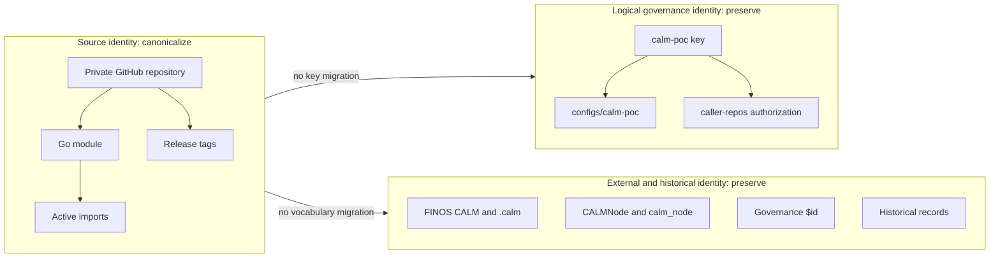
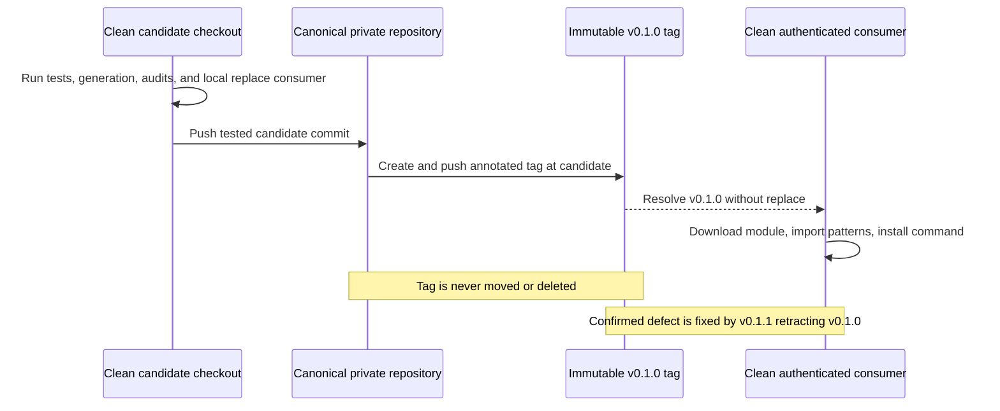

# Canonical agent-fitness-functions repository and module

## Metadata

| Field | Value |
|---|---|
| Date | 2026-08-21 |
| Status | Accepted |
| Scope | Repository |
| Authors | Peter O'Connor with OpenCode assistance |
| Type | Decision |
| Partially supersedes | ADR-0002 repository/module/import identity requirements and related old-path confirmation only |
| Fulfills | ADR-0001 deferred repository and module migration |

## Problem Statement

The source repository already has a product-aligned GitHub location while its Go module and active imports still identify an earlier repository owner and name. Without one explicit source-identity and release contract, maintainers and private consumers cannot reliably distinguish source coordinates from intentionally stable CALM and governance identifiers.

## Decision Drivers

- One canonical source repository and Go module identity.
- No permanent compatibility surface for an unshipped old module identity.
- Exact preservation of the logical governance repository key and FINOS CALM vocabulary.
- A reproducible private-module release that tests both the candidate checkout and the immutable tag.
- Byte-level controls that authorize module substitutions without reopening product, governance, wire, historical, or TLS decisions.

## Considered Options

### Option 1: Status quo - retain the old module identity

**Benefits**

- Avoids changing `go.mod`, imports, and private-consumer configuration.
- Preserves the coordinates recorded by ADR-0001 and ADR-0002 without another migration.

**Costs**

- Keeps source identity split between the actual GitHub repository and the declared Go module.
- Makes release and consumer instructions depend on a repository identity that is no longer canonical.
- Rejected because the module would continue to misidentify its source.
- Rejected because ADR-0001's explicitly deferred migration would remain unresolved.
- Rejected despite having the lowest immediate implementation cost.
- Rejected despite avoiding a coordinated consumer cutover.

### Option 2 (Selected): Direct hard cut to the canonical repository and module

**Benefits**

- Makes repository, module, imports, tags, and consumer commands use one source identity.
- Completes the deferred migration without adding a permanent compatibility mechanism.

**Costs**

- Requires an exact import rewrite and private-module authentication setup.
- Requires coordinated release verification because the first canonical tag cannot be repaired in place.
- Adopted because it creates one durable and auditable source identity.
- Adopted because it keeps source identity separate from the stable logical governance key.
- Adopted despite requiring all consumers to cut over in the same release.
- Adopted despite requiring authenticated clean-consumer verification for a private repository.

### Option 3: Redirect or mirror compatibility

**Benefits**

- Could reduce immediate disruption for consumers still using the old source coordinates.
- Could provide an operational fallback while consumers migrate.

**Costs**

- Creates two apparent sources of truth and an indefinite synchronization obligation.
- Git hosting redirects are operational behavior, not a dependable Go module contract.
- Rejected because there is no evidenced consumer need that justifies maintaining two identities.
- Rejected because a mirror or redirect would weaken confirmation that consumers use the canonical source.
- Rejected despite offering the smoothest transition for unknown consumers.
- Rejected despite potentially reducing same-release coordination.

### Option 4: Stable vanity module path

**Benefits**

- Could decouple future module identity from a GitHub owner or repository rename.
- Could provide controlled discovery metadata for public consumers.

**Costs**

- Introduces a new domain, availability dependency, and ownership surface for a private module.
- Adds indirection and authentication complexity without a current portability requirement.
- Rejected because the additional infrastructure does not solve an evidenced requirement.
- Rejected because the canonical private GitHub repository is already the authoritative source.
- Rejected despite reducing the impact of a possible future host rename.
- Rejected despite offering a conventional long-term abstraction for module discovery.

## Advice

RFC 2119 terms in this MADR are normative.

### Precedence and Decision Boundary

ADR-0001 and ADR-0002 MUST remain immutable. This MADR partially supersedes only ADR-0002 requirements that preserve `github.com/poconnor/calm-poc` as the repository, module, or import identity and confirmation requirements that require the old source path to remain; it fulfills ADR-0001's deferred repository and module migration.

Every other ADR-0002 decision remains active, including the product hard cutover, absence of predecessor runtime aliases, managed-hook migration, managed development-certificate identity and atomic publication, governance metadata limits, FINOS CALM protections, wire identity, production TLS boundary, impact, migration, rollback, and confirmation requirements. Implementers SHOULD evaluate ADR-0002 and this MADR together, using this MADR only where their source-identity requirements conflict.

### Canonical Source Identity

The canonical private GitHub repository and Go module MUST be exactly `github.com/AvogadroSG1/agent-fitness-functions`. The repository visibility MUST be `PRIVATE`, and its default branch MUST be `main`.

`go.mod`, active source imports, active test imports, and current module instructions selected by the authorized inventory addendum MUST use the canonical module literal. There MUST NOT be an old repository or module maintenance branch, mirror, compatibility module, vanity module path, redirect guarantee, or old-path release tag. An incidental hosting redirect is non-contractual and MUST NOT be depended upon by builds, releases, tests, automation, or documentation.

Private consumers MUST configure `GOPRIVATE=github.com/AvogadroSG1/*` and MUST use existing authenticated GitHub credentials. Credentials MUST NOT be embedded in `go.mod`, source, repository URLs, shell history examples, documentation, release metadata, or generated artifacts. Maintainers SHOULD prefer credential helpers or environment-supported authentication over URL-embedded tokens.

### Identity Boundaries

Source identity and logical governance identity are distinct. `github.com/AvogadroSG1/agent-fitness-functions` names source retrieval and Go imports; `calm-poc` MUST remain exact as the logical governance repository key in `configs/calm-poc/`, `caller-repos.json`, settings, tests, and runtime authorization/configuration behavior. This module migration MUST NOT perform a configuration-key or authorization-key migration.

The `.calm/` and `configs/` paths and content MUST remain unchanged except for module import literals expressly selected by the authorized inventory addendum. `CALMNode`, `calm_node`, the FINOS `calm` executable and package, FINOS CALM vocabulary, governance `$id` `https://stackoverflow.com/calm-poc/patterns/governance.json`, and historical records MUST remain exact. Under ADR-0002, only the governance `title` and `description` MAY change to their already-decided product values; this MADR authorizes no additional governance hunk.



### Hash and Hunk Contract

The contract baseline MUST be commit `d761e723e5aec2bfe6aa207cc3864b32665d4096`. The factual path and hunk selection MUST be `docs/escalation/q8d1-module-identity-inventory-addendum.md`; the immutable PHK.6 inventory remains evidence and MUST NOT be edited.

For every addendum-authorized module-literal file, verification MUST compute normalized SHA-256 values after replacing every exact `github.com/poconnor/calm-poc` and `github.com/AvogadroSG1/agent-fitness-functions` module literal with `<CANONICAL_MODULE>` in both baseline and candidate content. The four exact semantic current-document lines selected by the addendum MUST move from their recorded baseline text to their recorded target meaning: source repository and Go module identity become `github.com/AvogadroSG1/agent-fitness-functions`, while FINOS CALM, `.calm/`, `configs/`, the FINOS `calm` CLI, and logical governance key `calm-poc` remain stable. These semantic lines authorize no product rename beyond ADR-0002.

The executable protected gate MUST derive its definitive path and literal inventories from the pinned baseline. Its independently enforced total of 31 raw-protected paths MUST include every tracked file below `.calm/`; every tracked `configs/` file except union-projected `configs/config_test.go`; `caller-repos.json`; `internal/fitness/contract.go`; every PHK.6 historical path that exists at the baseline; other immutable evidence paths; and all tracked `internal/calm/` files except `internal/calm/pattern.go`. The verifier MUST independently parse exact path rows between `### historical` and `### unrelated` in the pinned PHK.6 blob, reject malformed or duplicate rows, intersect them with pinned baseline tracked paths, require manifest `phk6_historical_paths` to equal that derived set, and require every derived path to be raw protected.

`patterns/governance.json` MUST use an exact projection that masks only baseline title `CALM PoC Fitness Functions` to target title `Agent Fitness Functions` and baseline description `CALM JSON Schema pattern enforcing the PoC architecture fitness functions.` to target description `FINOS CALM pattern enforcing Agent Fitness Functions governance.` The projection MUST require both target values, exact governance `$id` `https://stackoverflow.com/calm-poc/patterns/governance.json`, and SHA-256 equality for every other byte.

The protected gate MUST derive and compare exact normalized baseline/candidate path-count inventories for `CALMNode`, `calm_node`, `.calm/`, `configs/`, `@finos/calm-cli`, the governance `$id`, and boundary-matched logical key `calm-poc`. Normalization MAY account only for manifest-enumerated module, semantic, exact governance, and ADR-0002 product token/path pairs; the two new contract documents MUST be explicit inventory exclusions because they did not exist at baseline and necessarily quote protected terms.

This module-migration gate does not authorize any product rename hunk. Product-token masking in the 26 union-projected implementation paths and `internal/calm/pattern.go` is comparison tolerance only and is delegated to the separately required **ADR-0002 Confirmation verifier**; that external verifier is not delivered by this ticket, and passing this module verifier MUST NOT substitute for it. `configs/config_test.go` remains union-projected only for its module literal, while its logical-key assertions and all other bytes remain protected.

The executable manifest and verifier MUST be maintained at `$HOME/peter_code/scratch_work/agent_fitness_functions_q8d1_module_revision_code/module_revision_manifest.json` and `$HOME/peter_code/scratch_work/agent_fitness_functions_q8d1_module_revision_code/verify_module_revision.py`. Candidate verification MUST execute this algorithm:

1. Read baseline bytes from Git commit `d761e723e5aec2bfe6aa207cc3864b32665d4096` and candidate bytes from the clean checkout, mapping only exact ADR-0002 product path tokens.
2. Prove the baseline literal partition is exactly 30 paths/62 occurrences: 23 paths/44 rewrite occurrences and 7 paths/18 retained occurrences.
3. Prove the semantic partition is exactly 4 paths/4 lines and the combined selection is 26 distinct paths/48 authorized rewrite hunks or occurrences.
4. Require zero old literals and the exact expected new-literal count in every rewrite path; execute the definitive protected raw, exact-projection, path-inventory, and literal-inventory gates.
5. Normalize old/new module literals to `<CANONICAL_MODULE>`, normalize only the three explicit ADR-0002 product token pairs to stable placeholders, and normalize each exact semantic before/after line to its stable hunk placeholder.
6. Compare per-path normalized SHA-256 values and reject any unnormalized byte drift.
7. Scan all tracked candidate files and reject unlisted old occurrences, stale allowlist rows, unexpected repository/module identities, protected literal drift, protected path drift, missing semantic targets, and surviving semantic baseline lines.

The verifier manifest MUST encode the baseline, literal path/count partitions, protected prefixes and paths, protected literal matchers, retained raw-hash partition, exact governance values, semantic before/after lines, module literals, product content/path pairs, contract-evidence exclusions, and all expected totals. Its `self-check` mode MUST prove baseline arithmetic, protected coverage, and non-empty protected inventories; unit tests MUST exercise stale, unlisted, raw-hash, protected-literal, remote-tag, tag-input, and URL-redaction failures.

### Executable Verification

All Python invocations MUST use the existing PHK.6 virtual environment or an equivalently pinned project virtual environment. Consumer work MUST use a caller-provided directory below `$HOME/peter_code/scratch_work`; commands MUST NOT embed credentials, and authentication MUST come from the environment or an existing Git credential helper.

```bash
repo="$HOME/peter_code/agent-fitness-functions-q8d1-revision"
scratch_root="$HOME/peter_code/scratch_work"
python="$HOME/peter_code/scratch_work/agent_fitness_functions_phk6_inventory_code/.venv/bin/python"
verifier="$HOME/peter_code/scratch_work/agent_fitness_functions_q8d1_module_revision_code/verify_module_revision.py"

"$python" "$verifier" self-check --repo "$repo"
"$python" "$verifier" candidate --repo "$repo"
"$python" "$verifier" pretag --repo "$repo" --scratch-root "$scratch_root"
"$python" "$verifier" metadata --repo "$repo"
```

`candidate` covers union-projected hashes, the definitive protected gate, exact rewrite counts, semantic targets, the exact old-path allowlist, stale rows, and unexpected module identities. `pretag` additionally enforces a clean tracked and untracked checkout before and after `go generate ./...`, runs both Go test suites under the normal authenticated environment to prewarm dependencies, verifies `go list -m`, and checks origin URLs. It then sets `GOPROXY=off`, `GONOPROXY=none`, `GOSUMDB=off`, `GOVCS=*:off`, and `GIT_TERMINAL_PROMPT=0` for local-replacement consumer `go mod tidy`, `go test`, and command build; a cache miss MUST fail rather than use a proxy, checksum service, VCS, or prompt. `metadata` uses authenticated `gh api graphql` output parsed as typed JSON to verify `nameWithOwner`, `isPrivate`, `defaultBranchRef.name`, and `url`. Remote URL mismatch diagnostics MUST redact HTTPS and nonstandard user information before output.

### Canonical Release

The first canonical release MUST be the immutable annotated tag `v0.1.0`. The tag MUST be created only from the tested candidate commit whose `go.mod` declares `module github.com/AvogadroSG1/agent-fitness-functions`; external consumers, if any, MUST hard-cut to the canonical module in that same release.

Maintainers MUST perform the release in this order:

1. From a clean candidate checkout, run `go list -m`, `go test ./...`, `go test -tags=integration ./...`, `go generate ./...`, the clean tracked-file assertion, import and metadata audits, and all ADR-0002 gates.
2. Before tagging, exercise a local no-network consumer using a temporary `replace github.com/AvogadroSG1/agent-fitness-functions => <candidate-checkout>`; it MUST import `github.com/AvogadroSG1/agent-fitness-functions/patterns`, and the canonical command package MUST build.
3. Push the tested candidate commit to the canonical repository.
4. Create annotated tag `v0.1.0` at exactly that candidate commit.
5. Push the immutable tag without moving or deleting it.
6. From a clean authenticated consumer with no `replace` directive, run `go mod download github.com/AvogadroSG1/agent-fitness-functions@v0.1.0`, compile an import of `github.com/AvogadroSG1/agent-fitness-functions/patterns`, and run `go install github.com/AvogadroSG1/agent-fitness-functions/cmd/agent-fitness-functions@v0.1.0`.

Tag creation and publication remain explicit operator actions and MUST NOT be performed by the verifier:

```bash
candidate_commit="$(git -C "$repo" rev-parse HEAD)"
git -C "$repo" push origin "$candidate_commit:refs/heads/main"
git -C "$repo" tag -a v0.1.0 "$candidate_commit" -m "agent-fitness-functions v0.1.0"
git -C "$repo" push origin refs/tags/v0.1.0

"$python" "$verifier" posttag \
  --repo "$repo" \
  --scratch-root "$scratch_root" \
  --tag v0.1.0 \
  --candidate-commit "$candidate_commit"
```

`posttag` MUST validate the tag as a plain semantic-version ref, verify the local annotated tag object and peeled commit, and query canonical remote refs with `git ls-remote --tags origin refs/tags/v0.1.0 refs/tags/v0.1.0^{}`. The remote tag-object SHA MUST equal the local annotated tag-object SHA, and the remote peeled commit MUST equal both the local peeled commit and candidate commit. It then MUST create a retained authenticated consumer below the supplied scratch root with no `replace` directive and run canonical module download, `.../patterns` import compilation, and command installation. The verifier MUST NOT create, move, delete, or push a tag.

The release process MUST NOT move or delete `v0.1.0`. A transient authentication or network failure SHOULD be retried after confirming credentials and connectivity without changing the tag. A confirmed artifact defect MUST be fixed in `v0.1.1`, and `v0.1.1` MUST retract `v0.1.0`; maintainers MUST NOT repair the released tag in place.



### Recommendations

- Maintainers SHOULD record the candidate commit, tag object, GitHub API response, and verification output in release evidence.
- Consumer setup SHOULD use the narrow `GOPRIVATE=github.com/AvogadroSG1/*` pattern rather than a broader GitHub-wide exclusion.
- Release automation SHOULD fail before tag creation when the checkout is dirty or generated tracked files differ.
- Audits SHOULD report exact unexpected paths and literals rather than broad counts alone.
- A future source-identity change SHOULD be proposed as a new ADR rather than extending this migration contract.

## Consequences

- Repository, Go module, active imports, release tags, and private-consumer commands converge on one canonical source identity.
- The logical `calm-poc` governance key intentionally remains different from the source repository name.
- Consumers MUST authenticate to GitHub and migrate atomically; no old-module fallback exists.
- Exact normalized hashes make the permitted module substitution reviewable while preserving unrelated bytes.
- Immutable tags make release defects visible and require a corrective release rather than silent replacement.

## Impact

**Project Maintainers** MUST update only the addendum-selected module literals, execute both pre-tag and post-tag gates, and retain release evidence. This work begins after ADR-0003 is accepted and completes with authenticated clean-consumer verification of `v0.1.0`; implementation effort is one coordinated source migration and release.

**External Consumers**, if any, MUST set the private-module environment and update imports or installation commands in the `v0.1.0` release window. No external consumers are currently known; that statement is not evidence that none exist.

**Governance Operators** MUST NOT rename repository authorization/configuration keys as part of this work. They SHOULD verify that `calm-poc` still selects the same configuration and caller authorization after the source migration.

## Migration

1. Freeze raw hashes for ADR-0001, ADR-0002, PHK.6, historical evidence, governance `$id`, logical keys, and other protected files at baseline `d761e723e5aec2bfe6aa207cc3864b32665d4096`.
2. Self-check the executable manifest's 23-path/44-occurrence literal rewrite set, 7-path/18-occurrence retained set, and 4-path/4-line semantic set.
3. Apply the combined 26-distinct-path/48-hunk selection; replace exact old module literals and exact semantic lines while applying ADR-0002 product hunks only under its independent contract.
4. Run candidate confirmation, including local replace import and command-build checks.
5. Push the candidate, create and push annotated `v0.1.0`, then run authenticated no-replace consumer confirmation.
6. Preserve the immutable tag and publish corrective `v0.1.1` with a `v0.1.0` retraction only if a confirmed artifact defect is found.

## Rollback

Before `v0.1.0` is tagged, maintainers MAY revert the candidate to the baseline source identity and rerun all gates. After the tag is published, an identity reversal or any new module path MUST require a new ADR; rollback MUST NOT move or delete the tag, add an old-path compatibility module, or rely on a redirect.

Operational retries for transient authentication or network failures do not constitute rollback and SHOULD preserve the candidate and tag identity. A released artifact defect MUST follow the `v0.1.1` correction and retraction path.

## Confirmation

The decision is confirmed only when automated or captured release gates establish all of the following:

- `go list -m` returns exactly `github.com/AvogadroSG1/agent-fitness-functions` from a clean candidate checkout.
- `go test ./...` and `go test -tags=integration ./...` pass.
- `go generate ./...` leaves no tracked diff in a fresh checkout.
- Current imports, product metadata, release instructions, and repository-identity audits use the canonical source identity.
- The old-path allowlist contains only the seven exact retained paths and 18 retained occurrences in the addendum, uses no globs, and has no stale rows.
- Normalized SHA-256 checks pass across all 26 distinct implementation paths and 48 authorized literal/semantic hunks; the definitive protected gate passes raw/projected hashes plus exact protected path-count and literal path-count inventories.
- Local `origin` fetch and push URLs resolve to `https://github.com/AvogadroSG1/agent-fitness-functions.git` or an equivalent authenticated SSH URL for that exact repository.
- An authenticated GitHub API query reports exact `nameWithOwner` `AvogadroSG1/agent-fitness-functions`, visibility `PRIVATE`, default branch `main`, and canonical URL `https://github.com/AvogadroSG1/agent-fitness-functions`.
- The local replace consumer imports `.../patterns` and builds the command before tagging.
- Local and canonical-remote annotated tag object SHAs match, their peeled commits match the candidate commit, and the clean authenticated no-replace consumer downloads `v0.1.0`, imports `.../patterns`, and installs `.../cmd/agent-fitness-functions@v0.1.0` after tagging.
- All still-active ADR-0002 product, hook, certificate, governance, CALM, wire, and production TLS gates pass without expansion by this decision.

## Supporting Evidence

- [ADR-0001: Rename calm-bridge to stack-fitness-functions](0001-rename-calm-bridge-to-stack-fitness-functions.md)
- [ADR-0002: Rename stack-fitness-functions to agent-fitness-functions](0002-rename-stack-fitness-functions-to-agent-fitness-functions.md)
- [Certified PHK.6 rename inventory](../escalation/phk6-rename-inventory.md)
- [Q8D.1 module identity inventory addendum](../escalation/q8d1-module-identity-inventory-addendum.md)
- [Go private module configuration](https://go.dev/ref/mod#private-modules)
- [GitHub repository visibility](https://docs.github.com/en/repositories/managing-your-repositorys-settings-and-features/managing-repository-settings/setting-repository-visibility)
- [RFC 2119 requirement levels](https://datatracker.ietf.org/doc/html/rfc2119)

*Authored By Peter O'Connor with Assistance from OpenCode (openai/gpt-5.6-sol) · 2026-08-21 · calm-poc-q8d.1 canonical repository and module revision*
