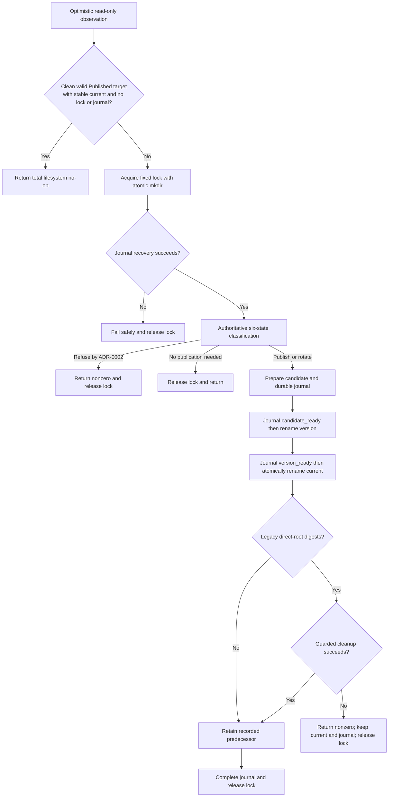

# Atomic development certificate publication

## Metadata

| Field | Value |
|---|---|
| Date | 2026-08-21 |
| Status | Accepted |
| Scope | Repository |
| Accountable owner | Peter O'Connor, repository maintainer |
| Authors | Peter O'Connor with OpenCode assistance |
| Type | Decision |
| Supplements | ADR-0002 managed development certificate publication only |

This MADR is Accepted following independent specification and standards review.

## Context and Problem Statement

Development certificate generation is exposed through Go onboarding and shell workflows while Compose and local TLS consumers can read the same managed material concurrently. ADR-0002 fixes lifecycle outcomes, but crash recovery, durable retention, ownership, and managed-consumer provenance remain underspecified, exposing maintainers to race-driven trust failures and unrecoverable local setup.

## Decision Drivers

- Preserve ADR-0002's exact six states, force matrix, identical-byte migration, and complete no-op guarantee.
- Give both user entry points one publication implementation and one failure model.
- Serialize publishers with portable Go `os` primitives and fail conservatively across the accepted ownerless crash window.
- Recover publication, direct-root cleanup, and exactly-one-previous retention after every crash boundary.
- Pin each managed server TLS load to one immutable version without reclassifying user-supplied TLS paths as managed.
- Support macOS and Linux without parsing fragile `ps` output or depending on `flock`.
- Keep private keys and ownership tokens out of logs and tracked files.

## Considered Options

### Option 1: Status quo - independent Go and Bash publication

**Benefits**

- Keeps the shell workflow usable without an installed product binary.
- Avoids changing either current entry point.

**Costs**

- Duplicates classification, locking, durability, and recovery semantics across languages.
- Allows drift and cross-writer races around publication and retention.
- Rejected because two authorities cannot provide one auditable recovery contract.
- Rejected because crash behavior can diverge between user entry points.
- Rejected despite having the lowest bootstrap cost.
- Rejected despite preserving standalone shell generation.

### Option 2: Shared `flock` coordination with independent publishers

**Benefits**

- Kernel release simplifies ordinary process-exit recovery.
- Both implementations can retain their certificate-generation logic.

**Costs**

- `flock` availability and behavior differ across supported development environments.
- Serialization does not remove duplicate journal and lifecycle implementations.
- Rejected because portability and semantic drift remain unresolved.
- Rejected because publisher duplication remains after coordination is added.
- Rejected despite familiar Linux behavior.
- Rejected despite kernel-managed release on supported `flock` hosts.

### Option 3: Fixed atomic directory lock with independent Go and Bash publishers

**Benefits**

- Uses atomic fixed-path `mkdir` available through Go and Bash on macOS and Linux.
- Can serialize both writers without an additional executable dependency.

**Costs**

- Requires lock, journal, and recovery schema parity in two languages.
- Doubles fault-injection and conformance obligations for security-sensitive filesystem code.
- Rejected because review found that the shared mechanism does not justify two authorities.
- Rejected because every schema evolution would require two atomic implementations and reviews.
- Rejected despite preserving shell independence.
- Rejected despite avoiding a product-binary dependency for the script.

### Option 4 (Selected): Go publication authority with shell delegation

**Benefits**

- Gives classification, locking, journaling, publication, and recovery one implementation.
- Preserves Go onboarding and `scripts/generate-dev-certs.sh` as user entry points.

**Costs**

- The shell workflow now depends on a discoverable `stack-fitness-functions` binary.
- A certificate-only Go invocation and delegation tests become part of the CLI contract.
- Adopted because one authority removes cross-language state-machine parity and race risk.
- Adopted because one journal and one loader define publication and recovery evidence.
- Adopted despite the new binary bootstrap dependency.
- Adopted despite adding a certificate-only CLI mode that q8d.8 MUST rename safely.

The selected option changed from independent publishers after review identified schema-parity and crash-recovery gaps. A fixed atomic directory lock remains the internal Go mechanism; Bash does not implement it, and this decision accepts the small ownerless window between lock creation and durable owner publication.

## Decision Outcome

Go MUST be the sole managed development certificate publication authority. During q8d.11, `scripts/generate-dev-certs.sh` MUST exec `stack-fitness-functions client onboard --certificates-only`; shell `--force` MUST map to Go `--force-dev-cert-rotation`, and the script MUST preserve the Go process exit code and standard streams. Normal Go onboarding MUST call the same in-process publisher. Bash MUST NOT generate certificates, parse owner or journal JSON, acquire the publication lock, or mutate managed publication files.

The q8d.11 command, script, and environment spellings MUST remain `stack-fitness-functions`, `STACK_FITNESS_FUNCTIONS_DEV_CERT_DIR`, and `STACK_FITNESS_FUNCTIONS_*`. q8d.8 MUST later rename those product-facing spellings behavior-preservingly; this MADR does not perform that rename.

## Advice

RFC 2119 terms in this MADR are normative.

### Precedence and Boundary

| Record | Authority after this MADR | Relationship |
|---|---|---|
| ADR-0002 | Immutable authority for product and certificate identity, six states, force matrix, and lifecycle outcomes | This MADR narrowly supersedes only independent shell publication: shell UX delegates to Go; every other requirement remains authoritative |
| ADR-0003 | Authority for repository, Go module, import, and release identity | This MADR MUST NOT reinterpret or supersede ADR-0003 |

ADR-0002's states MUST remain exactly `Empty`, `Published target`, `Legacy direct-root target`, `Recognized predecessor`, `Partial`, and `Unknown complete`. Transaction-journal presence is metadata, not a seventh state. Force MUST override only `Partial` and `Unknown complete`; it MUST NOT bypass lock, journal, digest, file-type, path, or recovery guards.

A clean valid `Published target` MUST be a total filesystem no-op, including content and metadata. A stale `Published target` and every valid or stale `Recognized predecessor` MUST rotate. A valid `Legacy direct-root target` MUST publish identical bytes; a stale one MUST rotate. `Partial` and `Unknown complete` MUST refuse unchanged without their exact force interface.

This decision excludes q8d.8 product rename implementation, phk.7 hook migration, production TLS, product TLS, unrelated user-explicit TLS inputs, repository/module identity, governance identity, FINOS CALM, and wire identity.

### Managed Provenance and TLS Loading

During q8d.11, `STACK_FITNESS_FUNCTIONS_DEV_CERT_DIR` MUST be the only explicit managed selector; Compose MUST set it to `/app/certs`. Default workflows with no TLS selector or explicit path MUST use the default managed root. Explicit TLS paths alone select external mode. The managed selector combined with any explicit server/client TLS path flag or `STACK_FITNESS_FUNCTIONS_TLS_*` or `STACK_FITNESS_FUNCTIONS_CLIENT_*` variable MUST fail as ambiguous. q8d.8 MUST rename the selector spelling only.

Outside managed mode, explicit TLS inputs remain external user inputs. The publisher and managed loaders MUST NOT generate, rotate, delete, or reinterpret them. Production and external TLS remain excluded.

Go MUST own `ResolveManagedVersion(root)`, returning one validated immutable relative version and concrete five-file path set, plus role-specific loaders for server and client material. Each call MUST read and validate `current` once and MUST NOT resolve it per file. Default Go client validation, doctor/onboard, daemon/autostart server, and Compose server MUST use these loaders.

Hooks, helpers, demos, and other shell entry points MUST invoke `stack-fitness-functions client resolve-dev-cert-version` once, capture exactly one validated `versions/<opaque-id>` line, and derive every explicit path beneath it. Before invoking the existing client with those paths, they MUST unset `STACK_FITNESS_FUNCTIONS_DEV_CERT_DIR`. This deliberate managed-to-explicit handoff preserves provenance while preventing the selector-plus-explicit ambiguity; they MUST NOT read `current` or resolve per file. q8d.8 MUST rename every spelling without changing the handoff.

Compose MUST mount `/run/stack-fitness-functions` as tmpfs. Before serving, server startup MUST record its non-secret pinned version ID at `/run/stack-fitness-functions/pinned-dev-cert-version` and copy only the pinned public CA bytes, never keys, to `/run/stack-fitness-functions/health-ca.crt` mode `0644`. Each file MUST use a unique exclusive mode `0600` temp, byte/file fsync, chmod to `0644`, atomic rename, and runtime-directory fsync. CA certificate bytes are public and MUST NOT be treated as a secret. The health check MUST use only that immutable CA copy and MUST NOT read `current` or the source version. Restart refreshes both runtime files, and retention can remove the source version without breaking health checks.

### Managed Layout and Object Rules

The layout MUST be `<root>/current -> versions/<opaque-id>`. `current` MUST be a relative symlink with exactly those two safe components. Absolute, empty, dot-component, nested, or escaping targets MUST fail safely.

This is a local-development-only trust boundary. Implementations MUST use Go `os` operations, `Lstat`, `Readlink`, `Open`, `File.Stat`, and `os.SameFile` revalidation; they MUST NOT require `x/sys`, descriptor-relative APIs, or shell no-follow extensions. The accepted residual TOCTOU risk between validation and path operation is limited to a local user able to mutate their own managed root. This exception MUST NOT extend to production or external TLS.

The configured root's parent MUST already be an existing non-symlink directory. If root is missing, Go MUST create it mode `0755`, verify with `Lstat`, fsync root and parent, and continue; concurrent `EEXIST` MUST be revalidated. It MUST bootstrap missing `versions` similarly and fsync root and `versions`. Existing root or `versions` that is a symlink, non-directory, or not mode `0755` MUST fail unchanged. Managed child directories MUST be `0755`, lock `0700`, certificates `0644`, keys `0600`, and all five filenames exact.

Every temporary path MUST use an exclusive cryptographically random 128-bit, 32-lowercase-hex name. Before open, rename, or removal, Go MUST `Lstat` and reject symlinks or unexpected types; after open it MUST compare `File.Stat` with the observation using `os.SameFile`. A collision MUST remain untouched and receive at most 16 fresh-name retries. Private-key bytes and tokens MUST NOT enter logs, reports, or tracked files.

### Canonical Owner Schema and Acquisition

The owner document MUST be compact UTF-8 JSON with one trailing LF, keys in the order shown, no duplicate or unknown fields, and this exact schema:

```json
{"schema":1,"hostname":"host","pid":123,"token":"0123456789abcdef0123456789abcdef","acquired_at":"2026-08-21T12:34:56.123456789Z"}
```

`schema` MUST be integer `1`; hostname MUST be non-empty; PID MUST be positive; token MUST be 32 lowercase hex; timestamp MUST be UTC RFC3339Nano; duplicate or unknown fields MUST fail.

Acquisition MUST call `os.Mkdir(<root>/.certificate-publication.lock, 0700)`. Successful mkdir is the ownership linearization point. Go MUST immediately create unique `owner.<128-bit-token>.tmp` mode `0600` exclusively, write canonical owner JSON, fsync it, rename it to `owner.json`, fsync the lock directory, and fsync root.

This order has an accepted crash window in which the acquired lock lacks durable canonical owner JSON. Missing, partial, malformed, symlinked, or mismatched owner data is unverifiable and MUST NOT be auto-reaped. After bounded waiting, acquisition MUST fail. Manual recovery MUST require independent operator proof that no publisher is live and SHOULD preserve the lock as diagnostic evidence before removal.

### Wait, Recovery, and Release

Attempt zero MUST occur immediately. Retries MUST be scheduled approximately every 100 milliseconds without an intentional busy-loop against Go's monotonic 10-second deadline; each sleep MUST be at most 100 milliseconds and capped at remaining time. Acquisition MUST return immediately after an earlier successful attempt. Once the deadline is reached, Go MUST fail without another attempt. Only timeout failure MUST wait at least 10 seconds absent an injected clock; tests SHOULD allow scheduler overrun through 11 seconds.

For canonical same-host ownership, Go MUST use `os.FindProcess` plus signal zero to test PID existence on supported Unix hosts. Proven-dead owners MUST be renamed to `.certificate-publication.reap-<owner-token>`, root-fsynced, token-revalidated, and safely removed. A successful signal, PID reuse that cannot be distinguished with `os`, foreign host, permission error, or any unverifiable evidence MUST NOT be reaped.

Release MUST validate lock type and matching canonical token, rename it to `.certificate-publication.release-<token>`, fsync root, revalidate, remove only `owner.json` and a matching unique `owner.<token>.tmp`, remove the directory, and fsync root. Mismatch MUST fail without deletion.

Readers remain lock-free. The Go publisher MUST hold the lock through journal recovery, authoritative classification, candidate preparation, publication, cleanup, retention, and journal completion.

### Canonical Transaction Journal

There MUST be exactly one durable journal at `<root>/.certificate-publication-transaction.json`. It MUST use the same strict compact JSON rules as owner JSON and this exact schema:

```json
{"schema":1,"transaction_id":"0123456789abcdef0123456789abcdef","candidate_path":"versions/.candidate-0123456789abcdef0123456789abcdef","version_path":"versions/v-0123456789abcdef0123456789abcdef","predecessor_version":"versions/v-fedcba9876543210fedcba9876543210","stage":"candidate_ready","direct_root_sha256":{"ca.crt":"64-lowercase-hex","client.crt":"64-lowercase-hex","client.key":"64-lowercase-hex","server.crt":"64-lowercase-hex","server.key":"64-lowercase-hex"}}
```

Paths and non-null predecessor MUST be safe relative paths tied to `transaction_id`. `stage` MUST be exactly `candidate_ready`, `version_ready`, `current_published`, `cleaning_direct_root`, or `retaining`. Direct digests MUST be `null` except for legacy migration, where all exact five lexical keys and lowercase SHA-256 values are mandatory.

Every journal creation or stage replacement MUST create `.certificate-publication.transaction-<transaction_id>-<128-bit-temp-token>.tmp` mode `0600` exclusively, write and fsync canonical bytes, atomically rename it over the journal, and fsync root. Before exclusive temp recreation, recovery under the lock MUST reconcile existing temps. If fixed journal and one canonical same-transaction temp coexist, it MUST parse both and compare every immutable field. An exact duplicate stage MUST be removed and root-fsynced. The temp MAY complete replacement only for an exact legal adjacent transition: `candidate_ready -> version_ready`, `version_ready -> current_published`, `current_published -> cleaning_direct_root` when digests exist, `current_published -> retaining` when they do not, or `cleaning_direct_root -> retaining`; replacement and root fsync MUST then complete. Nonadjacent stage, immutable-field mismatch, multiple temps, or invalid content MUST fail and preserve all evidence.

### Ordered Durable Publication

Under the lock, the publisher MUST execute these durability boundaries in order:

1. Recover the journal before classification, then classify again under the lock. Safely read the prior `current` as predecessor or `null`.
2. For legacy direct-root input, `Lstat`, open, `File.Stat`/`os.SameFile`, read, and SHA-256 hash all five originals first. Those pinned bytes, not later path reads, MUST be the candidate source.
3. Exclusively create `versions/.candidate-<id>` mode `0755`; exclusively write and fsync `.candidate-owner.<128-bit-token>.tmp`, rename it to canonical `.candidate-owner.json`, and fsync the candidate. The owner record MUST tie candidate and final paths to the transaction. Write generated or pinned bytes to the exact files, fsync every file and the candidate, and validate the pinned candidate material.
4. Durably create the journal at `candidate_ready` while the candidate still has its `.candidate-<id>` identity. Remove `.candidate-owner.json`, fsync candidate, rename candidate to final version, fsync `versions`, then durably replace journal stage with `version_ready`.
5. Exclusively create `.current-<id>` as a relative symlink to final version, fsync root, rename it over `current`, and fsync root. This rename is publication linearization. Durably persist `current_published`.
6. If direct digests exist, persist `cleaning_direct_root`; remove only present regular originals whose newly pinned bytes still match the journal. Missing means already deleted. Fsync root. Any mismatch or unverifiable path MUST return nonzero, preserve current and journal, and MUST NOT roll back.
7. Persist `retaining`; preserve final version and recorded predecessor, delete validated excess versions, fsync `versions` and root, remove journal, then fsync root. Completion MUST leave exactly one predecessor when recorded and none for first publication.

Exactly one previous complete version MUST remain after successful or recovered completion when a predecessor exists; none exists for a first publication. While a journal is active, additional older versions can remain temporarily, but candidate and predecessor MUST NOT be deleted. This rule makes the recorded predecessor, not directory ordering or timestamps, the rollback version across crashes.

Recovery MUST interpret each transition exactly:

- `candidate_ready`: candidate present/final absent resumes candidate rename; candidate absent/final present proves that rename completed and advances `version_ready`; any other combination fails. Current MUST still equal predecessor or be absent with null predecessor, proving never-published.
- `version_ready`: final MUST exist and candidate MUST not. Current equal predecessor proves never-published and resumes publication; current equal final proves a crash after publication rename and advances `current_published`.
- `current_published`, `cleaning_direct_root`, and `retaining`: current MUST equal final; resume cleanup or retention while preserving final and predecessor.
- With no fixed journal, one canonical regular non-symlink temp MAY be promoted only when its transaction and candidate evidence match. Fixed-plus-temp recovery MUST follow the duplicate/adjacent reconciliation contract above. Multiple, malformed, nonadjacent, or unmatched temps MUST remain and fail safely.
- Any other path combination, missing protected version, or digest conflict MUST preserve evidence and fail.

Candidates MUST use random exact `.candidate-<128-bit-id>` names and MUST be created only while holding the fixed lock. Recovery under that lock MAY remove an ownerless or partially initialized candidate only when `Lstat` proves that exact non-symlink directory name and its contents are empty or limited to one incomplete same-directory `.candidate-owner.<128-bit-token>.tmp`; lock ownership proves no live publisher can still initialize it. Removal MUST fsync `versions`. This narrow startup recovery is not a general stale-age heuristic. A completed candidate requires matching journal or canonical owner evidence; otherwise preserve and fail. A `.current-<id>` symlink requires a matching journal. A unique owner temp without canonical `owner.json` is never auto-cleanup evidence. Release/reap artifacts require exact names, types, and token-matching owner JSON.

Force MUST NOT bypass journal recovery.

### Read-Only Fast Path

The exact optimistic sequence MUST be: observe journal absent; observe lock absent; `Lstat` and `Readlink` one safe current; pin and validate current directory and all five file identities; verify no transaction artifacts and at most one other complete version; recheck lock absent; recheck journal absent; recheck current target, symlink identity, version identity, and five file identities unchanged; then perform one final lock-absence check. Any difference MUST acquire the lock.

The no-op linearizes in the final current-check/lock-absence interval; a writer whose `os.Mkdir` succeeds later is ordered after return. Lock mkdir linearizes ownership, current rename linearizes publication, and authoritative under-lock classification linearizes refusal.



### Recommendations

- Diagnostics SHOULD report lifecycle class, journal stage, and non-secret owner evidence without PEM bodies or tokens.
- Fault-injection tests SHOULD use deterministic clocks and filesystem seams before relying on wall-clock integration tests.
- Operators SHOULD retain malformed lock or journal evidence before manual repair.
- q8d.8 release notes SHOULD state that product spellings changed while publication behavior remained stable.

## Consequences

- One Go authority removes duplicate Bash cryptography, schemas, and recovery behavior.
- Shell generation now fails when `stack-fitness-functions` is unavailable, adding a documented bootstrap dependency.
- Fixed `os.Mkdir` is portable, but an ownerless crash requires independently justified manual recovery.
- PID-only `os` recovery cannot distinguish reuse, so false-live stale locks fail conservatively.
- The journal makes publication and rollback retention recoverable but adds fsync cost and visible transaction debt.
- Cleanup can return nonzero after valid publication; callers need to distinguish publication from transaction completion.
- Compose runtime tmpfs lets its health check verify with the server's exact pinned CA.
- Local `os` validation retains accepted TOCTOU risk that MUST NOT extend to external or production TLS.
- Exactly one previous version consumes bounded extra disk and old extras can remain until journal recovery completes.

## Impact

**Repository Maintainers** MUST own implementation, review evidence, and acceptance, with Peter O'Connor as accountable owner. The implementation and re-review window is approximately two working weeks, estimated at 7-10 engineer-days. q8d.11 MUST complete and pass re-review before q8d.8 begins; q8d.8 MUST rename current product spellings without changing this behavior, and phk.7 MUST remain limited to hook migration.

## Implementation and Migration Phases

Estimated implementation and review effort is 7-10 engineer-days:

1. **1-2 days:** Go schemas, `os` bootstrap/path checks, fixed locking, ownerless behavior, and clock tests.
2. **3-4 days:** ADR-0002 classification, durable candidate/current protocol, journal recovery, cleanup, retention, and crash injection.
3. **1-2 days:** managed Go TLS loader, Compose provenance, pinned server load, and loopback health-check change.
4. **1 day:** shell delegation, CLI compatibility, secret scans, integration/race/ShellCheck gates, and re-review fixes.

## Confirmation

Acceptance requires automated evidence for:

- Go table tests covering ADR-0002's exact states, outcomes, and force matrix.
- Shared Go schema/state golden fixtures and Bash delegation behavior tests proving Bash never publishes.
- Fixed `os.Mkdir`, immediate owner durability, ownerless/malformed non-reaping, manual-recovery guidance, injected-clock scheduling, and real waits never shorter than 10 seconds.
- macOS/Linux live, proven-dead, PID-reuse-as-unverifiable, foreign-host, permission, competing-reaper, and token-mismatch cases.
- Ordered file, candidate-directory, journal, symlink, `versions`, and root fsync/rename fault injection at every boundary.
- Journal-temp tests cover duplicate-stage removal, every legal adjacent transition, exclusive recreation, and preservation on nonadjacent, immutable-field mismatch, malformed, or multiple temps.
- Candidate cleanup tests remove only empty or owner-temp-only exact random candidates under lock, fsync `versions`, and preserve every broader partial candidate.
- Recovery before journal and at every candidate, journal-stage, version, current, deletion, retention, and journal-removal transition.
- Identical-byte valid legacy migration, guarded root deletion, non-rollback cleanup failure, and force prohibition.
- Current plus exactly one journal-recorded predecessor after normal and recovered completion.
- Missing root/versions bootstrap and fsync; unsafe existing root/versions unchanged failure; exact modes, `Lstat`/`os.SameFile`, exclusive temps, and evidence-bound cleanup.
- A metadata-inclusive total no-op for clean valid `Published target`, including stable optimistic revalidation.
- Pinning for every listed Go/shell consumer, one-shot shell capture plus selector unsetting, ambiguity rejection, Compose runtime identifier plus public-CA copy durability, retention after copy, restart refresh, and health checks that never read `current`.
- Secret scans excluding private keys and tokens from logs, reports, fixtures, and tracked files.
- `go test ./...`, `go test -tags=integration ./...`, `go test -race ./...`, ShellCheck, and independent specification and standards re-reviews.

## 30-Second Summary

ADR-0002's six-state behavior remains unchanged while shell publication narrowly gives way to Go delegation. Go uses a fixed mkdir lock, treats ownerless crashes as manual recovery, journals candidate-to-current transitions, and pins every managed consumer. Costs include the script's binary dependency, conservative stale-lock failures, Compose runtime state, and accepted local-only TOCTOU risk.

## Counterarguments

### Why not keep Bash independent?

Independent entry points do not require independent authorities. Delegation preserves user access while removing duplicate security-sensitive transaction code.

### Why not use `flock`?

It does not remove duplicate publishers and is not the same portable host contract on macOS and Linux. Fixed `os.Mkdir` is simpler; its ownerless window is handled conservatively.

### Why can cleanup fail after publication?

`current` rename is the atomic publication point. Reversing it after guarded legacy cleanup fails would discard a valid publication; the journal instead makes incomplete cleanup explicit and recoverable.

### Why does Compose need runtime pin files?

The health process cannot inherit in-memory pinned paths. A non-secret identifier records provenance, while a public CA copy keeps verification stable after retention removes the source version.

## Supporting Evidence

- [ADR-0002: Rename stack-fitness-functions to agent-fitness-functions](0002-rename-stack-fitness-functions-to-agent-fitness-functions.md)
- [ADR-0003: Canonical agent-fitness-functions repository and module](0003-canonical-agent-fitness-functions-repository-and-module.md)
- [Q8D.1 direct-root certificate publication joint framing](../escalation/q8d1-direct-root-certificate-publication.md)
- [RFC 2119](https://datatracker.ietf.org/doc/html/rfc2119)

*Authored By Peter O'Connor with Assistance from OpenCode (openai/gpt-5.6-sol) · 2026-08-21 · Supplemental certificate publication architecture decision for agent-fitness-functions*
