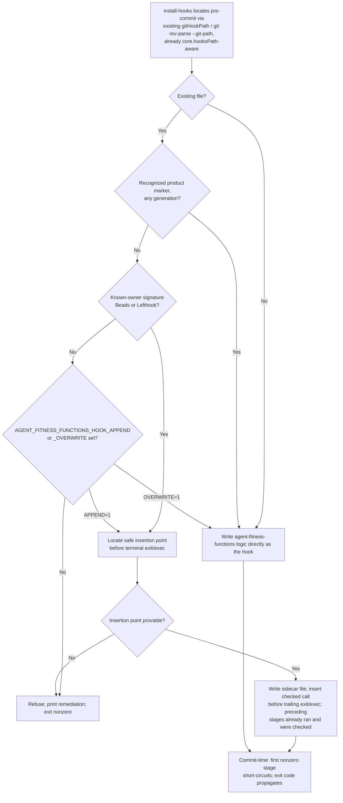

# Existing hook composition

## Metadata

| Field | Value |
|---|---|
| Date | 2026-08-22 |
| Status | Accepted |
| Scope | Repository |
| Accountable owner | Peter O'Connor, repository maintainer |
| Authors | Peter O'Connor with Claude Code assistance |
| Type | Decision |
| Enables | calm-poc-q8d.3 (implementation), depends on calm-poc-phk.7 (predecessor-hook upgrade bug) |

This MADR is Accepted following independent specification review. calm-poc-q8d.3 (implementation) MUST NOT start until this decision is accepted.

## Context and Problem Statement

`client install-hooks` (`internal/client/client.go`) is no longer the only actor that wants to own `.git/hooks/pre-commit`, `.git/hooks/pre-push`, and `.claude/settings.json` `PreToolUse` entries in a governed repository. Beads (`bd hooks install`) installs its own chained `pre-commit`/`post-merge`/`pre-push`/`post-checkout`/`prepare-commit-msg` hooks using in-file section markers and an explicit `--chain` flag. Lefthook, when present, generates its own single-owner hook files. Hand-written custom hooks predate any tool. Claude Code, Codex, and OpenCode each register their own `PreToolUse`-style entries — this repository's own `.claude/settings.json` already carries a `PreToolUse` entry wired directly to `hooks/pre-tool-use.sh` (self-governance, per `CLAUDE.md`), separate from anything `RunInstallHooks` would generate.

Today's installer (`internal/client/client.go:96-264`) already draws a three-way distinction for git hooks: absent (fresh install), product-managed (safe to overwrite in place, recognized via `managedHookMarker`/`legacyHookMarker` substring markers), and everything else (refuses by default; `STACK_FITNESS_FUNCTIONS_HOOK_APPEND=1` installs a sidecar script and appends a call block to the host file, `STACK_FITNESS_FUNCTIONS_HOOK_OVERWRITE=1` replaces it outright). This protects genuinely unknown hooks, but it has three concrete gaps that block calm-poc-q8d.3:

1. **No known-owner recognition.** Beads and Lefthook are both common, identifiable co-tenants, yet the installer treats them exactly like an unrecognized hand-written script — requiring a human to set an escape-hatch environment variable on every fresh clone. calm-poc-q8d.3's acceptance criterion is explicit: composition with Beads and Lefthook MUST work "without overwrite/append escape hatches."
2. **Unsafe append point.** `appendHookSidecar` (`internal/client/client.go:219-233`) appends its call block (`sidecarHookMarker` comment plus a bare quoted path, which Bash executes as a command) to the *end* of the existing hook file. A hook file that ends in an unconditional `exit 0` or an `exec <tool> "$@"` — both idiomatic endings for generated hooks, including patterns Lefthook is known to emit — makes everything appended after it unreachable. The sidecar would be installed but silently never invoked, with no error at install time or at commit time. This is precisely the "no command is placed after terminal exec" failure mode named in calm-poc-q8d.3's BDD contract.
3. **Marker history is two generations, not N.** `hookIsManaged` only recognizes the current product marker and one hardcoded legacy marker (`"CALM " + hook + " hook"`, from the original calm-bridge naming in ADR-0001). calm-poc-phk.7 documents the resulting bug directly: upgrade logic recognizes CALM and the current generation but omits the immediate `stack-fitness-functions` predecessor, so a repo onboarded under one product name and re-onboarded after a rename can end up with duplicate or stale hook entries instead of a clean in-place upgrade.

This MADR decides how agent-fitness-functions hooks compose with Beads, Lefthook, arbitrary pre-existing custom hooks, and Claude/Codex/OpenCode agent-harness hooks, so that calm-poc-q8d.3 has an accepted design to implement against.

## Decision Drivers

- Never destroy or silently disable a hook this product does not recognize; refusal MUST be loud, not silent.
- Compose with named, common co-tenants (Beads, Lefthook) automatically, without requiring a human to opt in via an environment variable on every governed clone.
- Guarantee that every stage in a composed chain actually runs and that its exit status is observable — a chain that appends after a terminal `exec` or `exit` is not a chain, it is dead code with a false sense of security.
- Keep `install-hooks` idempotent across repeated runs and across product-name generations (calm-bridge → stack-fitness-functions → agent-fitness-functions), closing the exact gap calm-poc-phk.7 found.
- Preserve today's fail-closed default for infrastructure/setup errors (`STACK_FITNESS_FUNCTIONS_ON_ERROR`, soon `AGENT_FITNESS_FUNCTIONS_ON_ERROR`) and the existing exit-code contract each hook type already relies on.
- Recognize that `.claude/settings.json` composition is a JSON-document merge problem, not a shell-composition problem, and that Codex/OpenCode may use neither format.
- Prefer the mechanism closest to what is already shipped and tested, unless a materially safer alternative exists.

## Considered Options

### Option 1: Wrapper/chain-runner script owns the hook file outright

The product installs itself as the sole content of `.git/hooks/<hook>`, and that wrapper is responsible for locating and invoking every other tool's original hook logic (moved aside at install time) plus its own check, in a fixed order it fully controls.

**Benefits**

- One file, one execution order, trivially expressed as an ordered list inside the wrapper.
- Exit-code propagation is simple to get right because the wrapper is the only thing that ever runs; nothing is appended after anything else.

**Costs**

- Requires the product to become the arbiter of `.git/hooks/<hook>` identity itself, which collides with Beads' own hook-install model: `bd hooks install` also wants to be (or manage) that same file, using in-file section markers it owns. Two tools each assuming they are the sole wrapper produces a race with no shared protocol to resolve it.
- "Move the original aside and re-invoke it" requires parsing or safely relocating arbitrary foreign shell content (Lefthook-generated scripts, hand-written scripts of unknown shape) — a much larger trust and correctness surface than calling out to an unmodified copy.
- Rejected because it requires exactly the kind of foreign-script rewriting this product has deliberately avoided since ADR-0004's "Go publication authority" precedent: one owner should not need to reverse-engineer another owner's file to coexist with it.
- Rejected because Beads already ships its own `--chain` wrapper convention; adopting a second, incompatible wrapper convention here would make the two products actively contend for the same file identity.
- Rejected despite giving the cleanest single-file execution-order story.
- Rejected despite removing the "appended after terminal exec" failure mode by construction.

### Option 2 (Selected, refined): Sidecar composition with known-owner detection and safe insertion

The product keeps its own logic in a separate, exclusively product-owned sidecar file (`<hook>` → `stack-fitness-functions-<hook>`, soon `agent-fitness-functions-<hook>`) and calls out to it from the shared entry-point file. This is what `internal/client/client.go` already does for unmanaged hooks today (`hookHasSidecar`, `refreshHookSidecar`, `resolveUnmanagedHook`, `appendHookSidecar`). The refinement closes the three gaps above: recognize known-owner signatures (Beads' section markers, a Lefthook-generated header) so composition with them needs no escape hatch; insert the delegated call immediately before any detected trailing unconditional `exit`/`exec` line instead of blindly appending at end-of-file; and generalize the marker list into an ordered product-name history checked in full, not a hardcoded legacy-plus-current pair.

**Benefits**

- Matches the file-ownership model already implemented, tested, and documented (`docs/runbooks/onboard-new-repository.md`, `docs/runbooks/red-green-demo.md`): the sidecar file is always fully owned and safely overwritable by the product; the shared entry-point file is never fully owned by anyone.
- Never requires parsing or rewriting a foreign tool's logic — only its file's tail is inspected, to find a safe insertion point, never its meaning.
- Composes transitively: Beads' own hooks already tolerate a "chain with existing hooks" world (`--chain` flag, section markers, explicit statement that "any user content outside the markers is preserved"), so a sidecar call appended before Beads' own terminal invocation is exactly the shape Beads' design already expects to coexist with.
- Extends cleanly to `.claude/settings.json`: that composition is already a JSON-array upsert keyed by a command substring marker (`upsertClaudeHook`, `findClaudeHookEntry`), independent of the shell-file sidecar mechanism, and needs no new file-ownership model.

**Costs**

- Detecting "a safe insertion point before a terminal `exec`/`exit`" and "a recognized Beads/Lefthook signature" requires new, product-maintained heuristics that can be wrong for shapes not yet seen; a wrong heuristic could still append after an undetected terminal statement.
- Adopted because the alternative (Option 1) does not remove foreign-shape risk, it relocates it into full-file rewriting, which is worse.
- Adopted because it requires the smallest change to already-shipped, already-tested behavior, and directly targets the three named gaps (known-owner escape hatches, terminal-exec safety, marker-history depth) rather than replacing a working mechanism.
- Adopted despite the residual heuristic risk, which MUST be mitigated by refusing (not guessing) whenever the insertion-point detector cannot prove where control would reach.

### Option 3: `git config core.hooksPath` directory redirect

Point `core.hooksPath` at a product-managed directory containing a full set of hook scripts, instead of writing into `.git/hooks/` at all.

**Benefits**

- Git-native: no file needs to be shared with another tool's content at all if every owner writes into the same redirected directory using its own naming.
- Removes the "read and interpret an existing file" problem entirely for any tool that also honors `core.hooksPath`.

**Costs**

- `core.hooksPath` is a single repository-wide config value: exactly one directory can be active at a time, so Beads, Lefthook, and this product still contend for the same resource — a config value instead of a file — with no shared protocol for whichever tool sets it last to preserve what came before.
- Verified against a real installation (`bd version 1.2.2`, see Confirmation): `bd init` already sets `core.hooksPath` to `.beads/hooks/` by default, so Beads *does* cooperate with the convention — but that means the redirect target is already Beads' own directory, not a neutral shared one. Adopting `core.hooksPath` as agent-fitness-functions's own composition mechanism would require either overriding Beads' redirect (reintroducing the exact single-owner config race) or writing into a directory Beads already treats as its own, which does not remove the file-content composition problem, it just relocates it one level down.
- Solves nothing for `.claude/settings.json` `PreToolUse` composition, which is not a `core.hooksPath`-addressable concept at all — a second, unrelated composition mechanism would still be required for the agent-harness half of this decision.
- Rejected because it trades a solvable per-file coexistence problem for an unsolved config-ownership race, while leaving the agent-harness half of the problem completely unaddressed.
- Rejected despite being the most "correct" answer if every hook owner in the ecosystem adopted it uniformly.
- Rejected despite eliminating foreign-file parsing for cooperating tools.

## Decision Outcome

1. Sidecar composition (Option 2) MUST remain the git-hook composition model. `install-hooks` MUST continue to write product logic exclusively into a product-named sidecar file (`agent-fitness-functions-<hook>`, plus `format-violations.py`) and MUST NOT rewrite, relocate, or parse the meaning of any other owner's hook logic.
2. The installer MUST classify an existing `.git/hooks/<hook>` file into exactly one of: absent, product-managed (any recognized generation), known-owner (Beads or Lefthook signature detected), or unrecognized. Only the unrecognized case MUST require `AGENT_FITNESS_FUNCTIONS_HOOK_APPEND=1` or `AGENT_FITNESS_FUNCTIONS_HOOK_OVERWRITE=1`; known-owner composition MUST proceed automatically via sidecar-append.
3. Sidecar-append MUST insert its call immediately before the first detected unconditional trailing `exit` or `exec` statement in the host file, never after. When the installer cannot prove where control flow would reach the appended call, it MUST refuse and fall back to the unrecognized-hook path (requiring an explicit escape hatch) rather than guess.
4. Execution order MUST preserve whatever order pre-existing owners already established in the host file; agent-fitness-functions's own call MUST be the final stage inserted for a given hook file. Only the very last stage in an assembled chain MAY terminate via `exec`; every earlier stage (including agent-fitness-functions's own call when it is not last) MUST be invoked as a checked subprocess call whose exit status is captured, not via `exec`.
5. Any nonzero exit from any composed stage MUST short-circuit remaining stages for `pre-commit`/`pre-push` composition. For `.claude/settings.json` `PreToolUse` composition, the product's own script MUST continue to signal a block using exit code `2` specifically (not merely "nonzero"), matching Claude Code's documented PreToolUse contract; composition logic MUST NOT collapse this distinction into a generic nonzero check.
6. `.claude/settings.json` MUST be composed via structured JSON-document merge keyed by a command-substring marker (as `upsertClaudeHook`/`findClaudeHookEntry` already do), never via a wrapper shell script, because it is not a POSIX-executable file. This binds Claude Code's `.claude/settings.json` shape only. Codex's and OpenCode's composition mechanism is undecided by this MADR: their settings format and file location are unverified in this repository (see Open Questions), so no MUST binds them yet. calm-poc-q8d.3 MUST treat Codex/OpenCode coexistence as an open research spike, not an assumed JSON-merge target, until a follow-up decision confirms their actual shape.
7. Marker recognition MUST be generalized from a hardcoded legacy-plus-current pair into an ordered list of every product-name generation (calm-bridge → stack-fitness-functions → agent-fitness-functions), checked in full on every install/upgrade, so calm-poc-phk.7's gap cannot recur on a future rename.
8. `install-hooks` re-runs MUST remain a no-op for content the product already owns (any recognized generation, any previously-inserted sidecar call) and MUST NOT duplicate an insertion it already performed.
9. No new path-resolution logic is needed or MUST be added: the existing `gitHookPath` helper (`internal/client/client.go:447-456`) already resolves every hook target via `git -C <repoRoot> rev-parse --git-path hooks/<name>`, which transparently follows `core.hooksPath` — including relative `core.hooksPath` values — because it delegates to git itself rather than re-deriving git's own resolution rules. The `bd init` reproduction (see Confirmation) confirms this directly: once Beads sets `core.hooksPath` to `.beads/hooks/`, `gitHookPath` returns `<repo>/.beads/hooks/pre-commit`, not `.git/hooks/pre-commit`. Hand-rolling `git config core.hooksPath` parsing and manual path-joining would duplicate what `git rev-parse --git-path` already does and contradicts this MADR's preference for the mechanism closest to what already exists (Decision Drivers). calm-poc-q8d.3 MUST add only a regression fixture proving `install-hooks` continues composing correctly in a repo where `bd init` has redirected `core.hooksPath` to `.beads/hooks/` — i.e., the product's sidecar-append lands in the redirected hook file, never in `.git/hooks/`.

## Advice

RFC 2119 terms in this MADR are normative.

### Precedence and boundary

| Record | Authority after this MADR | Relationship |
|---|---|---|
| ADR-0002 | Authority for product identity (`agent-fitness-functions`) and the rename from `stack-fitness-functions` | This MADR MUST NOT reinterpret product naming; it describes present code as `stack-fitness-functions` where that is what ships today, and decides future hook-composition behavior using the target name |
| ADR-0003 | Authority for repository, Go module, import, and release identity | Unaffected; this MADR is scoped to installed hook artifacts and `.claude/settings.json`, not module or repository identity |
| calm-poc-phk.7 | Predecessor-hook upgrade bug fix | MUST implement its fix using the marker-history model decided here (Migration from predecessor generations), not an independent patch |
| calm-poc-q8d.3 | Implementation of this decision | Blocked on this MADR's acceptance; MUST implement exactly the classification, insertion, and coexistence rules below |

This decision is scoped to `.git/hooks/pre-commit`, `.git/hooks/pre-push`, the product's own sidecar/git-guard/pre-tool-use scripts, and `.claude/settings.json` `PreToolUse` composition. It explicitly excludes Beads' `post-merge`, `post-checkout`, and `prepare-commit-msg` hooks (`bd hooks install`), which agent-fitness-functions does not currently install into or need to compose with, production TLS, certificate publication (ADR-0004's domain), and the calm-poc-q8d.8 rename implementation itself.

### Ownership model

| Artifact | Ownership | Rule |
|---|---|---|
| `.git/hooks/agent-fitness-functions-<hook>` sidecar scripts | Owned outright | Always safe to fully overwrite on install/upgrade; no other tool is expected to write here. |
| `.git/hooks/agent-fitness-functions-git-guard`, `.git/hooks/agent-fitness-functions-pre-tool-use`, `format-violations.py` | Owned outright | Same as above; these never share a file with another owner. |
| `pre-commit`, `pre-push` at the git-resolved hook path (`.git/hooks/<hook>`, or `<core.hooksPath>/<hook>` when that config is set — e.g. Beads' default `.beads/hooks/<hook>`) | Shared | Never fully owned; the installer may only insert a call into it, never assume it is empty or fully understand its contents. The existing `gitHookPath` helper (`git rev-parse --git-path hooks/<name>`) already resolves this path correctly, including under a `core.hooksPath` redirect; no new resolution logic is needed. |
| `.claude/settings.json` `PreToolUse` array | Shared | Composed by JSON-array upsert; each entry is independently owned and matched by command-substring marker, never by array index. |
| Codex/OpenCode equivalent config | Shared, format TBD | See open question below; MUST NOT assume the Claude Code JSON shape. |

### Execution order and failure propagation



Git-hook composition (`pre-commit`, `pre-push`) only needs zero-vs-nonzero fidelity: Git itself does not interpret specific nonzero values. `PreToolUse` composition is stricter — Claude Code's hook protocol treats exit code `2` as "block this tool call, show stderr to the model," and treats other nonzero codes as a hook-execution error that does not necessarily block the call. Any future chain-runner or wrapper touching the `PreToolUse` script MUST preserve that distinction rather than normalizing to "any nonzero blocks."

### Idempotent install/upgrade

Re-running `install-hooks` MUST NOT change behavior when nothing has changed: a hook already carrying any recognized product marker is treated as "no re-classification needed" and simply overwritten with the current embedded content (upgrade-in-place, not append). A hook already carrying a sidecar marker (`sidecarHookMarker`/`legacySidecarMarker`) is refreshed by rewriting only the sidecar file, never by re-appending the call block. This MUST extend unchanged to the refined model: a known-owner host file that already has an agent-fitness-functions insertion MUST be detected as already-composed (by the same marker check used for the fully-owned case, applied to the inserted block) and left untouched apart from the sidecar refresh.

### Unknown-hook protection and known-owner recognition

The existing refuse-by-default behavior for unrecognized hooks (`resolveUnmanagedHook`) is the correct default and MUST be preserved unchanged for anything that is not a recognized product marker or a recognized known-owner signature. Known-owner recognition is additive, not a relaxation: it narrows the "unrecognized, ask a human" bucket by carving out specifically Beads (its documented section-marker convention, `--chain` flag) and Lefthook (its generated-header convention) as pre-approved co-tenants, because calm-poc-q8d.3's acceptance criteria requires those two to compose without a human setting an environment variable. Every other pre-existing custom hook remains protected exactly as today: bytes untouched unless a human explicitly opts into append or overwrite.

### Claude/Codex/OpenCode coexistence

`.claude/settings.json` composition already works by parsing JSON, finding a `PreToolUse` entry whose `command` contains a known marker substring, and replacing or appending that one array entry (`upsertClaudeHook`) — this is document-level merge, not process-level chaining, and it is unaffected by anything decided above for git hooks. Codex and OpenCode are named in calm-poc-q8d.7's scope but this repository does not yet contain verified evidence of their settings format or file location; this MADR does not assume they share Claude Code's JSON shape. See Open Questions.

### Migration from predecessor generations

Every marker family MUST become its own ordered, append-only history, checked as a full set membership test, never a hardcoded two-generation pair. phk.7 MUST implement exactly these four literal arrays, with no ambiguity about what "the equivalent for git-guard and sidecar" means:

1. **Git-hook markers** (`managedHookMarker`/`legacyHookMarker`, one array per hook name — `pre-commit`, `pre-push`): `["CALM " + hook + " hook", "stack-fitness-functions " + hook + " hook", "agent-fitness-functions " + hook + " hook"]`.
2. **Sidecar markers** (`sidecarHookMarker`/`legacySidecarMarker`, one array per hook name): `["# CALM " + hook + " hook (sidecar)", "# stack-fitness-functions " + hook + " hook (sidecar)", "# agent-fitness-functions " + hook + " hook (sidecar)"]`.
3. **Git-guard markers** (`gitGuardName`/`legacyGitGuardName`): `["calm-git-guard", "stack-fitness-functions-git-guard", "agent-fitness-functions-git-guard"]`. `legacyGitGuardName` is the irregular literal `"calm-git-guard"` — lowercase and not template-derived from `hookProductPrefix + "-git-guard"` the way its two successors are (that template would have produced `"CALM-git-guard"`). phk.7 MUST hardcode this one irregular string rather than deriving it, and MUST NOT "fix" its casing, since that would stop it matching hooks installed by the original calm-bridge generation.
4. **Agent Edit/Write hook markers** (`agentHookName`): `["stack-fitness-functions-pre-tool-use", "agent-fitness-functions-pre-tool-use"]` — only two generations. The current code defines no legacy constant for this hook because it did not exist under the calm-bridge generation (`git-guard` predates it; `pre-tool-use` does not). phk.7 MUST NOT invent a fictitious `calm-pre-tool-use` predecessor marker to force symmetry with the other three families.

`hookIsManaged`/`hookHasSidecar` MUST test membership against the full history for the relevant family on every install/upgrade so that a repository onboarded under any prior generation, including one that skipped an intermediate rename, upgrades cleanly in one pass. This directly closes calm-poc-phk.7's finding that upgrade logic "includes CALM and agent markers but omits the immediate stack-fitness-functions predecessor."

## Consequences

- The installer gains two new pieces of maintained heuristic (safe-insertion-point detection, known-owner signature detection) that did not exist before; both must fail closed (refuse, not guess) when uncertain.
- calm-poc-q8d.3 can drop the requirement that a fresh clone with Beads and Lefthook already installed needs any environment variable set before `client onboard --enforcement block` succeeds.
- The marker-history generalization is a small, low-risk change that directly fixes calm-poc-phk.7 and prevents the same class of bug on any future product rename.
- `PreToolUse` composition logic must never be simplified to "nonzero blocks" without losing the exit-code-2 distinction Claude Code's protocol depends on.
- Sidecar composition remains, by design, unable to guarantee correctness against an arbitrary unrecognized hook shape; the explicit escape hatches (`AGENT_FITNESS_FUNCTIONS_HOOK_APPEND`/`_OVERWRITE`) remain the safety valve for anything the heuristics cannot classify.
- This decision does not itself rename `stack-fitness-functions` spellings to `agent-fitness-functions`; calm-poc-q8d.8 owns that rename and MUST preserve the marker-history and insertion-point behavior decided here.
- Beads' own integration marker is version-stamped (`# --- BEGIN BEADS INTEGRATION v1.2.2 ---`, confirmed against installed `bd version 1.2.2`), so Phase 2's known-owner signature MUST match on the version-independent substring `BEGIN BEADS INTEGRATION`, never the full versioned marker; a fixture that upgrades the installed Beads version between two `install-hooks` runs MUST be planned to prove the substring match survives a Beads version bump the product has never seen.

## Impact

**Repository Maintainers** MUST own implementation, review evidence, and acceptance, with Peter O'Connor as accountable owner. calm-poc-q8d.3 MUST NOT begin implementation until this MADR is accepted following independent specification review; calm-poc-phk.7 (the predecessor-hook upgrade bug) MUST land using the generalized marker-history model decided here rather than a one-off patch, so the two tickets do not diverge on marker semantics. No tracker dependency edge currently encodes that gate: tracker edge added at acceptance (`calm-poc-phk.7` depends on `calm-poc-q8d.7`). Until that edge exists, the accountable owner MUST manually hold calm-poc-phk.7's start on this MADR's acceptance rather than relying on `bd blocked`/`bd ready` to surface the constraint.

## Implementation and Migration Phases

Estimated implementation and review effort, to be refined by calm-poc-q8d.3:

1. **Marker-history generalization:** replace the hardcoded legacy/current marker pair with an ordered, append-only list; extend `hookIsManaged`/`hookHasSidecar` to test full-history membership. This phase alone closes calm-poc-phk.7 and should land first since later phases depend on stable marker semantics.
2. **Known-owner detection:** add signature checks for Beads (the version-independent substring `BEGIN BEADS INTEGRATION`, never the full versioned marker, resolved via `core.hooksPath` when set) and Lefthook (generated-header convention), each backed by a captured real-world fixture rather than an inferred pattern; include a fixture that upgrades the installed Beads version between runs.
3. **Safe insertion-point detection:** implement the trailing-`exit`/`exec` scan, with a fail-closed refusal path when no provable insertion point exists; add fixtures for both terminal shapes and for the "cannot prove" case.
4. **`PreToolUse` exit-code preservation:** audit any new chain-runner or wrapper logic introduced by calm-poc-q8d.3 to confirm exit code `2` remains distinct from other nonzero codes end to end.
5. **Codex/OpenCode research spike:** resolve the open question on their settings format before extending composition beyond Claude Code's JSON shape.

## Confirmation

Acceptance of calm-poc-q8d.3's implementation requires automated evidence for:

- A synthetic Beads-shaped and a synthetic Lefthook-shaped pre-existing hook, each composed without any environment variable set, each executing exactly once, in the order the fixture pre-established, with agent-fitness-functions inserted last.
- A fixture host hook ending in a bare `exec "$@"` and one ending in an unconditional `exit 0`: the installer MUST insert before that line (proven by the sidecar call actually running at commit/push time in the test), never after.
- A fixture host hook shape the detector cannot prove an insertion point for: the installer MUST refuse and require an explicit escape hatch, MUST NOT guess.
- Repeated `install-hooks` runs across all of the above producing no duplicate hooks, no duplicate `.claude/settings.json` entries, and no duplicate sidecar-call insertions.
- A fixture repo carrying only the immediate `stack-fitness-functions`-generation markers (no CALM markers) upgrading cleanly to the current generation in one `install-hooks` run — the calm-poc-phk.7 regression case.
- An unrecognized custom hook's exact bytes remaining unchanged after a default (no escape hatch) `install-hooks` run.
- `PreToolUse` composition tests asserting exit code `2` is preserved distinctly from other nonzero codes through any chain-runner or wrapper path introduced by calm-poc-q8d.3.
- `go test ./...`, `go test -tags=integration ./...`, ShellCheck on hook assets, and independent specification and standards re-reviews before calm-poc-q8d.3 implementation begins.
- A fixture that upgrades the installed Beads version between two `install-hooks` runs, proving the version-independent `BEGIN BEADS INTEGRATION` substring match (not the full `v1.2.2`-stamped marker) still recognizes Beads' hook after the bump.

**Already reproduced for this review round** (scratch worktree, non-destructive, no repository files touched): with `bd version 1.2.2` installed, a fresh repo was `git init`-ed, a `.git/hooks/pre-commit` was hand-written containing a simulated pre-existing custom line plus an appended agent-fitness-functions sidecar-call block (marker `# agent-fitness-functions pre-commit hook (sidecar)` followed by the quoted sidecar path), then `bd init --force` and `bd hooks install` (and separately `bd hooks install --chain`) were run three times total. Result: `bd init` set `git config core.hooksPath` to `.beads/hooks/`; Beads appended exactly one `# --- BEGIN BEADS INTEGRATION v1.2.2 ---` … `# --- END BEADS INTEGRATION v1.2.2 ---` block to `.beads/hooks/pre-commit` (the file git actually resolves once that config is set), after the pre-existing custom line and the agent-fitness-functions sidecar-call line, both of which remained byte-for-byte unchanged across all three reruns (`grep -c` for both the marker and the sidecar-call line stayed at `1` throughout; no duplicate blocks appeared with or without `--chain`). This confirms the reviewer's finding and additionally establishes that Beads' actual composition mechanism is `core.hooksPath` redirection to `.beads/hooks/`, not literal editing of `.git/hooks/<hook>`.

## 30-Second Summary

Sidecar composition — already shipped for unmanaged hooks — remains the model, refined with three additions: known-owner auto-composition for Beads and Lefthook (no escape hatch required), insertion immediately before any terminal `exit`/`exec` rather than blind end-of-file append, and a generalized multi-generation marker history that closes the calm-poc-phk.7 upgrade bug. `.claude/settings.json` composition stays a JSON-array upsert, unrelated to the shell-file mechanism. Wrapper/chain-runner and `core.hooksPath` were rejected: both relocate the same N-way file-ownership race rather than resolving it, and neither addresses agent-harness settings composition at all.

## Counterarguments

### Why not just require the escape hatch for everyone, including Beads and Lefthook?

calm-poc-q8d.3's acceptance criteria is explicit that Beads, Lefthook, and agent-fitness-functions must each execute exactly once without overwrite/append escape hatches. Treating well-known, identifiable co-tenants identically to a wholly unrecognized script optimizes for the rarer case (a truly unknown hook) at the cost of the common case (a governed repo that already uses Beads).

### Why not fully parse the host hook to guarantee a correct insertion point in all cases?

Full parsing of arbitrary POSIX shell to prove reachability in the general case is undecidable in practice for hooks containing conditionals, sourced files, or dynamic dispatch. The chosen heuristic (detect a *trailing* unconditional `exit`/`exec`) is deliberately narrow and fails closed — refusing rather than guessing — exactly because full generality is not achievable safely.

### Why does the `PreToolUse` exit-code distinction matter for a hook-composition MADR?

Because calm-poc-q8d.3 explicitly lists Claude/Codex/OpenCode coexistence in scope, and a naive chain-runner built for git hooks (where only zero-vs-nonzero matters) would silently break `PreToolUse` blocking if applied unchanged to `.claude/settings.json`-driven hooks, where exit code `2` carries distinct meaning.

## Open Questions

- Codex's and OpenCode's hook/settings file format and location are not yet verified in this repository; calm-poc-q8d.3 needs a research spike before implementing anything beyond the Claude Code JSON case.
- The exact signature used to detect "this is a Lefthook-generated hook" versus "this is a hand-written hook that happens to end in `exec`" has not been validated against a real Lefthook installation in this repository; calm-poc-q8d.3 should capture a real fixture rather than inferring the signature from documentation alone.

**Resolved during this review round:** whether Beads' `--chain` flag preserves a previously-inserted agent-fitness-functions sidecar call was reproduced empirically in a scratch worktree (`bd version 1.2.2`, see Confirmation and Supporting Evidence). It does. The reproduction also surfaced a mechanism detail this MADR did not previously account for: `bd init` sets `git config core.hooksPath` to `.beads/hooks/`, so git resolves `pre-commit` there instead of `.git/hooks/pre-commit` once Beads has initialized a repository. This does not require new installer logic: the existing `gitHookPath` helper (`internal/client/client.go:447-456`) already resolves the effective target file the same way git does, via `git rev-parse --git-path hooks/<name>`, which follows `core.hooksPath` transparently (Decision Outcome item 9). calm-poc-q8d.3 MUST add a regression fixture proving this composes correctly in a `core.hooksPath`-redirected repo, not new resolution code. This also corrects Option 3's cost analysis (Considered Options, above): Beads' own default install path does cooperate with `core.hooksPath`, it just does not free agent-fitness-functions from needing its own file-content composition logic, since Beads still owns whatever file that path resolves to.

## Addendum (2026-08-28): dispatcher-chain recognition and forge-managed settings

### Forge dispatcher-chain scenario

The `forge` scaffolder generates repositories where `bd init` sets `core.hooksPath=.beads/hooks/`, and after `lefthook install --force` clobbers Beads' hook, `forge` rewrites the affected hook file (e.g. `.beads/hooks/pre-commit`) as a dispatcher chain:

```bash
#!/usr/bin/env bash
set -euo pipefail

script_dir="$(CDPATH= cd -- "$(dirname "$0")" && pwd)"
"$script_dir/<hook>.old" "$@"
exec "$script_dir/<hook>.lefthook" "$@"
```

The dispatcher runs under `set -euo pipefail`, so a nonzero exit from the first stage (`.old`, which contains Beads' hook) exits the host immediately — identical propagation semantics to the inline error handling already specified in Decision Outcome 4 (Execution order and failure propagation), so no special case is needed. Advisory-mode validation exits 0 and the chain continues to the `exec`.

### Known-owner detection misses the dispatcher without sibling-signature transfer

Content-only known-owner detection (recognizing a direct substring marker in the host file like `BEGIN BEADS INTEGRATION`) would not identify the dispatcher chain case: the dispatcher file itself contains neither Beads' marker nor Lefthook's marker — those markers live in the *sibling* files it calls (`.beads/hooks/<hook>.old` and `.beads/hooks/<hook>.lefthook`). Before this addendum, `install-hooks` would treat an unmanaged dispatcher as an unrecognized hook, requiring an explicit escape hatch.

### Sibling-signature transfer rule with fail-closed guard

The refined known-owner detection adds a rule: an unmanaged host hook is treated as known-owner when it **references a sibling chain file by name** (either `<hook>.old` — lefthook's clobber-rename convention — or `<hook>.lefthook` — forge's repairBeadsHookChain rename) AND that sibling file's content carries a known-owner signature (`BEGIN BEADS INTEGRATION` substring or Lefthook-generated header).

The fail-closed guard: a stale or unrelated sibling next to an unrelated hand-written host hook that never references it does NOT unlock auto-composition. A dispatcher cannot compose unless the referenced siblings prove their ownership via their own signatures. This preserves ADR-0006's "refuse, not guess" posture for anything without hard evidence.

### Composition order and `set -e` propagation

When the sibling-signature rule recognizes a dispatcher chain, composition proceeds exactly as specified in Decision Outcome 2–5: the agent-fitness-functions sidecar call is inserted before the dispatcher's terminal `exec "$@"` line (the same safe-insertion-point rule applies, just in the dispatcher context rather than a bare script). Execution order becomes: Beads hook (in `.old`) → agent-fitness-functions sidecar → Lefthook (in `.lefthook`).

Because the dispatcher runs under `set -euo pipefail`, a nonzero exit from the Beads stage exits the entire host without reaching the agent-fitness-functions sidecar. When the sidecar runs (Beads succeeded), its own exit status determines whether the Lefthook stage runs: a block (nonzero) short-circuits the `exec`, preserving Decision Outcome 4's failure-propagation contract. Advisory-mode validation exits 0 and `exec` continues to Lefthook.

### Forge-managed `.claude/settings.json` protection

In forge-generated repositories, `.claude/settings.json` is on `forge upgrade`'s managed-file list and is overwritten wholesale on every `forge upgrade` run (and `forge upgrade --check` runs at every Claude session start via a SessionStart hook). Without protection, `agent-fitness-functions client install-hooks`' PreToolUse entries would be silently destroyed and recreated on each upgrade cycle.

New behavior: when `.claude/settings.json` is detected as forge-managed (its SessionStart commands contain `forge upgrade` or `forge sync-allowlist`), `install-hooks` upserts the two PreToolUse entries (`git-guard` and `pre-tool-use`) into `.claude/settings.local.json` instead (Claude Code automatically merges both files, with `.local.json` entries taking precedence). Forge never wholesale-rewrites `settings.local.json` — its reconciler only edits between `// BEGIN FORGE ALLOW` / `// END FORGE ALLOW` markers — so PreToolUse entries survive the upgrade.

Trade-off: `forge` gitignores `.claude/settings.local.json`, making PreToolUse entries per-machine: each fresh clone runs `agent-fitness-functions client install-hooks` once to set them up. Running `agent-fitness-functions client doctor` flags a missing PreToolUse entry (advisory `⚠` if absent), and its remediation explains that `forge upgrade` rewrites `.claude/settings.json` and entries are kept in `.claude/settings.local.json` on a per-machine basis.

### Fixture evidence

A forge-generated repository with both Beads and Lefthook installed, onboarded for agent-fitness-functions governance, now provides a real-world fixture for the dispatcher-chain scenario: the order of execution (Beads → agent-fitness-functions → Lefthook), idempotent composition without escape hatches, PreToolUse entries persisting across `forge upgrade` cycles, and `doctor` flagging absence correctly.

## Supporting Evidence

- [ADR-0001: Rename calm-bridge to stack-fitness-functions](0001-rename-calm-bridge-to-stack-fitness-functions.md)
- [ADR-0002: Rename stack-fitness-functions to agent-fitness-functions](0002-rename-stack-fitness-functions-to-agent-fitness-functions.md)
- [ADR-0004: Atomic development certificate publication](0004-atomic-development-certificate-publication.md) — precedent for "one authority, no foreign-file rewriting" reasoning
- `internal/client/client.go` (`RunInstallHooks`, `handleExistingGitHook`, `appendHookSidecar`, `upsertClaudeHook`) — current sidecar and JSON-merge implementation
- `hooks/pre-commit.sh`, `hooks/pre-push.sh`, `hooks/pre-tool-use.sh`, `hooks/git-guard.sh` — current hook logic and exit-code contracts
- `docs/runbooks/onboard-new-repository.md`, `docs/runbooks/red-green-demo.md` — documented escape-hatch behavior
- `bd hooks install --help` (Beads CLI, invoked locally) — Beads' own section-marker/`--chain` composition convention
- `bd version 1.2.2` scratch-worktree reproduction (this review round) — `bd init --force`, `bd hooks install`, `bd hooks install --chain` run three times against a fixture `pre-commit` carrying a pre-existing custom line and an agent-fitness-functions sidecar-call block; confirmed `core.hooksPath` redirection to `.beads/hooks/`, exactly one idempotent `# --- BEGIN BEADS INTEGRATION v1.2.2 ---` … `# --- END BEADS INTEGRATION v1.2.2 ---` block appended after existing content, and byte-for-byte preservation of the pre-existing lines across all reruns
- [RFC 2119](https://datatracker.ietf.org/doc/html/rfc2119)

*Authored By Peter O'Connor with Assistance from Claude Code (claude-sonnet-5) · 2026-08-22 · Hook composition architecture decision for agent-fitness-functions, enabling calm-poc-q8d.3*
