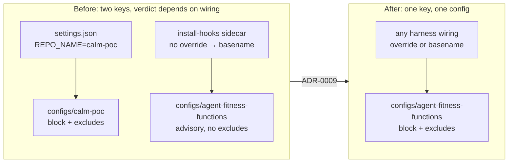

# Canonical Governance Key Is the Product Name

## Metadata

| Field | Value |
|---|---|
| Date | 2026-09-05 |
| Status | Accepted |
| Scope | Repository / Governance configuration |
| Accountable owner | Peter O'Connor, repository maintainer |
| Authors | Peter O'Connor with Claude Code assistance |
| Type | Decision |
| Context | Resolves calm-poc-sip4; partially supersedes ADR-0003 |

## Context and Problem Statement

ADR-0003 drew a deliberate boundary between *source identity* (canonicalized to
`github.com/AvogadroSG1/agent-fitness-functions`) and *logical governance
identity* (preserved as `calm-poc`). Its Identity Boundaries clause states that
`calm-poc` "MUST remain exact as the logical governance repository key in
`configs/calm-poc/`, `caller-repos.json`, settings, tests, and runtime
authorization/configuration behavior."

That boundary has since stopped paying for itself. The repository drifted into
governing itself under **two** keys at once:

1. `.claude/settings.json` pinned `AGENT_FITNESS_FUNCTIONS_REPO_NAME=calm-poc`,
   resolving `configs/calm-poc/config.json` (`block`, with the intentional-violation
   fixtures excluded).
2. A second `configs/agent-fitness-functions/config.json` existed in both the
   repository and the machine governance root (`advisory`, **no** exclude
   patterns), and `caller-repos.json` authorized `dev-hook-pool` for both names.

Which config a given edit was evaluated against depended entirely on which
harness wired the hook: the tracked `settings.json` entry sent `calm-poc`, while
the `client install-hooks`-generated sidecar in `.claude/settings.local.json`
sends no override at all and therefore falls back to the worktree basename —
`agent-fitness-functions`. The same edit could be blocked or merely advised
depending on which entry fired first. A governance system whose own governance
identity is ambiguous cannot be trusted to be authoritative about anyone else's.

## Decision Drivers

- The self-governance hook MUST resolve to exactly one config, deterministically.
- A fresh clone MUST reach the same verdict as this maintainer's machine.
- The predecessor key `calm-poc` no longer names anything a reader can find:
  the product, the binary, the module, the repository, and the worktree
  basename are all `agent-fitness-functions`.
- ADR-0003's motivation was to keep a *module migration* from silently becoming
  an *authorization migration*. That risk was specific to that change and has
  passed; performing the key migration deliberately, with its own decision
  record, is not the failure mode ADR-0003 guarded against.

## Considered Options

### Option 1: Preserve `calm-poc` as the canonical key (honor ADR-0003 as written)

Keep `configs/calm-poc/`, delete `configs/agent-fitness-functions/`, and keep the
`REPO_NAME=calm-poc` override in every harness wiring.

- Requires no ADR supersession.
- Rejected because it requires an explicit `REPO_NAME` override in *every* harness
  integration forever, since the basename fallback yields `agent-fitness-functions`.
  ADR-0008 added two more harnesses; each new one is a fresh chance to omit the
  override and silently govern under the wrong key. The ambiguity above is the
  direct consequence.

### Option 2 (Selected): Make `agent-fitness-functions` the canonical key

Retire `configs/calm-poc/`, merge its enforcement mode and exclude patterns into
`configs/agent-fitness-functions/config.json`, and drop `calm-poc` from
`caller-repos.json`.

- The basename fallback and the explicit override now agree, so a missing override
  is no longer a silent misconfiguration.
- Costs one supersession of a narrow ADR-0003 clause.

### Option 3: Support both keys as aliases

Teach the server to treat `calm-poc` as an alias of `agent-fitness-functions`.

- Rejected: ADR-0002 established that this product has no predecessor runtime
  aliases. Adding one to the authorization path contradicts that and doubles the
  surface every authorization test must cover.

## Decision Outcome

RFC 2119 terms in this MADR are normative.

### Precedence and Decision Boundary

This MADR supersedes **only** the governance-repository-key sentence of
ADR-0003's Identity Boundaries section. Every other ADR-0003 decision remains
active, including the canonical source repository and module identity, the
`GOPRIVATE` requirement, and the prohibition on old-path mirrors or vanity
module paths. ADR-0001 and ADR-0002 remain immutable.

### Canonical Governance Key

The logical governance repository key for this repository MUST be exactly
`agent-fitness-functions`. It MUST match the worktree basename so that the
`client validate` basename fallback and any explicit
`AGENT_FITNESS_FUNCTIONS_REPO_NAME` override resolve to the same config.

- `configs/agent-fitness-functions/config.json` MUST be the single mounted config
  for this repository, and MUST retain the `exclude-patterns` that keep the
  calibrated fixtures under `fixtures/violations/` editable.
- `configs/calm-poc/` MUST NOT exist.
- `caller-repos.json` MUST authorize `dev-hook-pool` for `agent-fitness-functions`
  and MUST NOT list `calm-poc`.
- Harness wiring MAY omit `AGENT_FITNESS_FUNCTIONS_REPO_NAME` entirely and rely on
  the basename fallback; where it is set, it MUST be `agent-fitness-functions`.

### FINOS CALM Surfaces Are Out of Scope

This MADR authorizes **no** change to FINOS CALM surfaces. The governance pattern
`$id` `https://stackoverflow.com/calm-poc/patterns/governance.json`, the `.calm/`
path, the `configs/` path, `CALMNode`, the `calm_node` wire tag, the FINOS `calm`
executable, and all historical records MUST remain exact, as required by ADR-0002
and ADR-0003. CALM is the external standard being enforced, never the product name.

### Beads Issue Identifiers Are Out of Scope

Beads issue IDs (`calm-poc-<hash>`) are opaque historical handles referenced by
immutable ADR bodies, code comments, and git history. They are not a governance
key and MUST NOT be rewritten by this decision.

## Positive Consequences

- One key, one config, one verdict, regardless of which harness wired the hook.
- Omitting `AGENT_FITNESS_FUNCTIONS_REPO_NAME` is now correct rather than a silent
  misconfiguration, which removes a per-harness footgun as more harnesses are added.
- The governance key is discoverable: it is the product, binary, module, and
  worktree name.

## Negative Consequences & Trade-Offs

- Any external caller still sending `--repo calm-poc` now receives an authorization
  failure rather than a config. This is intended and is the reason the change is
  recorded rather than made silently.
- ADR-0003's Identity Boundaries section can no longer be read standalone; readers
  MUST read it together with this MADR.
- Historical records — ADR bodies, escalation notes, beads IDs, and git history —
  continue to reference `calm-poc`. They are immutable and remain accurate as of
  their own dates.

## Confirmation

- `configs/config_test.go` asserts the canonical config's mode and exclude patterns
  and asserts `configs/calm-poc/` is absent.
- `self_governance_hook_test.go` asserts the tracked `.claude/settings.json` names
  the canonical key, pins no binary, uses no absolute paths, and registers the hook
  at most once per matcher.
- `internal/renamecheck` protects `agent-fitness-functions` as the caller-repos key
  while continuing to protect the FINOS CALM governance `$id`.
