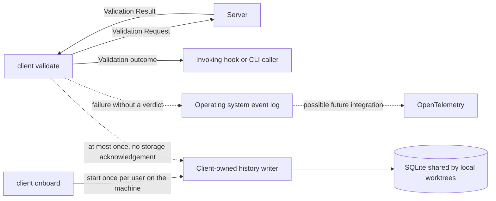

# Client validation history is downstream observability

## Context and problem statement

Developers need repository-local history to compare submitted source versions and Validation Results across attempts, including rejected proposals that never enter Git. A small SQLite database will hold history shared by the worktrees of one local clone, with origin, session, worktree, and branch context on its entries. Passing proposals do not prove that edits were applied.

Making persistence part of validation would allow unavailable storage to delay or prevent an edit or commit. Peter explicitly chose downstream observability with at-most-once delivery and no blocking.

## Decision drivers

- Validation MUST remain independent of observability availability.
- History SHOULD help explain attempts and subsequent changes.
- The system MAY lose history events; completeness is not required.

## Considered options

- Require durable recording before returning the validation outcome.
- Attempt recording on the validation path with bounded retries and a warning on failure.
- Emit events with at-most-once delivery to a downstream history consumer.

## Decision outcome

Chosen option: downstream history consumption with at-most-once delivery. This is an accepted design decision; implementation is pending.

The client MUST produce history events independently of their persistence. The downstream consumer owns SQLite writes. The validation path MUST NOT wait for a storage acknowledgement, retry history delivery, replay dropped events, or wait for downstream capacity. Unavailable consumers, storage errors, or overload MAY cause event loss. History failure MUST NOT change the validation verdict, its exit behavior, or its machine-readable output.

At-most-once delivery applies to an event representing one client-observed attempt. Separate user or hook invocations remain distinct attempts, even if they submit identical content. The implementation MUST NOT create duplicate records by replaying an event.

Each recorded validation MUST preserve its submitted source and result. Origin metadata MUST record invocation source, tool, and session identifier when available, with missing identity explicitly unknown. One local clone's worktrees MUST share history; worktree and branch context belong on the record. Separate clones and machines retain separate histories.

Attempts that receive no Validation Result, including server connection failures and timeouts, MUST NOT create SQLite validation-history entries. These failures MUST be logged to the operating system's event logging stream. OpenTelemetry integration is a possible future consumer, not part of step 1. Operational diagnostics remain independent of the validation verdict and history persistence.

Successfully recorded history MUST NOT expire or be automatically pruned. Step 1 MUST NOT introduce retention settings, age limits, or size-based deletion; retention is outside the current scope.

One client-owned history writer MUST run per user on the machine and serve the separate databases of local repository clones. `client onboard` MUST manage its startup. The writer MUST have a lifetime independent of `client validate`, and history MUST remain on the client machine when governance uses a remote server. The validation path MUST NOT start the writer or replay events when it is unavailable.

The [implementation plan](../plans/2026-09-06-repository-validation-history.md) specifies the Unix stream handoff, database in the clone's common Git directory, record schema, native OS logging adapters, and seven BDD delivery slices. This ADR records the architectural decision; implementation remains pending.

## Consequences

Validation remains available when observability is unavailable. Events lost during process exit, overload, or storage failure MAY leave incomplete sequences of attempts. A missing record MUST NOT be interpreted as proof that validation did not run, and this history MUST NOT be used as an enforcement prerequisite or a complete audit trail.

The implementation MUST define a handoff suitable for the short-lived client process. Starting a background task in that process alone does not establish that a downstream consumer will receive the event. Delivery MAY fail, but normal successful recording and the lack of a persistence dependency both require verification.

The earlier suggestion to retry recording on the validation path is superseded. A future completeness requirement would require a new decision and cannot recover previously lost events.

*Authored By Peter O'Connor with Assistance from Codex (gpt-6) · 2026-09-06 · Downstream repository validation history decision*
