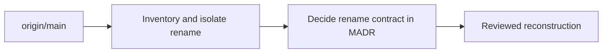

# Joint Brief Rename MADR Sequencing

## Joint Escalation Brief: Decide Whether Isolation or the Rename MADR Comes First

Agents: OpenCode GPT-5.6-Sol orchestrator and GPT-5.6-Sol Medium spec reviewer · Triggered: 2026-08-20 · Trigger: reviewer disagreement with approved dependency order

## 1. The Outcome We Both Want

Reconstruct a reviewable `agent-fitness-functions` rename from `origin/main` without importing unrelated checkpoint churn or accidentally changing protected FINOS CALM, module, wire, or historical surfaces.

## 2. What We Agree On

- The checkpoint MUST remain recovery evidence and MUST NOT be merged or cherry-picked.
- `github.com/poconnor/calm-poc`, `CALMNode`, `calm_node`, `.calm/`, `configs/`, and the FINOS `calm` executable MUST remain unchanged.
- Historical ADRs, dated plans/specifications, and closed Beads history MUST remain unchanged.
- Active product, binary, helper, environment-variable, hook, container, and current documentation surfaces MUST use `agent-fitness-functions` after the MADR approves the rename contract.
- A new MADR MUST record the distinct `stack-fitness-functions` to `agent-fitness-functions` decision.
- Implementation MUST NOT proceed against an ambiguous compatibility or certificate-identity contract.

## 3. What Horizon Each Side Is Optimizing For

- Orchestrator: preserve the approved dependency graph and first produce a clean, reviewable inventory from the contaminated checkpoint.
- Spec reviewer: prevent any rename implementation or path selection before the governing decision defines exactly what MAY change.

## 4. The Options

**Option A: Accept the rename MADR before `phk.6` implementation.** The orchestrator's steelman of the reviewer position: `phk.6` is not merely mechanical cleanup; selecting active rename hunks encodes compatibility, certificate identity, metadata, and historical-boundary decisions. Accepting the MADR first makes those decisions explicit, gives the implementor a stable contract, and avoids reconstructing work that a later decision could invalidate. The cost is changing the approved dependency graph and writing the MADR while the source tree still contains the old product name.

**Option B: Complete a decision-neutral `phk.6` inventory before the rename MADR.** The reviewer's steelman of the orchestrator position: the contaminated checkpoint does not provide a trustworthy decision surface. A factual inventory first establishes active product surfaces, unrelated hunks, protected boundaries, and unresolved decisions. This preserves the approved inventory-first intent and gives the MADR concrete evidence. The pre-MADR work MUST remain factual and reversible: it MUST NOT rename files, select compatibility behavior, choose certificate identities, alter metadata, or create a target-specific implementation baseline.

## 5. The Exact Decision Needed

Should `phk.6` remain an implementation issue before the MADR, or be narrowed to a decision-neutral inventory gate followed by a separate post-MADR implementation issue?

## 6. Cost of Delay

No product implementation can begin until sequencing is resolved. Delay leaves all downstream MADR, contract, security, hook, installer, and matrix work blocked.

## 7. Status

- Orchestrator: Resolved
- Spec reviewer: Resolved

## 8. Escalation Decision

- Arbitration Decision: Not required
- Arbitration Reason: Both parties resolved the disagreement in communication round 1 by separating the inventory and implementation issues.

---

## Communication Ledger

- OpenCode GPT-5.6-Sol orchestrator - Suggestion 4 The Options - Steelmanned the reviewer's MADR-first option and requested the reviewer steelman the approved isolation-first option.
- GPT-5.6-Sol Medium spec reviewer - Suggestion 4 The Options - Steelmanned a factual, reversible inventory-first option and proposed separating implementation into a post-MADR ticket.
- OpenCode GPT-5.6-Sol orchestrator - Resolution 5 The Exact Decision Needed - Accepted the split: `phk.6` becomes the decision-neutral inventory gate; a new rename implementation issue is blocked by the accepted rename MADR.

## Resolved Decision

`calm-poc-phk.6` will produce only the exact current-state inventory, candidate change map, exclusion map, and unresolved decision list. It MUST NOT modify product surfaces. `calm-poc-q8d.1` remains blocked by that evidence gate. A separate rename implementation issue will depend on the accepted MADR and own the reconstructed code changes.

---

*Authored By Peter O'Connor with Assistance from OpenCode (openai/gpt-5.6-sol) · 2026-08-20 · Joint framing for calm-poc-phk.6 rename and MADR sequencing*
