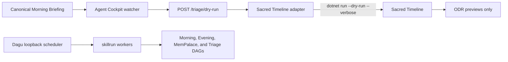

---
type:
  - technical
  - summary
org:
  - Platform-Engineering
created: 2026-09-02
updated: 2026-09-02
tags:
  - agent-cockpit
  - sacred-timeline
  - dagu
  - handoff
  - dry-run
status: active
author:
  - Peter O'Connor
  - ai-assisted
last-reviewed: 2026-09-02
---

# Agent Cockpit Cross-Machine Handoff

## Purpose

This document records the implemented state of the Autonomous Multi-Agent Orchestration plan and the exact safe execution pattern for resuming on another Mac. The system is implementation-complete for local, dry-run-only operation. It MUST NOT perform live Obsidian, TODO, feedback, or notification writes.

## System Model



Agent Cockpit owns orchestration, Dagu scheduling, the loopback web surface, and file watching. `skillrun` remains the atomic worker. Sacred Timeline remains authoritative for the 12 deterministic decision signals, ODR-only classification (`NoOdr`, `QuickCapture`, `Minimal`, `Full`), `DeciderScope`, drafting, and sequential `ODR-###` allocation.

## Repository State

| Repository | Current state | Remote state |
| --- | --- | --- |
| `~/peter_code/agent-cockpit` | Implementation is uncommitted on `main`; all local dry-run composition is complete. | No `origin` is configured and `AvogadroSG1/agent-cockpit` does not exist on GitHub. A private remote MUST be selected or created before this repository can be pushed. |
| `~/peter_code/sacred-timeline` | Uncommitted dry-run command, pipeline behavior, and hermetic integration test changes. | `origin` is configured. |
| `~/peter_code/ai_support` | Uncommitted Morning, Evening, MemPalace, and radiator-triage skill artifacts. The worktree also contains unrelated deletions that MUST NOT be staged or committed with this feature. | `origin` is configured. |

Beads in `agent-cockpit` has the following completion reconciliation pending: `agent-cockpit-py9` (Phase 2), `agent-cockpit-2h9` and `agent-cockpit-dxh` (Phase 3), `agent-cockpit-1cd` (Phase 4), and `agent-cockpit-5ab` (Sacred Timeline adapter) are implemented but currently marked `in_progress`. This handoff document is tracked by `agent-cockpit-v9y` and its required footer by `agent-cockpit-130`.

## Implemented Behavior

- Dagu is configured for `America/New_York` and loopback-only web exposure on `127.0.0.1:8080`.
- Four workflows validate: Morning Radiator, Evening Radiator, MemPalace archival, and radiator triage.
- The web process exposes only `POST /triage/dry-run`; no write-enabled route exists.
- The watcher accepts only a configured absolute canonical briefing path inside the configured vault root, rejects symlinks, watches the briefing parent directory, and handles atomic-save `Create` and `Write` events.
- The Sacred Timeline adapter invokes only `dotnet run ... --dry-run --verbose`. It returns observable previews and propagates command failures.
- Sacred Timeline dry-run retains real detection, classification, scope mapping, drafting, and sequential in-memory ODR allocation while suppressing feedback, aging/archive, ODR, companion, and notification writes.
- Hermetic integration coverage uses fixtures and recording fakes. It does not need credentials, network access, a live vault, Ring Station data, or an LLM provider.

## Required Local Configuration on the Next Mac

The checked-in Dagu plist/configuration currently contains `/Users/avogadro/peter_code/...` paths. Before loading it on another Mac, replace those paths with the new checkout locations. The following values MUST be absolute:

```text
AGENT_COCKPIT_SACRED_TIMELINE_ROOT=/absolute/path/to/sacred-timeline
AGENT_COCKPIT_VAULT_ROOT=/absolute/path/to/ObsidianNotes/Work
AGENT_COCKPIT_BRIEFING_PATH=/absolute/path/to/ObsidianNotes/Work/<canonical-briefing>.md
```

`AGENT_COCKPIT_VAULT_ROOT` and `AGENT_COCKPIT_BRIEFING_PATH` MUST be supplied together. Leave them unset to run the web service without activating the watcher.

The next Mac needs Go, .NET 10, Dagu, and the `skillrun` toolchain. Dagu MUST remain bound to `127.0.0.1`; its initial authentication warning is acceptable only while it is not externally exposed.

## Verification Pattern

Run these checks after cloning and path configuration. They are safe and do not require live data.

```bash
cd ~/peter_code/agent-cockpit
go test ./... -count=1
go test -race -count=1 ./cmd/web
plutil -lint deploy/com.poconnor.agent-cockpit.plist

cd ~/peter_code/sacred-timeline
make test

cd ~/peter_code/ai_support
uv run --with pytest pytest -q skills/productivity/morning-radiator/tests/test_validate_morning_radiator.py
```

Validate each Dagu workflow with the deployed Dagu configuration. Confirm every invocation is still loopback-only and dry-run-only before starting the LaunchAgent.

## Resume Pattern

1. Create or select a **private** remote for `agent-cockpit`, add it as `origin`, then push the scoped commit.
2. Commit and push the scoped Sacred Timeline changes separately.
3. Commit and push only the named skill artifacts in `ai_support`; do not include the unrelated deleted agent/command files.
4. On the next Mac, clone all three repositories, apply the absolute-path configuration, and run the verification pattern.
5. Exercise `POST /triage/dry-run` only against fixtures or a local test briefing first. Review preview output; it MUST NOT write to Obsidian or TODO systems.
6. A real-data pilot requires the Ring Station gold-data location and a deliberate review of generated previews. Write-capable workflows remain a future, explicitly authorized change.

## Known Non-Blocking Conditions

- `ai_support/tools/skillrun` has a pre-existing macOS assertion mismatch between `/var/...` and `/private/var/...` in `internal/runner/TestRunSetsWorkingDirectory`. It is unrelated to this work.
- Dagu emits an initial `auth.mode` warning during structural validation. Do not expose Dagu beyond loopback until authentication is configured and verified.
- Beads uses Dolt and can fail under sandboxed execution because its lock cannot be opened. Run Beads operations in a normal local shell when that occurs.

*Authored By Peter O'Connor with Assistance from Codex (gpt-5) · 2026-09-02 · Cross-machine implementation handoff for Agent Cockpit, Sacred Timeline, and ai_support*
