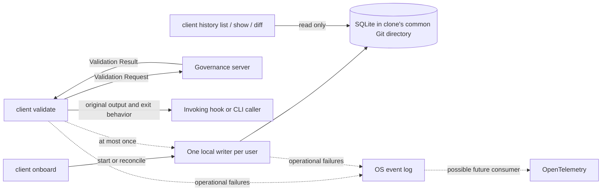

# Repository Validation History Implementation Plan

> For agentic workers: use the executing-plans skill to execute the Beads slices below. Beads is the task tracker; this document specifies behavior and verification. Implementation is present; final verification and slice 7 reviews are pending.

**Goal:** Let a developer or agent inspect submitted source versions, their actual validation verdicts, and explicit comparisons within a local repository clone.

**Architecture:** The client emits a completed validation event at most once to a client-owned local writer. The writer persists SQLite history shared by a clone's worktrees; validation never waits for database persistence. Operational failures go to the OS event stream.

**Tech stack:** Go 1.25 minimum, `database/sql`, `modernc.org/sqlite v1.46.2` with its `modernc.org/libc v1.70.0` dependency, Unix stream IPC, native OS logging, and `github.com/pmezard/go-difflib v1.0.0` for unified diffs. CGO-disabled release and container builds MUST remain supported.

**Tracking:** `calm-poc-f4f7`, with seven dependent implementation slices. [ADR-0011](../adr/0011-client-validation-history-is-downstream-observability.md) records the accepted architectural boundary. The authoritative document is the matching Obsidian draft; the interview transcript is a separate planning draft.

## Accepted scope

- One SQLite database per local Git clone, shared across worktrees. Worktree and branch context belong on each record; separate clones and machines have separate histories.
- Each recorded validation MUST preserve the exact submitted source and received verdict, including speculative dry-run proposals. A passing proposal MUST NOT be described as an applied fix.
- Origin MUST contain invocation source, calling tool, action, and session ID where available. Missing identity MUST remain unknown; neither the server's `local` identity nor Git authorship identifies an agent.
- Observability is downstream with at-most-once delivery. Storage failures, unavailable consumers, or overload MAY lose an event and MUST NOT alter validation stdout, verdict, or exit behavior.
- Attempts without a genuine verdict MUST NOT enter SQLite. Their diagnostics MUST go to the OS event stream; OpenTelemetry export is future work.
- Saved history MUST NOT expire or be automatically pruned. Retention controls, replay, synchronization between machines, dashboards, and automatic inference of fixes are outside step 1.
- `client onboard` MUST start one writer per user on the machine. `client validate` MUST NOT start it or replay events when it is unavailable.
- `client history list`, `show`, and `diff` MUST support JSON. Comparison requires two explicitly selected record IDs.
- Peter approved raising the minimum Go version from 1.22 to 1.25, including alignment of the Docker build.



## Storage and identity

Resolve the worktree with Git, then resolve its absolute common Git directory using `git rev-parse --path-format=absolute --git-common-dir`. The database MUST be `<common-git-dir>/agent-fitness-functions/history.sqlite3`. It is local Git metadata and is not staged or pushed. Removing a linked worktree leaves it intact. Never use the logical governance name in `--repo` as a filesystem path.

Add `--history-worktree` to `client validate` for an explicit checkout path, overriding `AGENT_FITNESS_FUNCTIONS_HISTORY_WORKTREE`. Installed hooks supply their known repository root through that environment variable so older binaries ignore the metadata safely. Without either, use the existing checkout discovery from the file, repository path, and working directory. If no checkout can be established, emit an OS diagnostic and preserve validation behavior. History read commands use `--repo <checkout-path>`, defaulting to the current directory.

Create the history directory with mode 0700 and database with mode 0600. The writer MUST reject symlink targets and MUST write only the fixed history subpath beneath the supplied, validated common Git directory. The IPC endpoint is accessible only to the current user. These local attribution fields are descriptive, not authentication claims.

Use one table. The source is retained inside `request_json` so it is not duplicated in a second content column. `request_json` and `result_json` preserve all submitted and received JSON values before SARIF conversion, including the exact decoded source string; JSON whitespace need not be preserved. Caller output bytes remain unchanged. `file` is a normalized worktree-relative query key; the original path remains in the request. Branch and HEAD MAY be null for detached or unborn checkouts. Renames are not automatically linked.

```sql
CREATE TABLE validation_history (
    sequence INTEGER PRIMARY KEY AUTOINCREMENT,
    event_id TEXT NOT NULL UNIQUE,
    completed_at TEXT NOT NULL,
    recorded_at TEXT NOT NULL,
    repository TEXT NOT NULL,
    worktree TEXT NOT NULL,
    branch TEXT,
    head_oid TEXT,
    file TEXT NOT NULL,
    source TEXT NOT NULL,
    tool TEXT,
    action TEXT,
    session_id TEXT,
    status TEXT NOT NULL CHECK (status IN ('pass', 'advisory', 'block')),
    dry_run INTEGER NOT NULL CHECK (dry_run IN (0, 1)),
    request_json BLOB NOT NULL,
    result_json BLOB NOT NULL
);
CREATE INDEX validation_history_file_sequence
    ON validation_history(file, sequence);
PRAGMA user_version = 1;
```

Generate `event_id` once per invocation from 16 cryptographically random bytes, encoded as hex. Failure to generate history metadata drops history, not validation. Use UTC RFC3339Nano timestamps; `sequence` supplies deterministic arrival order independently of clock adjustments. Identical content in separate invocations produces separate IDs. Insert with parameter bindings and `ON CONFLICT(event_id) DO NOTHING`; never resend a dropped event.

The writer initializes schema version 1 transactionally and enables WAL and `synchronous=FULL`. For each insertion, open that clone's database with one write connection, write once, and close it; no database-handle cache is required. Use `busy_timeout=0` and drop/log an event on a write failure. Readers open an existing database read-only and never initialize, migrate, truncate, or repair it. A newer schema produces a clear read error and writer diagnostic, never destructive recreation. Normal WAL checkpointing is not history expiration.

## Event handoff

Use a Unix stream socket under `<installer.StateRoot>/history/writer.sock`, inside a 0700 directory. `AGENT_FITNESS_FUNCTIONS_HISTORY_SOCKET` MAY override the socket path for isolated tests or long state-root paths. Reject a path that exceeds the platform limit; do not silently use a temporary directory or TCP listener.

Each connection carries one frame: four ASCII bytes `AFH1`, an unsigned 32-bit big-endian payload length, then that many UTF-8 JSON bytes. Every envelope has `version: 1` and `kind`, one of `validation`, `identify`, or `shutdown`. A validation envelope also contains `common_git_dir` and the fields needed for one table row, excluding writer-owned `sequence` and `recorded_at`. Its request and result are embedded JSON values. The maximum encoded envelope is 16 MiB; this is a resource budget, not a guarantee every response near the current 5 MiB request and 10 MiB response limits will fit. Encoding expansion or excess metadata MAY cause the complete event to be dropped.

The publisher uses a nonblocking socket, requests 6 MiB send capacity, and attempts one connection. It continues writes only while they immediately make positive progress. On `EAGAIN`, pending connection establishment, zero progress, another transport error, or excess envelope length, it closes and drops the event. It MUST NOT poll for writability, sleep, retry, read an acknowledgement, create a disk spool, or wait for a goroutine. A denied buffer-size request is a diagnostic/drop, not a validation error. No payload truncation is allowed.

The listener requests 6 MiB receive capacity before accepting connections. Admission is limited to eight concurrent receivers and 64 MiB of reserved frame memory. Reserve the declared length before allocation; reject an event immediately if it cannot be admitted. Receivers may wait up to one second for a complete frame. EOF or timeout before the declared length, invalid JSON/version, trailing content, or inconsistent status/dry-run metadata causes a diagnostic and no insertion. Completed frames enter an eight-event queue without waiting; the writer consumes it serially. Byte reservations remain charged through persistence or discard, preventing an apparently small queue from retaining unbounded source payloads.

A complete frame MAY still be lost before commit. The consumer MUST never turn a partial frame into a row. The producer does not know whether an event was persisted. This is deliberate at-most-once observability.

## Writer lifecycle and diagnostics

Add an internal foreground command, `agent-fitness-functions internal history-writer`. Keep its lifecycle in `internal/historyservice`, independent of `internal/server`. The service receives its state directory from the existing installer state-root resolver and holds a nonblocking OS lock for its entire lifetime. A losing concurrent start exits without unlinking another writer's socket. Only the lock owner may remove an owned stale socket; it MUST reject a regular file or symlink at that path.

`client onboard` starts/reconciles the writer after its existing input, TLS, repository, and governance checks succeed. Writer startup failure is an observability warning and MUST NOT fail otherwise successful onboarding. Control requests contain only `version` and `kind`. An `identify` response uses the same framing and contains `version`, `kind: identity`, `service_name: agent-fitness-functions-history-writer`, `build_revision`, `modified`, `pid`, and `started_at`. A `shutdown` response contains `version`, `kind: shutdown`, and `accepted: true`; it acknowledges admission stopping, not persistence. Validation connections receive no response. Onboard gracefully replaces a known stale writer; it MUST NOT kill a PID found in a file. `doctor` reports an absent or stale writer as a warning and does not repair it implicitly.

On shutdown, stop admission, cancel receiver work, request cancellation of the active write, release buffers, close the database and socket, and release the ownership lock. Volatile queued events MAY be lost. Lifecycle commands stop waiting after five seconds and report a warning; cancellation cannot guarantee interruption of blocked filesystem I/O. If the old writer still holds its lock, onboard MUST NOT start a replacement. The authorized uninstall path MUST stop a verified local writer before removing its executable and MUST leave every clone's database intact; if shutdown cannot be confirmed, preserve the executable and report the incomplete uninstall. Wire this at the command composition boundary without making `internal/installer` depend on `internal/client` or `internal/server`.

Send operational diagnostics through a focused `internal/osevent` adapter. On macOS and Linux, invoke the native `logger` program directly with fixed arguments, without a shell. The short-lived validation client starts the helper once and releases its process handle without waiting for log persistence or spawning an unjoined Go logging goroutine. The persistent writer MUST reap its logging helpers: it MAY run and wait for a helper with a one-second context timeout on its consumer error path, independently of validation. Resolve the logger executable once per process. Failure to start it is dropped without recursive logging. The macOS adapter MUST NOT use Go's `log/syslog`, which no longer works there.

Diagnostic fields are event name, UTC time, error kind, phase, event ID if available, and relevant repository/worktree/tool/session context. Do not log submitted source, raw hook payloads, authorization material, or arbitrary server response bodies to the OS stream. Existing validation output for the caller remains unchanged. OS routing takes precedence over the generic stdout-logging guideline for this feature; OpenTelemetry SDKs/exporters are not added.

## Capture and CLI behavior

Integrate the event emission into `internal/client/client.go` after a genuine response is available. Capture request bytes from the same serialization used by `postCheck`; preserve result bytes before formatting. A history-only decoding or metadata failure MUST NOT change existing client behavior. Record pass, advisory, and block results only when `warming` is false. Keep the existing server wire contract unchanged.

Dry-run agent proposals enter local history while still leaving server outstanding-violation state untouched. Doctor's synthetic probe bypasses capture. Connection failures, timeouts, invalid responses, and `warming: true` use OS diagnostics and produce no history row. Do not fetch a later verdict, retry validation for history, or infer a result from server state.

Installed hooks pass invocation source and checkout explicitly through `AGENT_FITNESS_FUNCTIONS_HISTORY_WORKTREE`, `_SOURCE`, `_TOOL`, `_ACTION`, and `_SESSION_ID` (all names share the full `AGENT_FITNESS_FUNCTIONS_HISTORY` prefix). New optional CLI flags `--history-source`, `--history-tool`, `--history-action`, and `--history-session-id` override these values for manual calls. Installed hooks MUST use environment variables, which older binaries ignore, without introducing new validation retries or changing existing compatibility fallback. Codex and Claude Code receive different tool labels from their generated configuration; propagate the hook payload's `session_id` and `tool_name` where supplied. OpenCode propagates `input.sessionID` from `tool.execute.before` when present; unavailable fields stay null. Git pre-commit and pre-push hooks label their respective actions and preserve staged/committed-content selection. Manual invocations default to source `manual`, tool/session unknown. Keep both embedded and repository hook copies consistent and preserve hook composition.

```text
agent-fitness-functions client history list [--repo PATH] [--file PATH]
    [--session ID] [--worktree PATH] [--limit 50] [--before SEQUENCE] [--format json]
agent-fitness-functions client history show EVENT_ID [--repo PATH] [--format json]
agent-fitness-functions client history diff FROM_ID TO_ID [--repo PATH] [--format json]
```

List newest recorded entries first by `sequence DESC`. JSON is an object containing `records` and `next_before`; list omits source payloads. Show includes parsed request/result and metadata. Diff contains both record contexts, both verdicts, and a unified diff of submitted source. Use three context lines and stable labels containing the record ID and file. Diff requires the same normalized file; explicit comparison across worktrees is allowed. Labels identify proposals and MUST NOT claim a fix was applied. No automatic pairing is implemented.

Read commands MUST work with the writer stopped. An absent database yields an empty list without creating files; show/diff with an absent ID return a not-found error. Identical versions produce an empty diff. A nonempty diff is successful inspection, so it exits zero. Invalid flags or unlike-file comparison exit two; unavailable/corrupt storage and missing records exit one. Capture-related failures never change `client validate` exit behavior.

## Delivery slices and file ownership

Run the following slices in dependency order. Each slice MUST begin with its failing behavioral test, demonstrate the intended red failure, implement the stated contract, run the targeted tests to green, refactor, and commit the scoped result. Reviews dispatched for a slice MUST finish and have feedback addressed before advancing. Keep commits reviewable and aim for PRs below 300 changed lines; split a slice into additional red/green commits when necessary.

### 1. Contracts, paths, and Go baseline — calm-poc-f4f7.1

Modify `go.mod`, `go.sum`, and the Go builder stage in `Dockerfile`. Set minimum Go 1.25.0 and use the verified official `golang:1.25-alpine` builder tag; pin its resolved digest when implementing. Verify with Go 1.25.14 as the compatibility toolchain. Pin the SQLite driver and matching libc versions stated above. Create `internal/history/event.go`, `paths.go`, `event_test.go`, and `paths_test.go`.

BDD: given a main checkout and linked worktree, both resolve the same database; a separate clone resolves another. Detached/unborn metadata remains explicit. A logical governance name never becomes a storage directory. An invalid envelope or warming response is ineligible. Run `go test ./internal/history` before and after implementing these contracts.

### 2. SQLite writer and readers — calm-poc-f4f7.2

Create `internal/history/schema.sql`, `store.go`, `reader.go`, and `store_test.go`. Embed the schema above. Implement transactional initialization, one parameterized insert with event-ID uniqueness, read-only queries, and schema-version checks. Register the SQLite driver at the composition root or through a concrete driver connector rather than unrelated package initialization.

BDD: given an event, after insert and database reopen its request/result values, source string, and metadata are unchanged. Repeating the event ID produces one row; a second invocation with identical content produces a second row. A reader creates no database. A write lock, corrupt database, or newer schema causes a classified error without deletion. Run `go test ./internal/history -run 'TestHistoryStore|TestHistoryReader'` red, then green.

### 3. IPC and OS logging — calm-poc-f4f7.3

Create `internal/historyipc/{publish_unix.go,receive.go,protocol.go,protocol_test.go,publish_unix_test.go}` and `internal/osevent/{logger_unix.go,logger_test.go}`. Platform files MUST use `//go:build darwin || linux`; a `_unix.go` suffix alone does not select a Go platform. Implement the exact framing, single-attempt nonblocking publication, memory reservations, receiver deadlines, and native logging contract above. Keep nonblocking system calls behind a small injectable transport boundary so tests can force partial writes and `EAGAIN` deterministically.

BDD: given a stopped receiver, publication returns without a storage dependency; given a partial frame, no consumer record is produced; given a complete large frame, the received bytes match; given exhausted admission capacity, the event is dropped. A fake logger records exact arguments and proves no shell, source payload, retry, or validation-side wait is used; persistent-service tests prove helpers are reaped. Run `go test ./internal/historyipc ./internal/osevent` red/green, then the Unix integration tests on macOS and Linux.

### 4. Local writer lifecycle — calm-poc-f4f7.4

Create `internal/historyservice/{service.go,lifecycle.go,service_test.go,lifecycle_test.go}` and `internal/client/historyruntime.go`. Modify `cmd/agent-fitness-functions/main.go`, `internal/client/onboard.go`, and `doctor.go`; add lifecycle tests at those boundaries. Implement ownership lock, control messages, bounded receivers/queue, sole-writer dispatch with one database opened per insert, startup, identity checks, graceful replacement, and uninstall integration.

BDD: concurrent onboards start one writer; a foreign file at the endpoint is preserved; stale owned sockets recover; writer failure does not fail successful governance onboarding; remote governance starts only a local history writer for this feature; shutdown releases resources; uninstall preserves databases. Run `go test ./internal/historyservice ./internal/client ./cmd/agent-fitness-functions` red/green, then targeted race tests.

### 5. Client and hook capture — calm-poc-f4f7.5

Create `internal/client/{historycapture.go,historycapture_test.go}`. Modify `client.go`, embedded `hookassets/{pre-tool-use.sh,pre-commit.sh,pre-push.sh,opencode-plugin.js}`, and matching `hooks/` copies. Extend existing Codex, Claude, OpenCode, portability, composition, and scheme-fallback tests. Use focused helpers; do not restructure the unrelated client command implementation.

BDD: pass/advisory/block produce one eligible event; dry-run is recorded locally but never updates server outstanding violations; a timeout, malformed response, or warming response produces no history event; missing identity stays null; disabled/failed publication leaves exact stdout bytes and exit behavior unchanged. Older binaries ignore the new environment metadata and receive no new flags; existing compatibility fallback MUST preserve dry-run semantics and enforcement behavior. Run `go test ./internal/client ./hooks ./cmd/agent-fitness-functions` red/green.

### 6. Read and diff commands — calm-poc-f4f7.6

Create `internal/client/{history.go,history_test.go}` and `internal/history/{diff.go,diff_test.go}`. Add the `history` branch to the existing client command switch and update help tests. Implement the specified flags, JSON envelopes, stable pagination, three-line unified diff, context labels, and exit codes. Pin `go-difflib v1.0.0`; do not implement a custom diff algorithm.

BDD: two explicit IDs yield the expected source diff and their distinct contexts; a same-source comparison is empty; a difference consisting only of the final newline remains visible; a stopped writer does not affect reads; absent history is empty without mutation; missing IDs and unlike files fail clearly. Preserve original line endings when preparing the diff: the library's `SplitLines` helper appends a newline and would hide that distinction. Run `go test ./internal/history ./internal/client ./cmd/agent-fitness-functions` red/green.

### 7. End-to-end verification and contributor documentation — calm-poc-f4f7.7

Add `internal/client/history_integration_test.go` using a fixture governance endpoint and the real child writer. Update `docs/quickstart-0-to-governed.md`, `docs/runbooks/onboard-new-repository.md`, `docs/spec/engineering-spec.md`, `CONTEXT.md`, and the repository contributor rules where the new commands and build minimum belong. Mirror substantive contributor-rule edits to `CLAUDE.md` when present, per repository guidance.

```gherkin
Scenario: Inspect a revised proposal across worktrees
  Given two worktrees of one clone and a running history writer
  When one proposal receives block and a revised proposal receives pass
  Then both records expose their submitted versions, verdicts, and origins
  And either worktree can list them and explicitly compare their IDs
  And the passing record is still labeled as a proposal

Scenario: Observability cannot gate validation
  Given the history database is write-locked or the writer is unavailable
  When a validation receives block
  Then its output and exit behavior match validation without history
  And no retry, startup, replay, or wait for persistence occurs

Scenario: A timeout has no validation verdict
  When the governance server times out
  Then the existing client failure reaches its caller unchanged
  And no SQLite history row is created
  And an operational event is sent once to the OS logging adapter
```

Also cover warmup exclusion, duplicate delivery, truncated frames, writer restart, removal of a linked worktree, byte-preserving empty/Unicode source, cross-clone isolation, Git staged-content accuracy, read-only behavior, and no expiration. Timing tests MUST use synchronization to prove absence of a dependency rather than a fragile latency threshold.

## Verification and handoff

From the repository root, use its documented caches. The feature is not complete until all relevant tests, native logging read-back, and both Unix-platform integration runs have evidence. Run checks at the minimum toolchain as well as the regular local toolchain; do not infer compatibility from the workstation's newer Go.

```bash
GOTOOLCHAIN=go1.25.14 GOCACHE="$PWD/.tmp/go-build" GOMODCACHE="$PWD/.tmp/go-mod" go test ./...
GOCACHE="$PWD/.tmp/go-build" GOMODCACHE="$PWD/.tmp/go-mod" go test . ./configs ./cmd/agent-fitness-functions ./internal/server
GOCACHE="$PWD/.tmp/go-build" GOMODCACHE="$PWD/.tmp/go-mod" go test -race ./internal/history ./internal/historyipc ./internal/historyservice ./internal/osevent ./internal/client
CGO_ENABLED=0 GOCACHE="$PWD/.tmp/go-build" GOMODCACHE="$PWD/.tmp/go-mod" go build ./cmd/agent-fitness-functions
git diff --check
```

Run container-contract tests and the documented Docker build with its pinned builder. Preserve the repository's known external test prerequisites: CALM CLI, radon, and the required .NET SDK. Tests MUST use fixture repositories and governed-file contents, not live vaults, credentials, or production server changes.

Planning evidence: the saved macOS probe delivered complete 1 KiB through 5 MiB payloads while reads were paused; a paused 15 MiB send returned `EAGAIN` after a partial send, supporting complete-frame rejection. A tagged native `logger` event was read back from the macOS event log. These probes are not product tests, do not cover Linux, and do not establish a latency or delivery guarantee. Source and results are saved under `~/peter_code/scratch_work/repository_validation_history_code/`.

The specification review preceded implementation. Slices 1–6 are implemented with their dispatched specification and quality reviews addressed. Slice 7 adds real CLI/writer integration scenarios and contributor documentation; its final platform verification and reviews remain pending. Use Beads for current execution status. Follow the repository's scoped commit/push protocol and required co-authors. No deployment, live governance restart, or installed-hook update is part of this implementation session.

Verification recorded on 2026-09-06: full `go test ./...` with Go 1.25.14, the normal
local-toolchain repository gate, `go vet ./...`, the history/client race gate, and
the CGO-disabled minimum-toolchain binary build passed. The corrected product
Docker image built successfully and passed its Node/CALM runtime contract. Final
slice 7 cross-platform integration and specification/quality review remain pending.

## Primary references

- [SQLite driver manifest](https://proxy.golang.org/modernc.org/sqlite/@v/v1.46.2.mod) and [driver changelog](https://gitlab.com/cznic/sqlite/-/blob/master/CHANGELOG.md): Go requirement, matching libc, SQLite version.
- [SQLite WAL documentation](https://www.sqlite.org/wal.html): concurrency, sidecar files, checkpointing, and fixed WAL-reset versions.
- [Apple logging](https://developer.apple.com/documentation/os/logging/): native OS event stream; the local `logger(1)` manual and read-back probe verify the adapter route on this Mac.
- [Git path resolution](https://git-scm.com/docs/git-rev-parse): common directory and worktree path semantics.
- [Claude Code hook inputs](https://code.claude.com/docs/en/hooks) and [Codex input schema](https://github.com/openai/codex/blob/main/codex-rs/hooks/schema/generated/pre-tool-use.command.input.schema.json): supplied identity fields; preserve unknown values when absent.
- [OpenCode plugin hook types](https://github.com/anomalyco/opencode/blob/dev/packages/plugin/src/index.ts): `tool.execute.before` exposes `sessionID`.
- [go-difflib v1.0.0 source](https://github.com/pmezard/go-difflib/blob/v1.0.0/difflib/difflib.go): unified-diff API and newline behavior.

*Authored By Peter O'Connor with Assistance from Codex (gpt-6) · 2026-09-06 · Repository validation history implementation plan*
