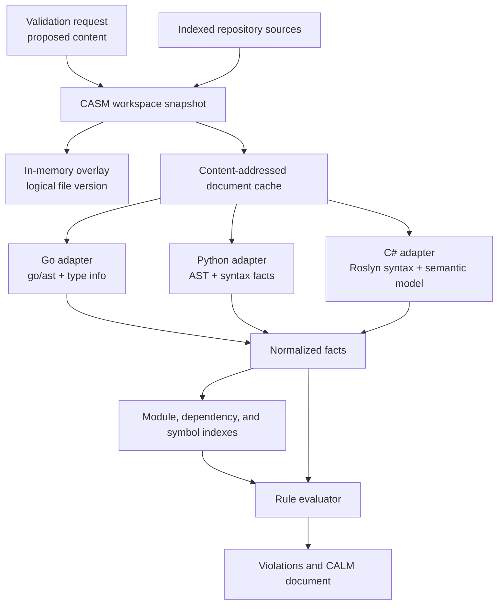

# Draft: Shared Abstract Syntax Model for Fitness Rules

## Status

Proposed implementation plan. This document intentionally makes no runtime
behavior change.

## Problem

The server receives one proposed file at a time, writes it to a temporary
file, invokes a language-specific analyzer, and retains only an
`analyzer.AnalysisResult`. Its parse tree and any semantic state are discarded
after that check. Consequently a new request reparses the proposal and, for
Go, reparses every peer source file in the directory before it can aggregate
module metrics.

The `baseline` command has a separate repository traversal and dispatch path.
It eventually calls the same exported file analyzers as the server, but it
does not share the server's proposed-file overlay, parser results, module
membership, or project context. Python makes one useful exception: its
findings scanner is explicitly shared by the Radon API and standalone scanner
paths. This plan must preserve that kind of reuse rather than claiming that
all analyzer code is duplicated.

### Evidence in the current implementation

| Observation | Evidence | Consequence |
| --- | --- | --- |
| Request analysis is temporary and per-file. | `Checker.writeProposedContent` creates `calm-check-*`; `Checker.analyzeSource` selects a `SourceAnalyzer`. | A subsequent request cannot reuse the proposal's parsed form. |
| Go reparses context on each check. | `analyzeGoWithModuleContext` calls `AnalyzeGoFile` for the proposal and each collected peer, then calls `AggregateModuleMetrics`. | The same unchanged peers are parsed repeatedly. |
| Repository and request orchestration are duplicated. | `AnalyzeRepository` dispatches Go/Python/C# separately from `Checker.sourceAnalyzer`. | New language/context behavior must be aligned in two orchestration locations. |
| Python scanner logic is not duplicated. | `pythonFindingsLibrary` is prepended to both `radonAPIScript` and `pythonFindingsScript`. | Retain this shared detector implementation during migration. |
| Existing aggregation identity is not a repository identity. | `AnalyzeGoFile` sets `CALMNode` to the Go package name; `AggregateModuleMetrics` groups only by `CALMNode`. | A repository-scale model must key modules by repository-relative path plus language/project identity, not only package name. |

## Fitness-function critique of the current design

I ran the product's `baseline` command against this repository's Go source:

```text
agent-fitness-functions baseline --repo . --language go --output .tmp/shared-ast-design-baseline.json
```

It analyzed 515 files and 8,120 functions. The resulting P90 cyclomatic
complexity was 4, while the P90 public-method count was 3,837. This is not a
pass/fail verdict: baseline calibrates distributions, and the current fitness
functions are predominantly intra-file. It is nevertheless a useful
system-level signal: a module-level metric is being distributed over many
per-file results, and the module key is too coarse for a whole-repository
architectural interpretation. The redesign uses a snapshot-owned module index
so interface-width and implementation-depth are evaluated over an explicit
module boundary.

## Proposed solution: a Central Abstract Syntax Model (CASM)

CASM is a versioned, repository-scoped analysis workspace. It is **not** an
attempt to force Go AST, Python AST, and Roslyn syntax trees into one in-memory
node type. Those native representations have different semantics, lifetimes,
and type systems.

Instead, CASM owns immutable source snapshots, language-native parse handles,
and a normalized semantic fact graph. A rule consumes a read-only snapshot
view and asks for capabilities such as declarations, imports, calls, symbols,
types, control flow, or module membership. Language adapters populate those
capabilities from their native parser/compiler APIs.



### Core data model

```go
type SnapshotKey struct {
    RepositoryID       string
    ProjectContextHash string // go.mod, csproj, interpreter/config versions
    OverlayVersion     string
}

type DocumentKey struct {
    RelativePath string
    Language     string
    ContentHash  string
    ParserVersion string
}

type SnapshotView interface {
    Document(DocumentKey) (DocumentView, bool)
    ModuleFor(path string) ModuleID
    Facts(scope Scope, needs ...Capability) FactIterator
}

type Rule interface {
    Requirements() RuleRequirements
    Evaluate(SnapshotView) []analyzer.Finding
}
```

`DocumentView` may retain a private native parse handle, but only its owning
adapter may inspect it. Rules receive normalized, location-preserving facts;
this makes a single rule contract usable for Go, Python, and C# without
pretending that their AST node taxonomies are equivalent.

### Rule execution tiers

1. **File syntax tier**: complexity, ordering, basic import and call-pattern
   checks. Recompute only the changed document.
2. **Module tier**: interface width and implementation depth. Recompute the
   affected module aggregate using unchanged cached document facts.
3. **Repository semantic tier**: layer sovereignty, resolved dependency
   rules, and later cross-file temporal/SQL rules. Recompute only affected
   index shards.

The first delivery can reuse the native parsers as they are. It should use
content-hash caching before attempting language-specific incremental parsing.
This reduces repeated parsing safely and establishes correct invalidation
behavior first.

## How CASM reduces complexity

- One snapshot/overlay mechanism replaces the server's temporary-file context
  gap and lets baseline and `/check` share the same analysis coordinator.
- One rule-planning interface replaces rules knowing which language pipeline
  supplied a metric or finding.
- Module identity becomes explicit and path-qualified, preventing accidental
  aggregation across unrelated packages with the same name.
- Parser/tool lifetime becomes an adapter concern. Python can retain its
  shared scanner library; C# can later use a long-lived Roslyn worker; Go can
  cache native parse results.
- Cache invalidation is centralized and auditable: source-content, parser,
  project-context, and rule-version changes all produce new keys.

## Tree-sitter comparison

[Tree-sitter](https://tree-sitter.github.io/tree-sitter/) is a parser generator
and incremental parsing library that updates a concrete syntax tree efficiently
after edits. Its [query language](https://tree-sitter.github.io/tree-sitter/using-parsers/queries/1-syntax.html)
matches grammar-specific tree structures. CASM should borrow its
versioned-document and incremental-update ideas, but not make Tree-sitter the
governance source of truth.

| Dimension | CASM | Tree-sitter |
| --- | --- | --- |
| Primary scope | Repository snapshot with an overlay | One source file's concrete syntax tree |
| Cross-source rules | Module/dependency/symbol indexes are first-class | Outside the core parser model |
| Rule representation | Language-neutral facts plus adapter-specific extractors | Grammar-specific structural queries |
| Semantic/type information | Provided by native adapter where available | Not provided by concrete syntax alone |
| Incrementality | Content-addressed reuse first; native incrementality optional | Structural sharing after an edited tree is reparsed |

Tree-sitter could later be an optional fast prefilter for syntax-only rules or
additional languages. It should not replace Go's parser/type checker or
Roslyn where rule correctness depends on resolved symbols or project context.

## Delivery plan

1. Add `internal/workspace` with immutable document keys, overlay snapshots,
   and a bounded in-memory cache. No rule behavior changes.
2. Define `LanguageAdapter` and migrate the existing Go/Python/C# analyzer
   entry points behind it. Keep `AnalysisResult` as a compatibility output.
3. Extract normalized facts beside current metrics/findings. Add parity tests:
   legacy and CASM paths must yield identical current violations.
4. Introduce path-qualified module identity and migrate Go aggregation. Add
   tests with identical package names in different directories.
5. Change `/check` and `baseline` to call one shared analysis coordinator;
   retain adapters as the only language-specific dispatch point.
6. Migrate the five metric rules to tiered fact consumption, then the four
   opt-in generalized rules. Profile before introducing persistent Python or
   Roslyn workers.
7. Add cache bounds, explicit invalidation tests, telemetry for hit/miss and
   parse duration, and a feature flag with immediate legacy fallback.

## Acceptance criteria

- A request overlay never reads or writes the proposed content into the
  repository and cannot be observed by another repository or request.
- An unchanged peer file is not reparsed while evaluating a second overlay in
  the same module.
- Baseline and `/check` use one coordinator and produce the same result for a
  matching repository snapshot.
- Current fixtures preserve verdict and location parity for Go, Python, and
  C#.
- Modules with the same package/namespace name in distinct directories remain
  distinct aggregation units.
- Cache keys include parser, rule, and project-context versions; eviction
  cannot change a verdict.

## Risks and decisions needed

- **Memory:** native trees and semantic models can be expensive. Start with
  facts cached broadly and native handles cached only under a strict budget.
- **Python semantics:** the present scanner is syntax-focused. Decide whether
  cross-file Python rules need name resolution before adding a semantic worker.
- **C# availability:** Roslyn project loads may dominate latency. Keep the
  existing CLI adapter as the fallback while validating a persistent worker.
- **Rule ownership:** choose whether rules are pure Go over facts, declarative
  specifications compiled by adapters, or a hybrid. The recommended starting
  point is pure Go rules plus adapter-owned fact extraction.
