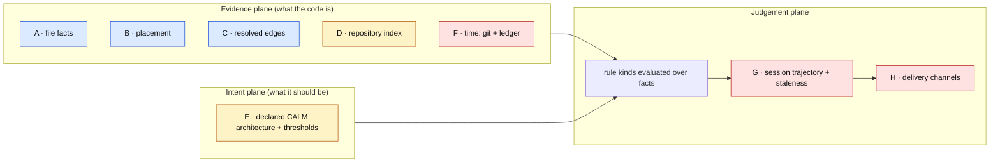
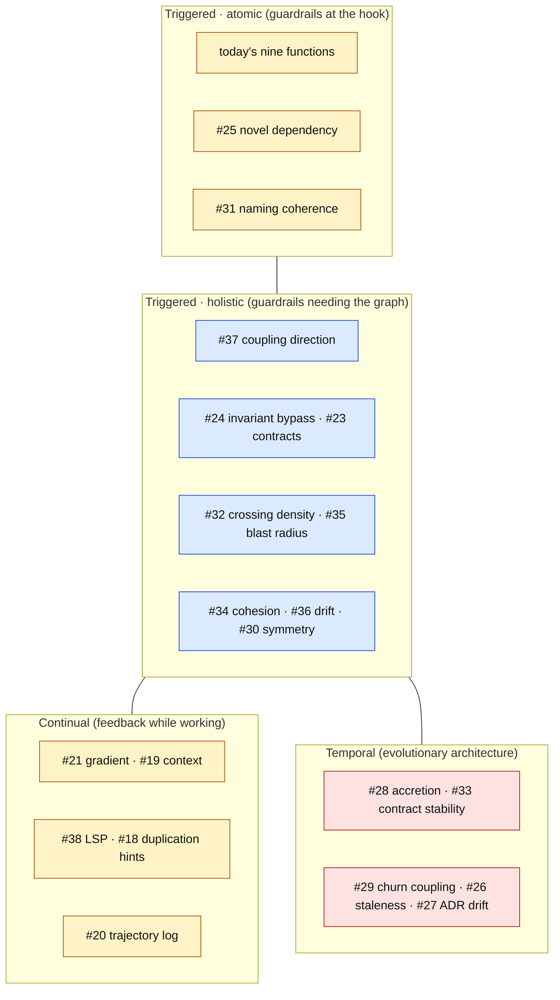
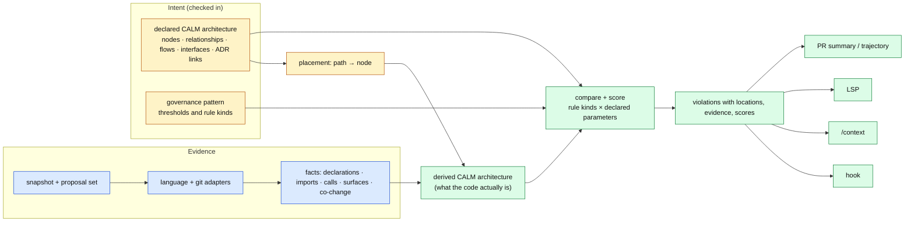
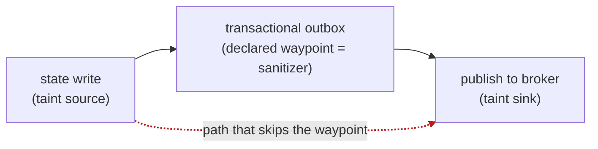
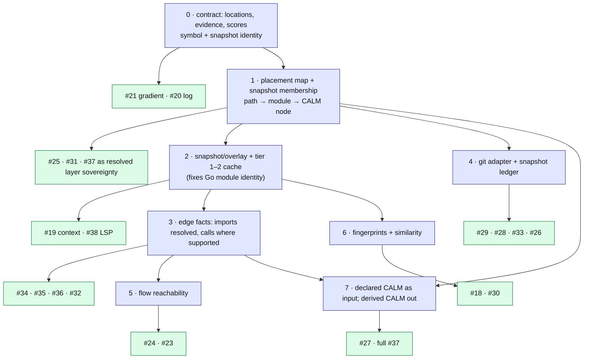

# Research: Pressure test of the Shared Abstract Syntax Model (PR #39) against the AFF catalog (#18–#38)

## Status

Discussion document. It changes no runtime behaviour and is not a plan of
record. Its purpose is to sharpen the two documents in PR #39
(`docs/plans/2026-09-08-shared-abstract-syntax-model.md` and
`docs/research/shared-ast-static-analysis-landscape.md`) by testing them
against the fitness functions the issue tracker says we want to build.

Vocabulary: **CASM** is the Central Abstract Syntax Model proposed in PR #39.
**The catalog** is GitHub issues #18–#38 (beads `calm-poc-ck8` and the
structural, intent, temporal, and pattern-contract guardrails listed in
`docs/handoffs/observability-fitness-functions.md`).

## TL;DR

- **CASM is the right substrate for roughly half the catalog** — every
  guardrail that needs resolved import or call edges between modules (#23,
  #24, #25, #32, #34, #35, #36, #37) and the two that need a repository symbol
  index (#18, #30). None of those can be built on the per-file pipeline.
- **CASM is necessary but not sufficient for the architecture-level
  guardrails.** Thirteen of the nineteen issues take their parameters from a
  *declared* architecture: allowed relationships, mandatory flows, ADR links,
  stable interfaces, vocabularies. PR #39 names a "governance architecture
  map" but never defines it. The missing input is the CALM architecture
  document itself.
- **Four issues need time, not syntax** (#26, #28, #29, #33). CASM's
  bounded in-memory cache cannot answer "how did this module change over the
  last forty commits". A git adapter and a per-snapshot metrics ledger are a
  separate, cheaper investment.
- **The gradient slices (#19, #20, #21, #38) do not need CASM; they need
  CASM's keys.** Symbol identity and snapshot identity should be designed now
  and reused later, so the tracer bullet does not have to be rebuilt.
- **PR #39's own evidence needs correcting.** The baseline it cites walked
  the Go module cache, and the Go peer-aggregation path it proposes to cache
  does not execute under the ADR-0007 daemon. Both critiques survive on clean
  evidence, and both point at the same undefined input: *where the daemon
  gets the repository from*.
- **Recommended direction:** keep CASM's snapshot, overlay, adapter, and
  fact design, but frame the product as *derive the actual CALM architecture
  from facts and validate it against the declared CALM architecture*. That
  gives the FINOS CALM CLI a real job (today it validates a synthetic two-node
  document) and hosts most of the catalog as pattern constraints instead of
  bespoke Go.

## 1. Ground-truth checks on PR #39's evidence

Every claim below was reproduced on this branch (`main` at `1ac08c4`) with a
binary built from source.

### 1.1 The baseline critique measured the module cache

PR #39 reports a Go baseline of 515 files, 8,120 functions, and a P90
public-method count of 3,837, and concludes that "the module key is too
coarse". The conclusion is right; the numbers are not this repository's.

| Run | Files | Functions | P90 CC | P90 public methods |
| --- | ---: | ---: | ---: | ---: |
| PR #39 (as cited) | 515 | 8,120 | 4 | 3,837 |
| Clean tree, no `.tmp/` | 84 | 1,179 | 8 | 47 |

`analyzer.DiscoverGoFiles` skips only `.git`, `.worktrees`, `vendor`, and
`node_modules`. `CLAUDE.md` tells every contributor to build with
`GOMODCACHE=$(pwd)/.tmp/go-mod`. Once that cache exists the walker enters it:
on this branch it holds 1,963 non-test dependency files (298 in
`golang.org/x/sys/unix` alone), and because `AggregateModuleMetrics` keys by
bare package name, every exported function in `unix` lands on one module.
That is where a P90 of 3,837 comes from. On this machine the same run aborts
on Go toolchain parser test data, which is why the PR's author saw a smaller,
non-aborting subset.

Consequence for CASM: **snapshot membership must be defined.** The
acceptance criteria say what an overlay must not do but never say which files
a snapshot contains. "Tracked and unignored files of the worktree, as Git
sees them" is the only definition that survives `.tmp/`, `.venv/`, and
`bin/obj/` alike.

### 1.2 The Go peer-aggregation path is dead code under ADR-0007

PR #39's first table row says "Go reparses context on each check" and the
delivery plan caches it. The reparse exists in the source, but it does not
run in the deployed configuration:

- `Checker.Check` canonicalises `request.Repo` to the bare governance key
  (`loadConfig` returns `repoName`, e.g. `agent-fitness-functions`).
- `analyzeGoWithModuleContext` then does `filepath.Join(request.Repo,
  request.File)` and lists that directory. The result is a path relative to
  the **daemon process's working directory**.
- `client onboard` starts the daemon with `exec.Command` and never sets a
  working directory, so the daemon inherits whatever directory the hook or
  wizard happened to run in. `os.ReadDir` fails and the function returns the
  proposed file alone (`if err != nil { return proposed, nil }`).

Corroboration from the clean baseline: under package-name aggregation,
`server` exposes 47 exported functions and `client` 25, both above the
interface-width limit of 20, yet this repository governs itself in `block`
mode with `interface-width` enabled and its edits pass. The aggregation
cannot be firing. In practice all nine fitness functions are per-file today,
exactly as `CONTEXT.md` claims — for the wrong reason.

Consequence for CASM: the cache is not the missing piece; **the repository
handle is.** The plan's diagram has an "Indexed repository sources" box with
no arrow into it. Section 5.2 proposes what that arrow should be.

### 1.3 Module identity: confirmed, with an in-repo example

The clean baseline merges `fixtures/green/go` and `fixtures/violations/go`
into one module named `demo` (8 files, 28 exported functions). That is the
PR's "same package name in different directories" hazard, live on `main`. The
proposed path-qualified module identity fixes it, but note the second half of
the problem: **a path-qualified Go package is still not a CALM node.** The
catalog's guardrails are all phrased per CALM node, and nothing in the
repository maps paths to nodes today (`layer-sovereignty` config comes
closest with its `paths` globs).

### 1.4 Thresholds were calibrated at file scope

`docs/threshold-calibration.md` derived interface-width ≤ 20 from repository
P90s of the *baseline* results, which for Python and C# are per-file counts
and for Go are per-package counts that, per 1.2, never apply at request
time. PR #39 says a threshold "must be recalibrated per layer"; the
calibration record does not yet say which layer each threshold belongs to.
Any module-tier migration has to restate that before it can be turned on in
`block` mode, or the first Go repository onboarded will block on its largest
package.

## 2. What the catalog actually needs

The nineteen issues decompose into eight capabilities. Only the first four
are what PR #39 describes.

| Key | Capability | Example question it answers |
| --- | --- | --- |
| **A** | File facts (syntax tier) | How complex is this function? Which identifiers and string literals does it contain? |
| **B** | Placement: path → module → CALM node | Which node does `payments/handler.go` belong to? |
| **C** | Resolved edges between modules | Which nodes does this file import or call, and who depends on this interface? |
| **D** | Repository index: symbols, per-function fingerprints | Does a structurally similar function already exist anywhere in the repo? |
| **E** | Declared intent: the CALM architecture (nodes, relationships, flows, interfaces, ADR links, vocabularies) plus thresholds | Is `payments → shipping` an allowed edge? Must writes pass through the outbox? |
| **F** | Time: git history and a per-snapshot ledger of module metrics and interface shapes | Did this module's interior grow 40% while its interface stood still? Which files co-change? |
| **G** | Session: score trajectory per agent session, staleness of evidence | Did the second edit reduce the score the first edit raised? Is the index behind `main`? |
| **H** | Delivery: hook output, `GET /context`, LSP diagnostics, PR summary, trajectory log | Does the signal actually reach the agent or the human? |

Blue is what PR #39 designs. Amber is named but undefined (the "governance
architecture map"; indexes without fingerprints). Red is absent.

### 2.1 Issue-by-issue requirements

| Issue | Guardrail | Needs | CASM as written | Verdict |
| --- | --- | --- | --- | --- |
| #18 | Cross-file duplication warnings | A D G H | index yes, fingerprints no | partial |
| #19 | Upfront `GET /context` | A B G H | one coordinator for `/check` and `baseline` enables it | strong |
| #20 | Trajectory log + PR summary | G H | out of scope | none |
| #21 | Complexity gradient after each edit | A G H | overlay versioning is the natural key | keys only |
| #22 | Gradient epic | — | — | — |
| #23 | Consistency pattern contracts | C E | calls yes, flows no | partial |
| #24 | Invariant bypass detection | C E | calls yes, reachability and flows no | partial |
| #25 | Novel dependency justification | A B D E | import facts + module index yes, ADR links no | strong |
| #26 | Architectural staleness | C E F | edges yes, model history no | partial |
| #27 | ADR drift | C E H | facts yes, executable invariants undefined | partial |
| #28 | Accretion rate | B F | no ledger | none |
| #29 | Churn-coupling correlation | B F | no git adapter | none (git only) |
| #30 | Symmetry / semantic duplication | A D E | declarations yes, fingerprints and pattern declarations no | partial |
| #31 | Naming coherence | A B E | identifiers derivable, vocabularies no | partial (cheap) |
| #32 | Boundary crossing density | C E | call graph yes, entry points no | partial |
| #33 | Contract stability gate | A B E F | exported declarations yes, previous shape no | partial (cheap) |
| #34 | Cohesion decay | B C | intra-module call graph | strong |
| #35 | Change propagation risk | B C | reverse dependency index | strong |
| #36 | Responsibility drift | B C E | edges yes, node profiles no | strong |
| #37 | Coupling direction | B C E | this is PR #39's own "layer sovereignty v2" | strong |
| #38 | LSP diagnostics | A G H | document cache is the LSP model | keys only |

Counting the columns:

| Capability | Issues that need it | Covered by CASM as written |
| --- | ---: | --- |
| C resolved edges | 9 | yes |
| D repository index | 4 | half (no fingerprints) |
| E declared intent | 13 | named, not defined |
| F time | 4 | no |
| G session / staleness | 5 | no |

### 2.2 The catalog on the fitness-function taxonomy

Ford, Parsons, and Kua classify fitness functions as atomic or holistic,
triggered or continual, static or dynamic, and temporal. The catalog's own
labels — guardrails, feedback, evolutionary architecture — map onto that
grid, and so does the coverage gap.

CASM is a design for the holistic-triggered quadrant. The continual quadrant
needs its keys; the temporal quadrant needs something CASM does not contain.

## 3. Where the overlap is exact

Three places where the PR and the catalog describe the same thing under
different names, and should be merged rather than built twice.

1. **#37 coupling direction is PR #39's layer-sovereignty migration.** The
   research document's step 4 ("replace raw-string matches with resolved
   dependency edges, reporting both source and target locations") is the
   whole of #37. The only addition #37 makes is that the allowed edges come
   from the CALM model rather than from `forbidden-patterns` regexes. Treat
   #37 as the acceptance test for CASM's edge facts.
2. **#19 `GET /context` is the "one coordinator" acceptance criterion made
   visible.** "Baseline and `/check` use one coordinator" is unobservable
   from outside; a `/context` endpoint that returns hotspot scores for a
   scope *is* the baseline, served from the cache. Make #19 the proof of that
   criterion.
3. **#18's staleness hedge is CASM's snapshot key, spoken aloud.** "You may be
   out of sync with `main`" is what a verdict says when its evidence
   snapshot is older than the working tree. Section 5.5 argues this should be
   a field on every cross-file violation, not a message style.

## 4. Precedents in the wild, and what to take from each

PR #39 compares CASM with CodeQL, Semgrep, SonarQube, Go `analysis`, and
Tree-sitter. The catalog pulls in a different set of neighbours; each row
names the one thing worth borrowing.

| Precedent | What it establishes | Borrow for |
| --- | --- | --- |
| gopls snapshots and overlays; Roslyn `Workspace`/`Solution` | An immutable workspace snapshot forked by unsaved buffer content, with content-based invalidation. This is CASM's snapshot/overlay design, already shipped in two of the three toolchains we depend on. | Snapshot semantics; the LSP model for #38 |
| Salsa (rust-analyzer) | Demand-driven memoised queries with *durability* classes, so a `go.mod` change invalidates more than a body edit. | The three execution tiers as query durability, not code layers |
| Glean | Per-language fact *schemas* over one storage and query layer, with incremental databases stacked on a base database. The pattern is "no universal AST, but one fact store". | The fact model; "base index at `main` plus overlay" |
| Kythe, SCIP | Cross-language symbol *identity* schemes with per-language indexers (SCIP has Go, Python, .NET, and TypeScript indexers). | Do not invent symbol naming; consider SCIP indexers as adapters for declaration and reference facts, which is the cheapest exit from the language explosion that motivated PR #39 |
| Joern's code property graph | AST, control flow, and data dependence merged into one queryable graph per language frontend. | The shape of the graph #24 needs; too heavy to embed, right idea |
| Semgrep taint mode; CodeQL data-flow barriers | Sources, sinks, sanitizers, propagators; path queries with intermediate steps. | #24 is a taint rule: source = state write, sink = publish, sanitizer = outbox. #23's contracts are rule templates |
| jQAssistant | Code scanned into a graph database; *concepts* label the graph, *constraints* assert over labels, rules grouped. | The concept/constraint split: placement (B) labels facts with CALM nodes; #37/#25/#32 are constraints over labelled edges |
| ArchUnit, ArchUnitNET, go-arch-lint, import-linter, dependency-cruiser, deptrac | Per-language coupling-direction rules with a shared vocabulary (layers, slices, cycles, "only depend on"). | The rule vocabulary for #37; the proof that the org-level, cross-language, model-driven version is the differentiator |
| code-maat, CodeScene | Change coupling, churn, age, and ownership computed from `git log` alone; code-maat's `-g` flag maps files to components so coupling is reported per subsystem. CodeScene gates on code health and hotspot goals but treats change coupling as a warning. | #29 needs no AST and already has a component-mapping precedent; #28 hotspots are a temporal rule kind |
| NDepend CQLinq and trend metrics; Sonargraph | Query languages over a code model (CQLinq, Groovy), baseline-vs-current issue diffs, and metric trends over time as a first-class feature. | The per-snapshot ledger for #28 and #26; policy stays outside the fact store |
| SonarQube architecture analysis (groups, perspectives, constraints) | A declared architecture file checked in CI. The 2025.x file format PR #39 cites was deprecated for removal in January 2026 and replaced in 2026.4. | Borrow the concepts; do not borrow the file format |
| `PublicAPI.Shipped.txt` analyzers, .NET ApiCompat, Go `apidiff`/`gorelease`, TypeScript API Extractor, Python `griffe` | The public surface is a checked-in artifact; widening it requires a reviewed diff to that file. | #33 in its cheapest form: "explicit justification" is a diff to the shipped-surface file, reviewable in the PR |
| Feature-envy detectors (JDeodorant, JMove); LCOM4 and community detection | Move-method recommendation from collaborator counts; cohesion from intra-module graphs. | #36 is feature envy at node scope; #34 is community detection on C |
| ADR tooling (log4brains, adr-tools, Structurizr `!adrs`, Backstage ADR plugin, adrkit, adr-kit) | All document; only adr-kit enforces, and only by generating import-restriction lint rules from a policy block in the ADR. | #27's realistic shape: an ADR carries a machine-readable policy, which in CALM terms is a control |
| Google Mangle (Datalog in Go), Soufflé | Logic rules over facts, evaluated in-process. Mangle is embeddable as a Go library and no longer a Google-supported project. | A rule language for policy instances if the Go-only rule decision is revisited |
| Tree-sitter, ast-grep | Real parsers for many languages with structural queries; ast-grep runs YAML rules over Tree-sitter and emits JSON. | Tier-1 facts for new languages instead of hand-rolled lexers; PR #15's ten blocking findings were all lexer defects |

Section 4 is verified in more detail, with sources, in the companion note at
the end of this document.

## 5. Pressure points on CASM, and the improvement each suggests

### 5.1 Fix the evidence and add the membership criterion

Replace the baseline numbers in the plan with the clean-tree figures from
section 1.1, keep the conclusion, and add an acceptance criterion: *a
snapshot contains exactly the tracked, unignored files of the worktree; the
walker never enters ignored directories.*

### 5.2 Say where the repository comes from

This is the open question that #18, #19, and #21 all park under
"repository storage for the index". There are exactly three deployment
shapes, and each needs a different answer:

| Where the daemon runs | How it can see the repository | Which tiers it can serve |
| --- | --- | --- |
| Machine-local daemon (ADR-0007, ADR-0010) | The governance root already maps a repo key to a config; extend it to map to worktree paths, registered at `client onboard` and re-validated on each check. Worktrees of one clone share an index the way they share history (ADR-0011). | All tiers, on the developer's own machine |
| CI | The checkout is present; run the coordinator in `baseline` mode over it. | All tiers, for the PR head |
| mTLS container (production path) | It has no checkout and must not be given one per request. Either it receives an *index artifact* produced in CI (the SCIP/Glean model) or it serves only tiers 1–2. | Tiers 1–2, plus cross-file verdicts against an uploaded index with an explicit staleness field |

The plan should state this table and pick the local daemon as the first
target, because it is the only place an overlay and a live index coexist
without a new artifact pipeline.

### 5.3 Do not invent identity; do not write every adapter

The PR rejects a universal AST correctly and then proposes to write three
fact extractors by hand. The actual driver of PR #39 was the cost of adding
TypeScript (PR #15). SCIP already has maintained indexers for all four
languages that emit declarations, references, and symbol identities in one
format. Making "consume a SCIP index" one adapter turns four languages into
one adapter for the symbol and reference facts, leaving native parsers for
what SCIP lacks: it carries no call graph, control flow, or data flow, and no
metrics or string-literal facts. Whether SCIP's symbol grammar is adopted or
not, symbol identity should be a chosen scheme, not a struct designed in this
repository. Glean's answer to the same problem is worth copying too: it does
not force every language into one schema, it gives each language its own
fact schema over one store and one query language.

### 5.4 Decide rule authorship now, not "after several rules"

The plan recommends "pure Go rules plus adapter-owned fact extraction" and
defers a declarative form. Thirteen catalog items are policy instances whose
parameters an architecture team must be able to write without a Go change:
which edges are allowed, which flows are mandatory, which node is stable,
which vocabulary belongs where. `CONTEXT.md` sells the product on exactly
that division of ownership. The workable split is:

- **Rule kinds are Go**: allowed-edge, mandatory-waypoint, novel-dependency,
  surface-stability, vocabulary, co-change, accretion. Roughly eight kinds
  cover the catalog.
- **Rule instances are CALM**: the architecture document declares the nodes,
  relationships, flows, interfaces, ADR links, and metadata that
  parameterise the kinds, and CALM `controls` (a requirement URL plus its
  configuration, attachable to nodes, relationships, and flows) are the
  natural place for each instance. `patterns/governance.json` keeps
  thresholds.

That is the ArchUnit and SonarQube shape (fixed kinds, user parameters), and
it keeps the option of a Datalog layer open without depending on it.

### 5.5 Two clocks, and staleness as a field

The hook budget is 500 ms. Tier 3 (repository semantic) cannot run on that
path for every edit, and the plan's "recompute only affected index shards" is
still a recompute. Split the clocks:

- **Synchronous clock**: tiers 1–2 on the overlay, always current.
- **Index clock**: tier 3 answered from the last completed index of `main`
  or of the worktree, refreshed in the background.

Every verdict that used the index carries `evidence: {snapshot, age,
behind_head_by}`. #18's hedged wording becomes a rendering of that field
rather than a special case. The same field is what a CI reader (#20) and the
LSP (#38) need to explain themselves.

### 5.6 Proposal sets, not single overlays

`/check` accepts one file. Agents edit five files in a task; `pre-commit`
validates a staged set. CASM's overlay should be a *set* of logical file
versions so the staged tree is judged as one snapshot. That also retires the
remembered-violation ledger that produces the deadlock in #7 (a clean edit of
file A is blocked by file B's remembered state): a verdict computed over the
actual proposed snapshot has nothing to remember.

### 5.7 Extend the wire contract before the substrate

`fitness.Violation` has one `File` and one `Function`. #37 needs two
locations, #24 needs a path, #32 needs a hop list, #21 needs scores. All are
additive: `locations []Location`, `evidence`, `scores`. `internal/sarif`
already models related locations, and LSP has related information. Land the
contract first; it is what lets the gradient tracer bullet (#21) ship before
any cache exists.

### 5.8 Respect the CGO-free build

`CLAUDE.md` requires CGO-disabled release builds. Tree-sitter's Go bindings
need cgo. If tier-1 facts for new languages come from Tree-sitter, they must
arrive the way `radon` and the Roslyn CLI do — as a subprocess (`ast-grep
--json`) or through a WebAssembly runtime — never as a linked dependency.
The plan should state this constraint next to the Tree-sitter comparison.

### 5.9 Add the temporal tier

Four issues are answered from history alone. Add a **git adapter** that emits
commit, touches, author, and timestamp facts, and a **snapshot ledger** that
persists per-module metrics and exported-surface hashes per commit. The
ledger is small (one row per module per commit), lives beside validation
history under the clone's common Git directory, and is the only way #28 and
#33 can compare "then" with "now". ADR-0011's rule that observability never
blocks validation applies unchanged.

### 5.10 Keep the trust boundary honest for #20

#20 wants a log "the agent cannot tamper with". Under ADR-0010 the daemon
runs as the same user as the agent, so local tamper-resistance is not
achievable; it is achievable in CI and in the mTLS container. The trajectory
log should be specified as *daemon-authored* (no agent write path) with
tamper-resistance stated per deployment shape, and its schema should reuse
the history event shape (`internal/history.Event` already carries session,
tool, worktree, and branch).

## 6. The improved direction in one picture

Keep everything CASM designs and change what it is *for*. Today the checker
synthesises a two-node CALM document (one service, one actor) so that the
CALM CLI can validate metric metadata against a pattern. With facts and a
placement map, the same code can emit the **actual** architecture — nodes
from placement, relationships from resolved edges, interfaces from exported
surfaces — and validate it against the **declared** architecture and its
pattern.

### 6.1 CALM already carries most of the intent plane

The catalog keeps saying "requires the CALM model to know X". Checked
against the CALM 1.0 and 1.2 core schemas, the model already has a place for
most of X; the repository simply never emits or reads those parts today.

| CALM concept | Attaches to | Catalog need it carries |
| --- | --- | --- |
| `relationships` (`connects`, `interacts`, `composed-of`, `deployed-in`) | top level | allowed edges for #37; containment for placement (B) via `composed-of` |
| `flows`: ordered `transitions` over relationships, each with a `sequence-number` and `direction` | top level, may carry `controls` | mandatory waypoints for #24 and #23 |
| `controls`: `{requirement-url, config or config-url}` | top level, nodes, relationships, flows | rule instances: thresholds, a `stable` marker (#33), a vocabulary (#31), an ADR-backed constraint (#27) |
| `interfaces` on a node | node | contracts for #33 and #35 |
| `options` relationship type: a decision listing the nodes, relationships, and controls it selects | relationship | the model-side half of #27 |
| `adrs`: external links as strings | **top level only** | an ADR inventory; a per-node link has to go through a control, `metadata`, or a 1.2 `decorator` |
| `metadata` | top level, nodes, relationships, flows | placement paths, vocabularies, pattern declarations (#30) until first-class concepts exist |
| 1.2 `decorators` and `timeline`; CLI `calm diff` and `calm timeline` | cross-cutting; CLI | model history for #26 |

Two practical notes. `controls` is the natural carrier for rule instances
(section 5.4): a control names a requirement by URL and carries its
configuration, which is exactly "which rule kind, with which parameters". And
the repository pins `@finos/calm-cli` 1.40.0 (May 2026) while 1.59.0
shipped on 2026-09-09; `diff` and `timeline` should be checked against the
pinned version before #26 leans on them.

What each catalog item becomes under this framing:

| Issue | Declared in the CALM architecture | Derived from facts | Rule kind |
| --- | --- | --- | --- |
| #37 | relationships between nodes | import/call edges between placed files | allowed-edge |
| #24, #23 | a flow with ordered transitions | call-graph reachability from source to sink | mandatory-waypoint |
| #25 | a control on the node whose requirement is the authorising ADR | imports per node | novel-dependency |
| #33, #35 | interfaces on a node, a control marking it stable | exported surface hash, reverse dependents | surface-stability, blast-radius |
| #31 | vocabulary in node metadata or a control | identifier tokens per placed file | vocabulary |
| #27 | an `options` decision or top-level ADR link, plus the control that makes it checkable | whichever rule kind the control names | any |
| #26 | two model versions (`calm diff`, `timeline`) | edges that survive a removed relationship | staleness |
| #29, #28 | node boundaries | co-change from git; interior vs. surface growth from the ledger | co-change, accretion |

The waypoint case, because it is the one the catalog calls "the most
dangerous agent failure mode":

A declared flow says every path from a write to a publish passes through the
outbox. The rule is a reachability query over call facts; the report is the
skipping path with its hops. That is a Semgrep taint rule or a CodeQL path
query with the outbox as the barrier, expressed once against facts rather
than per language.

## 7. Sequencing implied by the dependencies

This is not a delivery plan; it is the dependency order the analysis
forces, so that whichever slice is picked next does not need rework.

Two observations fall out of the graph. Steps 0, 1, and 4 need no parser
work at all and unlock seven issues, which is a cheaper way to validate the
intent plane than the cache is. And #24 sits at the far end of the longest
chain; it should be the last acceptance test for CASM, not, as the catalog's
prose suggests, an early one.

## 8. Questions this leaves for Peter and Gregor

1. **Placement authority.** Is the path-to-node map part of the declared CALM
   architecture (node metadata), part of `configs/<repo>/config.json`, or
   derived from language module identity with overrides? The catalog assumes
   the CALM model "knows where things belong"; nothing writes that down yet.
2. **Rule authorship.** Accept the "kinds in Go, instances in CALM" split, or
   commit to a query language now? The answer decides whether #27 is
   possible at all.
3. **Which daemon.** Is the machine-local daemon the first home for the
   index, with the container serving only tiers 1–2 until an index artifact
   exists? Section 5.2 recommends yes.
4. **Python depth.** Accept syntax-only Python facts for tier 3 with a
   permanent staleness/uncertainty hedge, or adopt a resolver (pyright,
   jedi, or scip-python's output) as the Python adapter's second stage?
   GitHub's stack-graphs, the obvious Tree-sitter-native option, was
   archived in September 2025 and should not be on the list.
5. **Threshold scope.** Restate each of the five metric thresholds with the
   scope it was calibrated at before any module-tier rule enters `block`
   mode (section 1.4).
6. **Naming.** "Abstract Syntax Model" over-claims and under-describes: the
   design is a snapshot of facts plus a declared architecture. Whatever it
   is called, the name should not suggest a shared AST, because the strongest
   part of the proposal is that there is none.

## Companion note: precedent verification

This section records what was checked, with sources, so sections 4 and 6.1
can be audited. Several canonical documentation sites were unreachable from
the session's egress proxy; where that happened the claim was verified from
the project's own GitHub source or the npm registry, and the source actually
read is the one cited.

**FINOS CALM.** Top-level properties of the 1.0 and 1.2 core schemas are
`nodes`, `relationships`, `metadata`, `controls`, `flows`, `adrs`; `adrs`
is an array of strings at the top level only. Relationship types are
`deployed-in`, `composed-of`, `interacts`, `connects`, `options`; `options`
entries carry `description`, `nodes`, `relationships`, `controls`. Flows
hold ordered `transitions` with `relationship-unique-id`, `sequence-number`,
`direction`. Controls are `{requirement-url, config | config-url}` and attach
at top level, node, relationship, and flow. Nodes carry `interfaces`,
`controls`, `metadata`, `details`. 1.2 adds `decorators.json` and timeline
schemas. Patterns are JSON Schema 2020-12 (`calm.json` is `allOf` of the
draft and `core.json`).
https://raw.githubusercontent.com/finos/architecture-as-code/main/calm/release/1.0/meta/core.json,
https://raw.githubusercontent.com/finos/architecture-as-code/main/calm/release/1.0/meta/flow.json,
https://raw.githubusercontent.com/finos/architecture-as-code/main/calm/release/1.0/meta/control.json,
https://github.com/finos/architecture-as-code/tree/main/calm/release/1.2/meta.
CLI: `calm validate -p <pattern> -a <architecture>`, plus `generate`,
`diff`, `timeline`, `docify`; `cli/package.json` is 1.59.0 and the npm
registry dates 1.59.0 to 2026-09-09 and 1.40.0 to 2026-05-08.
https://raw.githubusercontent.com/finos/architecture-as-code/main/cli/README.md,
https://registry.npmjs.org/@finos/calm-cli. CALM Hub stores ADRs as
first-class records with status and links but no element binding and no
drift check:
https://github.com/finos/architecture-as-code/tree/main/calm-hub/src/main/java/org/finos/calm/domain/adr.

**Glean.** "Facts are immutable terms described by user-defined schemas";
"Glean doesn't force all the data into a single schema"; Angle is a
Datalog-based query language; incrementality stacks a new database on a base
database with hidden units. Indexers: native C++, Hack, Haskell, JS/Flow,
Python; Go, TypeScript, Java, Python, .NET via SCIP/LSIF import.
https://github.com/facebookincubator/Glean,
https://github.com/facebookincubator/Glean/blob/main/glean/website/docs/introduction.md,
https://github.com/facebookincubator/Glean/blob/main/glean/website/blog/2022-12-01-incremental.md.

**Kythe.** Language-agnostic node/edge/fact schema (`ref`, `defines`,
`ref/call`, `childof`); indexers emit entries; C++, Go, Java, TypeScript
indexers; release v0.0.76 on 2026-07-16.
https://github.com/kythe/kythe/blob/master/kythe/docs/schema/schema.txt,
https://github.com/kythe/kythe/blob/master/RELEASES.md.

**SCIP.** `Index`, `Document`, `Symbol`, `SymbolInformation`,
`Relationship`, `Occurrence` with `SymbolRole`; no call-graph, control-flow,
or data-flow messages. Indexers include scip-typescript, scip-python,
scip-dotnet, and scip-go.
https://github.com/sourcegraph/scip/blob/main/scip.proto,
https://github.com/sourcegraph/scip-go.

**Joern.** Code property graphs merge AST, control-flow, and program
dependence graphs; Scala query DSL; frontends include gosrc2cpg,
csharpsrc2cpg, pysrc2cpg, jssrc2cpg. https://github.com/joernio/joern,
https://github.com/joernio/joern/tree/master/joern-cli/frontends.

**stack-graphs.** Incremental per-file name resolution on Tree-sitter, with
Java, JavaScript, Python, TypeScript definitions; repository archived and
read-only since 2025-09-09. https://github.com/github/stack-graphs.

**Semgrep and CodeQL.** Semgrep taint rules use `pattern-sources`,
`pattern-sinks`, `pattern-sanitizers`, `pattern-propagators`; the community
edition is intraprocedural, cross-function and cross-file analysis are Pro.
https://github.com/semgrep/semgrep-interfaces/blob/main/rule_schema_v1.yaml,
https://github.com/semgrep/semgrep-docs/blob/main/docs/semgrep-code/semgrep-pro-engine-intro.mdx.
CodeQL flow configurations define `isSource`, `isSink`, `isBarrier`,
`isAdditionalFlowStep`; path queries report source, sink, and intermediate
nodes.
https://github.com/github/codeql/blob/main/docs/codeql/codeql-language-guides/analyzing-data-flow-in-java.rst,
https://github.com/github/codeql/blob/main/docs/codeql/writing-codeql-queries/creating-path-queries.rst.

**gopls, Roslyn, Salsa.** gopls `Snapshot` is "an idempotent implementation
of file.Source" with invalidation in `clone`; an `overlay` is "a file open in
the editor" carrying content, hash, version, and saved state.
https://github.com/golang/tools/blob/master/gopls/internal/cache/snapshot.go,
https://github.com/golang/tools/blob/master/gopls/internal/cache/fs_overlay.go.
Roslyn: "A solution is an immutable model"; `Document.WithText` forks a new
solution; semantic models are cached per document.
https://github.com/dotnet/roslyn/blob/main/docs/wiki/Roslyn-Overview.md,
https://github.com/dotnet/roslyn/blob/main/src/Workspaces/Core/Portable/Workspace/Solution/Document.cs.
Salsa: memoised tracked functions with durability classes, used by
rust-analyzer.
https://github.com/salsa-rs/salsa/blob/master/book/src/reference/durability.md.

**Mangle, Soufflé, Tree-sitter, ast-grep, OpenRewrite.** Mangle is a
Datalog extension implemented as an embeddable Go library, developed
independently of Google. https://github.com/google/mangle. Soufflé:
https://github.com/souffle-lang/souffle. Tree-sitter has grammars for Go,
Python, C# (based on the Roslyn grammar), and TypeScript/TSX, with an
S-expression query language of captures and predicates.
https://github.com/tree-sitter/tree-sitter/blob/master/docs/src/using-parsers/queries/1-syntax.md.
ast-grep runs YAML rules over Tree-sitter with `--json` output.
https://github.com/ast-grep/ast-grep. OpenRewrite ships one LST module per
language (`rewrite-java`, `rewrite-python`, `rewrite-csharp`, `rewrite-go`,
`rewrite-javascript`, and more) rather than one tree.
https://github.com/openrewrite/rewrite.

**jQAssistant.** Scans artifacts into embedded Neo4j; concepts enrich the
graph, constraints detect violations, groups compose rules; Cypher in XML;
Java-first with an official TypeScript plugin and third-party C#/Python
parsers.
https://raw.githubusercontent.com/jQAssistant/jqassistant/master/manual/src/main/asciidoc/include/introduction.adoc,
https://github.com/jqassistant-plugin.

**Dependency-rule tools.** ArchUnit (https://github.com/TNG/ArchUnit) and
ArchUnitNET (https://github.com/TNG/ArchUnitNET) express rules as
in-language tests; go-arch-lint (https://github.com/fe3dback/go-arch-lint),
arch-go (https://github.com/arch-go/arch-go), import-linter
(https://github.com/seddonym/import-linter), dependency-cruiser
(https://github.com/sverweij/dependency-cruiser), and deptrac
(https://github.com/deptrac/deptrac) express them in config files.

**code-maat, CodeScene.** code-maat analyses include `coupling`, `soc`,
`churn` variants, `age`, `authors`, `entity-ownership`; `-g` maps files to
components. https://github.com/adamtornhill/code-maat. CodeScene's CI
gates fail on code-health decline, hotspot goals, and high-risk deltas;
change coupling is a warning threshold.
https://github.com/empear-analytics/codescene-ci-cd.

**NDepend, Sonargraph, SonarQube.** NDepend rules are CQLinq queries over
the code model with trend metrics and baseline diffs (verified from search
excerpts of https://www.ndepend.com/docs/cqlinq-syntax and
https://www.ndepend.com/docs/trend-monitoring; the site was blocked).
Sonargraph describes architecture in DSL files and tracks metric trends
(https://github.com/jenkinsci/sonargraph-integration-plugin). SonarQube's
2025.x architecture configuration file was marked deprecated pending removal
in January 2026, with a replacement in 2026.4 (search excerpts of the
Sonar documentation and release announcement; site blocked).

**ADR tooling.** log4brains (https://github.com/thomvaill/log4brains),
adr-tools (https://github.com/npryce/adr-tools), the Backstage ADR plugin
(https://github.com/backstage/community-plugins/tree/main/workspaces/adr),
and adrkit (https://github.com/mbeacom/adrkit) document or route decisions
without enforcing them; adr-kit (https://github.com/kschlt/adr-kit)
generates ESLint and Ruff import-restriction rules from an ADR policy block.

**From background knowledge, not fetched this session:** the Ford, Parsons,
and Kua taxonomy in section 2.2 (*Building Evolutionary Architectures*); the
public-surface analyzers (`PublicAPI.Shipped.txt`, ApiCompat, `apidiff`,
`gorelease`, API Extractor, `griffe`); feature-envy tooling (JDeodorant,
JMove); and LCOM4. Treat those rows as pointers to check, not as verified
claims.

*Authored By Peter O'Connor with Assistance from Claude Code · 2026-09-10 · Pressure test of the shared abstract syntax model against the AFF catalog*
