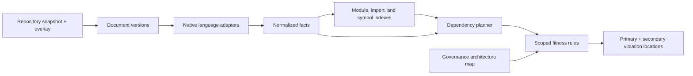

# Research: Shared AST / Fact Models in Static Analysis

## Conclusion

The proposed Central Abstract Syntax Model (CASM) should be a repository-scoped
snapshot with native language adapters and normalized facts. It should not be a
universal AST node type. This borrows the extraction/query boundary from
CodeQL, dependency-directed reuse from Go `analysis`, and explicit
architecture constraints from SonarQube, while retaining the daemon's
low-latency, one-overlay request model.

## Comparative research

| Tool | Representation and scope | Rule model | Relevance to CASM |
| --- | --- | --- | --- |
| [CodeQL](https://codeql.github.com/docs/codeql-overview/about-codeql/) | A per-language database for a codebase snapshot, including AST, name/type, data-flow, and control-flow information | Queries over language-specific schemas and libraries | Strong precedent for separating extraction from evaluation; too heavyweight to build a persistent database for every hook check. |
| [Semgrep](https://semgrep.dev/docs/writing-rules/glossary) | Pattern-oriented syntax/semantic matching; OSS analysis is primarily per-file | YAML search and taint rules | Useful inspiration for cheap local patterns, but not enough for graph or project semantics. |
| [SonarQube](https://docs.sonarsource.com/sonarqube-server/2025.6/design-and-architecture/configuring-the-architecture-analysis) | Architecture groups, perspectives, and constraints configured separately from source | YAML/JSON constraints | Strong fit for organizationally governed layers and architecture maps; keep policy separate from CASM facts. |
| [Go `analysis`](https://pkg.go.dev/golang.org/x/tools/go/analysis) / Staticcheck | Package-aware analyzers with typed reusable results | Go analyzers declare dependencies via `Requires` | Best direct model for capability planning and compute-once/reuse-many analysis. |
| [Tree-sitter](https://tree-sitter.github.io/tree-sitter/) | Incrementally updated concrete syntax tree per file | Grammar-specific structural queries | Borrow versioned-document mechanics and error tolerance; do not substitute concrete syntax for compiler semantics. |

### CodeQL: the closest architectural analogue

CodeQL stores extracted syntactic and semantic program information in a
language-specific database for one codebase point in time. Its documentation
explicitly includes AST, data flow, and control flow. This validates CASM's
fact-store boundary: rules should consume stable relationships and locations,
not Go/Python/Roslyn object types. [About CodeQL](https://codeql.github.com/docs/codeql-overview/about-codeql/)

The cost is inappropriate for the current request path. CodeQL database
creation is an explicit lifecycle step and can require an autobuild or manual
build for compiled languages. [CodeQL database creation](https://docs.github.com/en/code-security/reference/code-scanning/codeql/codeql-cli-manual/database-create)

**Adopt:** content-versioned snapshots, native extractors, normalized facts,
and rich source locations. **Reject:** a durable whole-repository database and
build interception as a prerequisite for every validation request.

### Semgrep: local syntax rules are valuable but insufficient

Semgrep documents search rules as patterns with some semantic conveniences,
including constant propagation and fully-qualified-name matching. It also
distinguishes per-file cross-function analysis from interfile analysis, which
its OSS engine does not provide. [Semgrep glossary](https://semgrep.dev/docs/writing-rules/glossary)

**Adopt:** a cheap syntax-tier rule shape and explicit scope declarations.
**Reject:** treating a structural query DSL as the product-wide semantic or
cross-source model. Start CASM rules as Go over facts; introduce a declarative
DSL only after several rules prove the fact schema stable.

### SonarQube: architecture policy is not parser state

SonarQube architecture analysis separates a formal architecture model (nested
Groups and Perspectives) from Constraints enforced against it.
[Sonar architecture configuration](https://docs.sonarsource.com/sonarqube-server/2025.6/design-and-architecture/configuring-the-architecture-analysis)
Its issue model supports a primary location, secondary locations, and
execution-flow context. [Sonar issues](https://docs.sonarsource.com/sonarqube-server/2025.5/user-guide/issues/introduction)

**Adopt:** path-/symbol-based architectural groups, centrally governed
constraints, and multi-location violations. **Reject:** conflating the fact
store with policy; CASM provides evidence, while governance configuration says
which boundaries are permitted.

### Go `analysis` and Staticcheck: direct implementation lessons

Go's `analysis` API lets analyzers declare requirements and consume typed
results from prerequisite analyzers. Its documentation gives reusable AST
inspection, control-flow graphs, and SSA as examples. [Go analysis](https://pkg.go.dev/golang.org/x/tools/go/analysis)

CASM should mirror this with `RuleRequirements`: a rule requiring imports and
module membership must not make the coordinator construct types, CFG, or
project indexes unnecessarily. Staticcheck demonstrates the desired
operational standard: fast, actionable checks usable from CLI, CI, and an
editor. [Staticcheck](https://staticcheck.dev/docs/)

### Tree-sitter: copy the incremental model, not the truth model

Tree-sitter updates an edited tree and reparses against the old tree, allowing
the new tree to share structure with it.
[Tree-sitter advanced parsing](https://tree-sitter.github.io/tree-sitter/using-parsers/3-advanced-parsing.html)
CASM should adopt content-versioned documents, request overlays, and explicit
invalidation. It should not use a concrete syntax tree as the source of truth
where Go type information or Roslyn semantic/project context is required.

## Audit: how the current AFFs translate across layers

The PR description's hypothesis is sound as a *target*: an architectural
fitness function can be expressed over graphs at several granularities. The
current implementation does not yet do that. It evaluates a single proposed
file, with a narrow Go peer-file aggregation exception, then generates a
synthetic two-node CALM document rather than a source or system graph.

| AFF | Current evidence | Current layer | Translation to CASM / system graph |
| --- | --- | --- | --- |
| Cyclomatic complexity | `FunctionMetric` values are checked individually | Function | CFG complexity for a function; aggregate or budget across component ownership only if policy needs it. |
| Interface width | `ModuleMetric.PublicMethods`; Go request path collects same-directory peers | File/module, partial | Count exported entry points for a path-qualified module, service API, or bounded-context boundary. |
| Implementation depth | `ModuleMetric.AverageLOCPerPublicMethod` | File/module, partial | Measure implementation behind an API at module/component granularity; threshold meaning must be recalibrated per layer. |
| Logic density | `FileMetric.LDR` | File | Keep as a file hygiene metric; it does not naturally become a system-map metric. |
| Dependency discipline | `ImportMetric.DDC` counts used imports | File | Promote to graph edges: dependency direction, allowed edges, fan-in/out, and forbidden transitive boundary crossings. |
| Layer sovereignty | Path glob selects a layer, then forbidden strings are searched in proposed content | File/text | Resolve imports/symbol references into edges, evaluate allowed source-layer to target-layer relationships, and report both endpoints. |
| Temporal purity | Python AST findings for naive time construction | Expression/file | Retain local detection; a system graph can add data-flow checks from time acquisition to persistence/API boundaries. |
| SQL composition safety | Python AST findings for interpolated execute calls | Expression/file | Retain local sink finding; a system graph can add cross-function taint/data-flow to database sinks. |
| Deterministic ordering | SQL `OVER ... ORDER BY` text scan | Expression/file | Retain local query rule; optionally model data-product/API ordering contracts, but do not force a graph representation prematurely. |

### Evidence and limits of the current graph model

- `report.BuildArchitecture` creates exactly one analyzed service node and one
  synthetic actor connected to it. It does not emit source imports, module
  dependencies, layers, or system-map relationships.
- `patterns/governance.json` validates metric metadata on nodes; its
  `relationships` property is only an array constraint, not a policy over
  source dependency edges.
- `layerSovereigntyViolations` applies configured path globs and searches the
  proposed content for forbidden patterns. Despite its name, it does not
  resolve import or symbol edges and cannot evaluate a system map.
- `analyzeGoWithModuleContext` is the current exception: it reads peers in the
  proposal's directory and aggregates their metrics. Python and C# request
  analysis currently work on the proposed temporary file (with C# project
  context only for the analyzer invocation).

The result is that **current AFFs are mostly point properties attached to a
single synthesized CALM node**, not graph properties transferable unchanged
from AST to system map. CASM should preserve rule intent while giving each
rule an explicit `Scope` and measurement definition. A threshold calibrated at
one layer must not silently apply at another.

## Recommended CASM boundaries

1. Native adapters own parse trees and compiler/semantic state.
2. Facts are normalized where meaningful (`Declaration`, `Import`, `Call`,
   `ModuleMembership`) and language-tagged where they are not.
3. Rules declare scope: expression, function, file, module, component, or
   system. The planner supplies only their required capabilities.
4. Governance configuration owns layers, components, and allowed edges; it is
   not embedded in AST/fact extraction.
5. Cache keys include content, parser, project-context, and fact-schema
   versions. Proposed overlays remain request-isolated.

## Implementation recommendation

1. Introduce snapshot/document keys and a bounded content-addressed cache.
2. Put existing Go/Python/C# entry points behind one coordinator, retaining
   `AnalysisResult` as the compatibility wire model.
3. Add normalized import, declaration, call, and module-membership facts.
4. Change layer sovereignty first: preserve its current path policy but
   replace raw-string matches with resolved dependency edges, reporting both
   source and target locations.
5. Add path-qualified module identity before any repository-wide aggregation.
6. Require fixture parity before enabling each migrated rule; measure cache
   hits and unchanged-peer analyzer invocations before adding persistent
   language workers.
