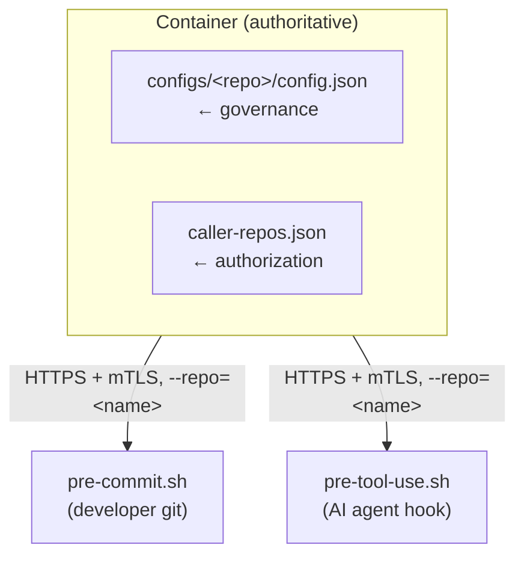
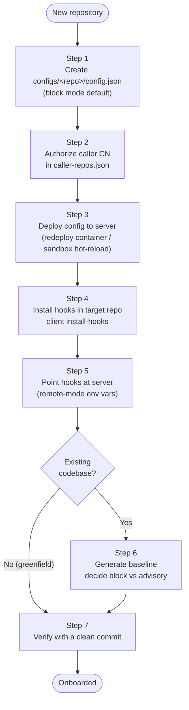

# Onboarding a New Repository

This runbook describes how to onboard a brand new repository to the
`stack-fitness-functions` governance system with its own per-repo settings.

It covers the steps the [README](../../README.md) leaves implicit: creating the
authoritative server-side config and authorizing the caller. The README documents
hook installation and remote-mode environment variables; this runbook documents
the full onboarding sequence end to end.

## Mental model

Onboarding is two distinct acts:

1. **Server-side governance** — create the authoritative config the container
   serves for this repo, and authorize the caller identity that may check it.
2. **Client-side wiring** — install Git hooks into the target repo and point them
   at the server.



**Critical:** the server resolves config **by repository name**, not by inspecting
the repo's contents (`internal/server/config.go` `loadConfig`). The hook sends
`--repo <name>`; the server looks up `configs/<name>/config.json`. A repo with no
matching config directory receives a not-found error and its checks fail. The
config MUST exist server-side before client-side onboarding means anything.

A local `.calm/config.json` is a developer sandbox only and **cannot weaken**
container governance. When the hook connects to the container, governance is
resolved exclusively from the mounted `configs/<repo>/config.json`.

## Onboarding flow

The full sequence end to end, from authoritative config to a verified commit:



## Prerequisites

- The repository name MUST match `^[a-z][a-z0-9_-]{0,63}$` (lowercase letter
  first, then lowercase alphanumerics, hyphens, or underscores; max 64 chars).
- Write access to the `configs/` and `caller-repos.json` deployment artifacts.
- For remote/container mode: mTLS client credentials issued for an authorized
  caller CN (see `scripts/generate-dev-certs.sh` for the `dev-hook-pool` dev CN).

## Step 1 — Create the per-repo governance config

Create `configs/<repo-name>/config.json`. New repositories start in `block` mode
(fail-closed) per the project default.

```bash
mkdir -p configs/<repo-name>
cat > configs/<repo-name>/config.json <<'EOF'
{
  "enforcement-mode": "block",
  "enforcement-on-error": "block",
  "fitness-functions": {
    "cyclomatic-complexity": true,
    "interface-width": true,
    "implementation-depth": true,
    "logic-density": true,
    "dependency-discipline": true
  }
}
EOF
```

### Config schema

Defined by `Config` in `internal/server/config.go`:

| Field | Required | Values | Meaning |
|-------|----------|--------|---------|
| `enforcement-mode` | Yes | `block`, `advisory`, `off` | How active violations are routed. `block` rejects; `advisory` reports but allows; `off` disables checks. |
| `enforcement-on-error` | No (defaults to `block`) | `block`, `advisory`, `pass` | How analyzer failures are routed. `block` fails closed; `advisory` reports without blocking; `pass` suppresses failures. |
| `fitness-functions` | Yes | object of `string → bool` | Enables/disables individual checks. A missing key defaults to **enabled**. |
| `exclude-patterns` | No | array of glob strings | File paths to skip, e.g. `"*_test.go"`, `"fixtures/**"`. |

Fitness function keys: `cyclomatic-complexity`, `interface-width`,
`implementation-depth`, `logic-density`, `dependency-discipline`.

> **Block mode on a legacy codebase rejects every commit that touches a
> pre-existing violation.** For an existing repo with unknown debt, generate a
> baseline first (see Step 5) and consider starting in `advisory` until the team
> has cleared the backlog, then flip to `block`. Greenfield repos can start in
> `block` immediately.

### Optional: exclude patterns example

```json
{
  "enforcement-mode": "block",
  "enforcement-on-error": "block",
  "fitness-functions": {
    "cyclomatic-complexity": true,
    "interface-width": true,
    "implementation-depth": true,
    "logic-density": true,
    "dependency-discipline": true
  },
  "exclude-patterns": [
    "*_test.go",
    "test_*.py",
    "fixtures/**"
  ]
}
```

## Step 2 — Authorize the caller

If the server enforces mTLS (the production path), the caller's certificate CN
MUST be authorized for the new repo name in `caller-repos.json`. Add the repo to
the relevant caller's list:

```json
{
  "callers": {
    "ci-runner-graft": ["graft"],
    "ci-runner-all": ["graft", "ringstation", "slackstatus"],
    "dev-hook-pool": ["calm-poc", "graft", "ringstation", "slackstatus", "<repo-name>"]
  },
  "admins": ["dev-hook-pool"]
}
```

- `dev-hook-pool` is the CN that `scripts/generate-dev-certs.sh` issues developer
  hook certs for. Add the new repo here for local developer commits.
- Add a CI caller CN (e.g. `ci-runner-<repo-name>`) for the repo's pipeline.

Without a matching caller entry, an authenticated request is rejected even when
the config exists.

## Step 3 — Deploy the config to the server

How the config reaches the running server depends on the mode:

- **Container (production):** `configs/` and `caller-repos.json` are mounted
  read-only (`docker-compose.yml`). Changes take effect by redeploying the
  service with the updated mounts/image.
- **Local sandbox server:** the server watches the configs directory with
  `fsnotify` (`internal/server/configstore.go`) and hot-reloads both repo configs
  and the caller policy. No restart is required for a locally running server.

## Step 4 — Install hooks in the target repository

From inside the target repo (or pass its path):

```bash
cd /path/to/<repo>
stack-fitness-functions client install-hooks
```

This installs:

- `.git/hooks/pre-commit` — validates staged files at commit time
- `.git/hooks/pre-push` — push-time hook
- `.git/hooks/stack-fitness-functions-git-guard` — blocks bypass commands
  (`--no-verify`, force-push, ff-only merges) and is registered in
  `.claude/settings.json` `PreToolUse` for AI-agent enforcement

If the repo already has unrelated hooks, the installer refuses to overwrite them.
Set `STACK_FITNESS_FUNCTIONS_HOOK_APPEND=1` to install as a sidecar alongside the
existing hook, or `STACK_FITNESS_FUNCTIONS_HOOK_OVERWRITE=1` to replace it.

## Step 5 — Point hooks at the server

### Local sandbox

No configuration needed. The client defaults to `https://127.0.0.1:7890`.

### Remote container (production)

Export the remote-mode environment variables (see README for the canonical table):

```bash
export STACK_FITNESS_FUNCTIONS_ADDR=https://calm-governance.example:7890
export STACK_FITNESS_FUNCTIONS_ALLOW_REMOTE=1
export STACK_FITNESS_FUNCTIONS_CLIENT_CERT=/path/to/client.crt
export STACK_FITNESS_FUNCTIONS_CLIENT_KEY=/path/to/client.key
export STACK_FITNESS_FUNCTIONS_CLIENT_CA=/path/to/ca.crt
export STACK_FITNESS_FUNCTIONS_REPO_NAME=<repo-name>
```

> `STACK_FITNESS_FUNCTIONS_REPO_NAME` is the linchpin: it becomes the `--repo`
> value the hook sends, and it MUST equal the `configs/<repo-name>` directory
> from Step 1. Without it, the hook falls back to the working-tree basename,
> which may not match the config directory name and will produce a not-found
> error.

## Step 6 (optional) — Generate a baseline

For an existing codebase, capture current metrics before enforcing:

```bash
stack-fitness-functions baseline \
  --repo /path/to/<repo> \
  --language <go|python|csharp> \
  --output baseline-report-<repo-name>.json \
  --name <repo-name>
```

Use the baseline to decide whether to start in `block` or `advisory`, and to
track debt reduction over time.

## Step 7 — Verify

```bash
cd /path/to/<repo>
# Stage a file that should pass and commit
git add <clean-file>
git commit -m "verify fitness-function onboarding"
```

Expected: the pre-commit hook runs, prints nothing for clean files (or the
`block`/`advisory` verdict for violations), and the commit succeeds. To verify a
single file directly against the server:

```bash
stack-fitness-functions client validate \
  --file <path> \
  --repo <repo-name> \
  --language <go|python|csharp>
```

## Troubleshooting

- **`repository "<name>" is not configured`** — the `configs/<name>/` directory
  is missing on the server, or `STACK_FITNESS_FUNCTIONS_REPO_NAME` does not match
  the config directory name.
- **`invalid repository name`** — the name violates `^[a-z][a-z0-9_-]{0,63}$`.
  Rename the config directory and the `REPO_NAME` value to match.
- **401 / unauthorized** — the caller CN is not authorized for this repo in
  `caller-repos.json`, or mTLS credentials are missing/incorrect.
- **`STACK_FITNESS_FUNCTIONS_ADDR must be loopback`** — set
  `STACK_FITNESS_FUNCTIONS_ALLOW_REMOTE=1` for a trusted remote server, and use
  an `https://` URL.
- **Hook installation refuses to overwrite** — inspect the existing hook, then
  use `STACK_FITNESS_FUNCTIONS_HOOK_APPEND=1` (sidecar) or
  `STACK_FITNESS_FUNCTIONS_HOOK_OVERWRITE=1` (replace).
- **Config change not picked up (container)** — container mounts are read-only;
  redeploy the service. A locally running sandbox server hot-reloads via fsnotify.

## Quick reference

```bash
# 1. Server-side config (block mode default)
mkdir -p configs/<repo-name>
# ...write configs/<repo-name>/config.json (see Step 1)

# 2. Authorize caller in caller-repos.json (see Step 2)

# 3. Deploy/redeploy server (container) — local sandbox hot-reloads

# 4. Install hooks in the target repo
cd /path/to/<repo> && stack-fitness-functions client install-hooks

# 5. Point hooks at server (remote mode)
export STACK_FITNESS_FUNCTIONS_ADDR=https://calm-governance.example:7890
export STACK_FITNESS_FUNCTIONS_ALLOW_REMOTE=1
export STACK_FITNESS_FUNCTIONS_CLIENT_CERT=/path/to/client.crt
export STACK_FITNESS_FUNCTIONS_CLIENT_KEY=/path/to/client.key
export STACK_FITNESS_FUNCTIONS_CLIENT_CA=/path/to/ca.crt
export STACK_FITNESS_FUNCTIONS_REPO_NAME=<repo-name>

# 6. Verify
git add <clean-file> && git commit -m "verify onboarding"
```

*Authored By Peter O'Connor with Assistance from Claude Code (databricks-claude-opus-4-8[1m]) · 2026-06-19 · Onboarding a New Repository runbook*
