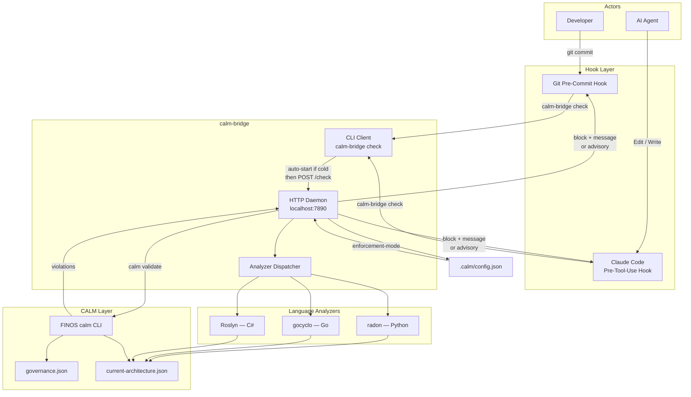

# CALM PoC: Engineering Technical Specification

> Context and goals: [why-and-what.md](why-and-what.md)

---

## 1. Overview

This document specifies the engineering design for a PoC system that enforces architectural fitness functions at two interception points: before an AI agent writes a file (Claude Code pre-tool-use hook) and before a developer commits code (git pre-commit hook).

The central component — `calm-bridge` — runs as a Go HTTP daemon. It analyzes proposed source code changes against three fitness functions, translates results into a CALM-compliant architecture document, calls the FINOS `calm` CLI validator, and returns a pass, a block with explanation, or an advisory message. Enforcement behavior is configured per repository.

The system runs entirely locally. No cloud dependencies are required.

> **Note on terminology:** This document uses "CALM node" to mean a component, module, or service in the CALM architecture model. This is distinct from the Stack Internal ubiquitous language definition of "Node" (an atomic unit of knowledge).

---

## 2. System Architecture



### Flow: Synchronous Check (Python, Go)

1. Hook captures proposed file content from tool input (Edit/Write) or staged diff.
2. Hook calls `calm-bridge check --file <path> --content <proposed>`.
3. CLI detects daemon running; POSTs to `localhost:7890/check`.
4. Daemon writes proposed content to a temp file and invokes the language analyzer.
5. Daemon builds a `current-architecture.json` fragment for the affected CALM node (module).
6. Daemon calls `calm validate` with `governance.json` and the fragment.
7. Daemon reads `.calm/config.json` for enforcement mode.
8. Daemon returns `{"status":"pass"}`, `{"status":"block","violations":[...]}`, or `{"status":"advisory","violations":[...]}`.
9. Hook exits 0 (pass or advisory) or 1 (block), with violation messages on stderr.

### Flow: Deferred First Call (C#)

1. First hook call on a C# file: CLI detects no running daemon; starts daemon in background.
2. CLI returns immediately with `{"status":"pass","warming":true}`. Hook allows the write.
3. Daemon warms (Roslyn cold start: up to 3 s). Analyzes the file just written.
4. If violations found: daemon stores them in state, keyed by file path.
5. On the next hook call in the same repository: daemon checks state for outstanding violations and blocks regardless of what the new file contains.

---

## 3. Components

### 3.1 calm-bridge

`calm-bridge` is a single Go binary providing two behaviors from one entry point:

- **CLI mode:** invoked by hooks as `calm-bridge check [flags]`. Auto-starts the daemon if not running, then delegates via HTTP.
- **Daemon mode:** HTTP server on `localhost:7890`. Manages analyzer lifecycle, state, and CALM CLI invocation.

**Daemon endpoints:**

| Endpoint | Method | Purpose |
|---|---|---|
| `/check` | POST | Run fitness check on proposed file content |
| `/state` | GET | Return outstanding violation state for a repository |
| `/health` | GET | Liveness check |
| `/shutdown` | POST | Graceful shutdown |

**`/check` request body:**

```json
{
  "repo": "/Users/poconnor/peter_code/graft",
  "file": "internal/parser/parser.go",
  "proposed_content": "...",
  "language": "go"
}
```

**`/check` response:**

```json
{
  "status": "block",
  "violations": [
    {
      "fitness_function": "cyclomatic_complexity",
      "calm_node": "internal/parser",
      "function": "Parse",
      "value": 14,
      "limit": 10,
      "message": "Function 'Parse' has cyclomatic complexity 14, exceeding the limit of 10. Extract conditional branches into separate functions."
    }
  ]
}
```

### 3.2 Language Analyzers

Each analyzer receives a file path (temp file with proposed content), runs analysis, and returns a normalized struct:

```go
type AnalysisResult struct {
    CALMNode     string          // module / package / namespace
    Functions    []FunctionMetric
    ModuleMetric ModuleMetric
    FileMetrics  FileMetric
    Imports      ImportMetric
}

type FunctionMetric struct {
    Name                 string
    CyclomaticComplexity int
    IsPublic             bool
    LOC                  int
}

type FileMetric struct {
    TotalLOC     int
    LogicLOC     int  // for LDR
    PublicMethods int
}

type ModuleMetric struct {
    PublicMethods             int
    TotalLOC                  int
    PrivateLOC                int
    AverageLOCPerPublicMethod float64
}

type ImportMetric struct {
    Total int
    Used  int  // for DDC
}
```

| Language | Approach |
|---|---|
| **Python** | `radon cc -j` and `radon raw -j` as subprocesses; parse JSON output |
| **Go** | `github.com/fzipp/gocyclo` as library; `go/ast` for public method count, LOC, imports |
| **C#** | Lightweight Roslyn CLI (built in Step 2) as subprocess; emits JSON matching `AnalysisResult` |

### 3.3 CALM CLI Integration

The daemon calls the FINOS `calm` CLI as a subprocess:

```bash
calm validate \
  --architecture current-architecture.json \
  --pattern governance.json
```

The CALM CLI returns exit code 0 on pass; non-zero with violation JSON on stdout on failure.

> **Note:** The exact `governance.json` schema will be confirmed against FINOS documentation during Step 1. The schemas shown in Section 6 are representative; adjustments SHOULD be expected after Step 1 validation.

### 3.4 Claude Code Pre-Tool-Use Hook

Configured in `.claude/settings.json` within each test repository:

```json
{
  "hooks": {
    "PreToolUse": [
      {
        "matcher": "Edit|Write",
        "hooks": [
          {
            "type": "command",
            "command": "calm-bridge check --file '$FILE' --repo '$REPO'"
          }
        ]
      }
    ]
  }
}
```

The hook receives tool input as JSON on stdin. It extracts `file_path` and proposed content (`new_string` for Edit, `content` for Write) and passes them to `calm-bridge check`. A non-zero exit blocks the tool call; stderr is surfaced to the agent as the reason.

### 3.5 Git Pre-Commit Hook

Installed at `.git/hooks/pre-commit` in each test repository via `scripts/install-hooks.sh`:

```bash
#!/bin/bash
set -euo pipefail

REPO=$(git rev-parse --show-toplevel)
FILES=$(git diff --cached --name-only --diff-filter=ACM)

for FILE in $FILES; do
  RESULT=$(calm-bridge check --file "$FILE" --repo "$REPO" --staged)
  STATUS=$(echo "$RESULT" | jq -r '.status')

  if [ "$STATUS" = "block" ]; then
    echo "CALM violation in $FILE:"
    echo "$RESULT" | jq -r '.violations[].message'
    exit 1
  elif [ "$STATUS" = "advisory" ]; then
    echo "CALM advisory for $FILE:"
    echo "$RESULT" | jq -r '.violations[].message'
  fi
done
```

---

## 4. Test Repositories

| Repository | Language | Enforcement Mode | First-Call Behavior | Analyzer |
|---|---|---|---|---|
| `StackOverflow/StackOverflow.Api.V3` | C# | Block + explanation | Deferred (Roslyn cold start) | Roslyn |
| `SlackStatus` | C# | Block + explanation | Deferred (Roslyn cold start) | Roslyn |
| `graft` | Go | Block + explanation | Synchronous (≤ 500 ms) | gocyclo |
| `ringstation` | Python 3.12 | Advisory | Synchronous (≤ 500 ms) | radon |

Each test repository MUST contain a `.calm/config.json` at its root. See Section 6.3 for the schema.

---

## 5. Fitness Functions

### 5.1 Cyclomatic Complexity

**What it measures:** The number of linearly independent paths through a function — a proxy for logical complexity and testability.

**Unit of analysis:** Per-function. Violations aggregate to the CALM node (module) in the architecture document.

**Threshold:** Set after Step 0 baseline. Starting point for calibration: ≤ 10 (McCabe's original recommendation).

**CALM pattern rule (representative):**

```json
{
  "id": "fitness-cyclomatic-complexity",
  "description": "No function may exceed the cyclomatic complexity threshold.",
  "constraint": {
    "property": "cyclomatic-complexity",
    "operator": "lte",
    "value": "{{CC_THRESHOLD}}"
  }
}
```

**Tooling:** `radon cc -j` (Python), `gocyclo` library (Go), Roslyn analyzer (C#).

**Violation message:**
> `Function 'X' in module 'Y' has cyclomatic complexity N, exceeding the limit of T. Extract conditional branches into separate functions.`

---

### 5.2 Deep vs. Shallow (Two Rules)

Based on John Ousterhout's cost-benefit framework from *A Philosophy of Software Design*: the best modules offer maximum functionality through a minimal interface. Ousterhout provides no mathematical formula for depth; these two proxy rules approximate the concept without misrepresenting it.

**Rule A — Interface Width Ceiling**

Enforces a maximum number of public methods per CALM node. A module with many public methods imposes high cognitive cost on callers regardless of what it does internally.

| Property | Value |
|---|---|
| Unit | Per-module (package / namespace / class) |
| Threshold | Calibrated in `patterns/governance.json`: ≤ 20 public methods. Initial planning value was ≤ 15. |
| Operator | lte |

**Violation:**
> `Module 'X' exposes N public methods, exceeding the limit of T. Consolidate related operations or reduce the public surface area.`

**Rule B — Implementation Depth Floor**

Enforces a minimum average implementation LOC per public method. For this PoC, implementation LOC is analyzer `logic_loc` divided by public method count so comments, imports, and structural scaffolding do not make a pass-through module look deep. Modules with very little logic per public method are likely pass-through facades with no real functionality.

| Property | Value |
|---|---|
| Unit | Per-module |
| Threshold | Calibrated in `patterns/governance.json`: ≥ 0.722 logic LOC per public method. Initial planning value was ≥ 5 LOC per public method. |
| Operator | gte |

**Violation:**
> `Module 'X' averages N LOC per public method, below the minimum of T. Methods with little implementation may be unnecessary pass-throughs.`

Rules A and B fire independently. A module may pass one and fail the other.

---

### 5.3 AI Slop — LDR + DDC

Two complementary metrics that detect hollow or undisciplined AI-generated code. Both are deterministic, fast, and cross-language.

**Logic Density Ratio (LDR)**

$$LDR = \frac{\text{logic\_lines}}{\text{total\_lines}}$$

- **Logic lines:** lines containing arithmetic, control flow, state mutation, or function calls.
- **Excluded:** whitespace, comments, imports, type declarations, and structural scaffolding.
- **Threshold:** LDR ≥ 0.255 (calibrated after baseline). A plummeting LDR in a large generated file signals hollow, boilerplate-heavy output.

**Violation:**
> `File 'X' has a Logic Density Ratio of N (minimum: T). The file may contain excessive boilerplate relative to functional logic.`

**Dependency Discipline Check (DDC)**

$$DDC = \frac{\text{used\_imports}}{\text{total\_imports}}$$

- **Used import:** referenced at least once in the file body.
- **Threshold:** DDC ≥ 0.8 (calibrated after baseline). Agents commonly import libraries they do not use.

**Violation:**
> `File 'X' has a Dependency Discipline ratio of N (minimum: T). Unused imports: [list].`

**Future iteration (v2):** Jensen-Shannon Divergence on AST node histograms for structural clone detection across the codebase.

---

## 6. Data Schemas

### 6.1 governance.json

The central CALM pattern file. Defines all fitness function rules applied across all repositories. Per-repository enforcement mode lives in `.calm/config.json`, not here — the governance rules are identical for all repositories; only behavior differs.

```json
{
  "$schema": "https://raw.githubusercontent.com/finos/architecture-as-code/main/calm/draft/2024-04/meta/pattern.json",
  "title": "CALM PoC Fitness Functions",
  "version": "0.1.0",
  "fitness-functions": {
    "cyclomatic-complexity": {
      "description": "Maximum cyclomatic complexity per function",
      "threshold": "{{CC_THRESHOLD}}",
      "operator": "lte",
      "unit": "function"
    },
    "interface-width": {
      "description": "Maximum public method count per CALM node",
      "threshold": "{{IW_THRESHOLD}}",
      "operator": "lte",
      "unit": "module"
    },
    "implementation-depth": {
      "description": "Minimum average implementation LOC per public method",
      "threshold": "{{ID_THRESHOLD}}",
      "operator": "gte",
      "unit": "module"
    },
    "logic-density": {
      "description": "Minimum logic density ratio per file",
      "threshold": "{{LDR_THRESHOLD}}",
      "operator": "gte",
      "unit": "file"
    },
    "dependency-discipline": {
      "description": "Minimum used-import ratio per file",
      "threshold": "{{DDC_THRESHOLD}}",
      "operator": "gte",
      "unit": "file"
    }
  }
}
```

`{{THRESHOLD}}` placeholders are replaced with values derived from `baseline-report.json` at the end of Step 0.

### 6.2 current-architecture.json

Generated by the Bridge per analysis run. Represents the proposed state of one CALM node (module) as node metadata in a CALM architecture document.

```json
{
  "$schema": "https://calm.finos.org/release/1.2/meta/calm.json",
  "nodes": [
    {
      "unique-id": "parser",
      "node-type": "service",
      "name": "parser",
      "metadata": {
        "fitness": {
          "cyclomatic-complexity": 14,
          "interface-width": 3,
          "implementation-depth": 60,
          "logic-density": 0.75,
          "dependency-discipline": 1.0
        },
        "module_metrics": {
          "public_method_count": 3,
          "total_loc": 210,
          "private_loc": 123,
          "avg_loc_per_public_method": 60
        },
        "file_metrics": {
          "total_lines": 240,
          "logic_lines": 180,
          "ldr": 0.75
        },
        "import_metrics": {
          "total_imports": 5,
          "used_imports": 5,
          "ddc": 1.0
        }
      }
    }
  ],
  "relationships": []
}
```

### 6.3 .calm/config.json

Per-repository configuration. Declares enforcement mode, daemon connection, and which fitness functions are active for this repository at the current step.

```json
{
  "version": "0.1.0",
  "repo": "graft",
  "language": "go",
  "enforcement-mode": "block",
  "daemon": {
    "host": "localhost",
    "port": 7890,
    "startup-timeout-ms": 500
  },
  "fitness-functions": {
    "cyclomatic-complexity": true,
    "interface-width": false,
    "implementation-depth": false,
    "logic-density": false,
    "dependency-discipline": false
  }
}
```

`ringstation` uses `"enforcement-mode": "advisory"`. Fitness functions are toggled per-repository per-step — only cyclomatic complexity is enabled at Step 1.

---

## 7. Enforcement Model

### Modes

| Mode | Daemon Response | Hook Exit Code | Experience |
|---|---|---|---|
| `block` | `{"status":"block","violations":[...]}` | 1 | Write or commit rejected. Violation message shown. Must fix before proceeding. |
| `advisory` | `{"status":"advisory","violations":[...]}` | 0 | Write proceeds. Advisory message shown. Agent or developer may self-correct. |
| `off` | `{"status":"pass"}` | 0 | No check performed. |

### Language-Specific Startup Behavior

| Language | First-call behavior | Condition |
|---|---|---|
| Python | Synchronous | `startup-timeout-ms` not exceeded |
| Go | Synchronous | `startup-timeout-ms` not exceeded |
| C# | Deferred on first call; synchronous from second call onward | Roslyn cold start may exceed timeout |

### Outstanding Violation State

The daemon maintains an in-memory map of `repo → []violation`. Any hook call against a repository with outstanding violations in `block` mode MUST return a block, regardless of whether the new file itself violates a rule. The block message lists outstanding violations and their locations.

This design prevents the agent from accumulating unresolved debt before addressing it.

---

## 8. Milestone Plan

### Step 0 — Baseline

**Goal:** Establish the current metric state of all four repositories before writing any rules. Thresholds MUST NOT be set without this data.

**Actions:**

1. Run language analyzers against all four repositories in their current state.
2. Record per-function cyclomatic complexity distributions, public method counts, LOC ratios, and import usage rates.
3. Set thresholds at the 90th percentile of current measurements — tight enough to catch new slop, loose enough to avoid flagging existing clean code.
4. Note any **known exceptions** (e.g., a legacy function with CC = 47) and exclude them from threshold calculation. Known exceptions will not trigger blocks on existing code but WILL trigger blocks if new changes worsen them.
5. Replace `{{THRESHOLD}}` placeholders in `governance.json`.

**Output:** `baseline-report.json` × 4, `governance.json` with concrete thresholds.

---

### Step 1 — Define World Rules

**Goal:** Author a working `governance.json` with cyclomatic complexity as the single active rule. Confirm the FINOS CALM CLI validates correctly.

**Actions:**

1. Install FINOS `calm` CLI: `npm install -g @finos/calm-cli@1.40.0`.
2. Author `governance.json` with only `cyclomatic-complexity` enabled.
3. Hand-craft a `current-architecture.json` that passes and one that fails the rule.
4. Run `calm validate` against both. Confirm expected outcomes.
5. Refine `governance.json` schema to match actual FINOS CLI requirements.
6. Add `.calm/config.json` to each test repository.

**Output:** Working `governance.json`, confirmed CALM CLI integration, per-repository configs.

---

### Step 2 — Build the Bridge

**Goal:** A working `calm-bridge` binary that analyzes real files from all four test repositories and produces correct pass/fail results against Step 1 rules.

**Actions:**

1. Scaffold Go module with HTTP daemon and CLI entry point.
2. Implement Python analyzer (radon subprocess).
3. Implement Go analyzer (gocyclo library).
4. Implement C# analyzer (Roslyn subprocess CLI).
5. Implement `current-architecture.json` builder.
6. Wire daemon to CALM CLI subprocess.
7. Implement per-repository config reader and enforcement mode routing.
8. Implement outstanding violation state map.
9. Write unit tests using scripted violation fixtures — one per language per fitness function.
10. Run against all four repositories manually. Verify zero false positives post-baseline.

**Output:** `calm-bridge` binary, unit tests passing, clean baseline run across all four repositories.

---

### Step 3 — AI Integration Loop

**Goal:** An agent detects a cyclomatic complexity violation and self-corrects without human intervention.

**Actions:**

1. Install the Claude Code pre-tool-use hook in each test repository.
2. Install the git pre-commit hook in each test repository via `scripts/install-hooks.sh`.
3. Task the agent with a feature that will cause a CC violation in `graft` (Go, block mode).
4. Observe the agent receive the block, read the violation message, and refactor.
5. Verify the commit proceeds cleanly after self-correction.
6. Run the scripted red-green demo manually in block mode (C#) and advisory mode (`ringstation`).

**Success gate:** Agent self-corrects without human intervention. Pre-commit hook blocks a commit containing a known violation.

---

### Step 4 — Iteration and Expansion

**Goal:** Activate Deep vs. Shallow and AI Slop fitness functions. Tune thresholds based on Step 3 observations.

**Actions:**

1. Enable `interface-width` and `implementation-depth` in each repository's `.calm/config.json`.
2. Implement LDR and DDC analyzers in the Bridge.
3. Enable `logic-density` and `dependency-discipline` in config.
4. Re-run the scripted red-green demo for each new fitness function.
5. Adjust thresholds if the false positive rate exceeds one per ten agent writes.
6. Document findings: which metrics are most effective, which thresholds need tuning, and how malleable enforcement performed across modes.

---

## 9. Threshold Calibration Strategy

Thresholds are always derived from the Step 0 baseline — never set in advance.

**Formula:**

```
threshold = percentile(baseline_measurements, 90)
```

The 90th percentile sets a ceiling that existing clean code comfortably passes (90% compliance) while catching new slop that exceeds current norms.

**Known exceptions:** Any module where existing code already exceeds a reasonable threshold is recorded in `baseline-report.json` and excluded from the percentile calculation. Known exceptions suppress blocks on existing code. They do not suppress blocks when new changes worsen the metric.

---

## 10. Repository Layout

```
calm-poc/
├── cmd/
│   └── calm-bridge/
│       └── main.go              # CLI entry point, daemon auto-start logic
├── internal/
│   ├── analyzer/
│   │   ├── python.go            # radon subprocess wrapper
│   │   ├── golang.go            # gocyclo library integration
│   │   ├── csharp.go            # Roslyn subprocess wrapper
│   │   └── analyzer.go          # AnalysisResult types, dispatcher interface
│   ├── bridge/
│   │   ├── server.go            # HTTP daemon (port 7890)
│   │   ├── checker.go           # Fitness function dispatch and aggregation
│   │   └── state.go             # Outstanding violation state map
│   ├── calm/
│   │   ├── pattern.go           # governance.json loader and schema types
│   │   └── validator.go         # calm CLI subprocess wrapper
│   └── report/
│       └── architecture.go      # current-architecture.json builder
├── patterns/
│   └── governance.json          # CALM fitness function rules (central, all repositories)
├── configs/
│   ├── block-template.json      # .calm/config.json template for block mode
│   └── advisory-template.json   # .calm/config.json template for advisory mode
├── fixtures/
│   └── violations/
│       ├── python/              # Known-bad .py files per fitness function
│       ├── go/                  # Known-bad .go files per fitness function
│       └── csharp/              # Known-bad .cs files per fitness function
├── hooks/
│   ├── pre-tool-use.sh          # Claude Code PreToolUse hook
│   └── pre-commit.sh            # Git pre-commit hook
├── scripts/
│   ├── baseline.sh              # Step 0: run analyzers, produce baseline-report.json
│   └── install-hooks.sh         # Install pre-commit hook into a target repository
├── docs/
│   └── spec/
│       ├── why-and-what.md      # Goals, non-goals, success criteria
│       └── engineering-spec.md  # This document
└── go.mod
```

---

## 11. Demo Runbook

The scripted red-green demonstration validates each fitness function independently and proves the guardrails work for human developers — not just agents.

**Per fitness function, per enforcement mode:**

1. **Red — introduce the violation:**
   Copy the relevant file from `fixtures/violations/<language>/` into the test repository. Stage it with `git add`. Attempt `git commit`.
   *Expected:* Pre-commit hook fires. Exit code 1. Violation message printed to stderr. Commit blocked.

2. **Green — fix and resubmit:**
   Refactor the file to satisfy the fitness function threshold. Re-stage. Attempt `git commit` again.
   *Expected:* Pre-commit hook fires. Exit code 0. Commit succeeds.

3. **Advisory variant** (run against `ringstation` only):
   Repeat step 1 with the violation file.
   *Expected:* Pre-commit hook fires. Exit code 0. Advisory message printed to stderr. Commit proceeds.

Run this sequence for: Cyclomatic Complexity, Interface Width, Implementation Depth, LDR, DDC. Implementation Depth is demonstrated with C# only under the calibrated `0.722` threshold because the current Go and Python analyzers cannot produce a real source fixture below that threshold without fake analyzer data.

Run in: `graft` (Go, block), `SlackStatus` (C#, block), `ringstation` (Python, advisory).

This demonstration proves three things in sequence: the fitness function correctly identifies a violation; the block mechanism prevents bad code entering history; and the fix path is navigable — the guidance message is actionable.

---

*Authored By Peter O'Connor with Assistance from Claude Code (databricks-claude-sonnet-4-6) · 2026-05-18 · CALM PoC Engineering Technical Specification*
