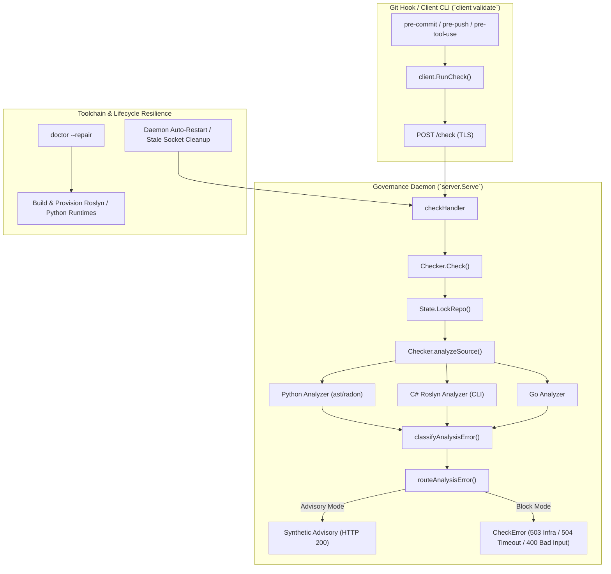

# Governance Daemon & Analyzer Resilience Implementation Plan

> **For agentic workers:** REQUIRED SUB-SKILL: Use superpowers:subagent-driven-development (recommended) or superpowers:executing-plans to implement this plan task-by-task. Steps use checkbox (`- [ ]`) syntax for tracking.

**Goal:** Eliminate governance daemon failures and blocking hook errors during local development by fixing analyzer error classification, adding Python 3.12+ AST and syntax resilience, enabling robust Roslyn C# analyzer discovery and dev-mode provisioning, and hardening daemon lifecycle recovery.

**Architecture:** The governance server acts as a local daemon validating code against CALM architecture and fitness function rules. When an analyzer fails due to toolchain absence, interpreter mismatch, or target syntax incompatibility, the server MUST classify these as analyzer infrastructure failures rather than malformed client requests (`ErrorKindInput` / HTTP 400). The Python analyzer gains multi-version interpreter discovery and AST syntax tolerance for modern Python 3.12+ grammar (`type` statement, PEP 695). The C# analyzer gains expanded search paths (`AGENT_FITNESS_FUNCTIONS_ROSLYN_PATH`, standard user directories, dev paths) and self-service build repair via `doctor --repair`. Client failure reporting is enriched to clearly distinguish infrastructure toolchain issues from governance rule violations with actionable remediation guidance.

**Tech Stack:** Go 1.22, Python 3.11/3.12/3.13, C# / .NET 8 / Roslyn (`Microsoft.CodeAnalysis.CSharp`), HTTP/TLS daemon, Git hooks.



---

## Confirmed Decisions

1. **Error Classification:** Analyzer execution failures, toolchain missing errors, and target file syntax parse errors MUST NOT be classified as `ErrorKindInput` (HTTP 400). They MUST be classified as `ErrorKindInfrastructure` (HTTP 503) or handled as AST diagnostic findings so `enforcement_on_error` policies (`advisory` / `pass` / `block`) function as designed.
2. **Python 3.12+ Compatibility:** The Python analyzer MUST support Python 3.12+ language features (including PEP 695 `type` aliases and PEP 701 f-strings). When executed against older host Python runtimes (< 3.12), syntax errors in target files MUST be handled gracefully without failing the entire HTTP validation pipeline.
3. **C# Roslyn Discovery & Provisioning:** The C# analyzer MUST resolve `calm-roslyn-analyzer` from environment variables (`AGENT_FITNESS_FUNCTIONS_ROSLYN_PATH`, `CALM_ROSLYN_ANALYZER_PATH`), standard local developer locations (`~/.local/share/...`, `~/.dotnet/tools/...`), and state directories. `agent-fitness-functions doctor --repair` MUST be able to compile and provision `calm-roslyn-analyzer` if `dotnet` is present on the host.
4. **Daemon Lifecycle & Warmup State:** Analyzer warmup failures MUST NOT permanently latch the daemon in a failed state for the entire process lifetime. A failed warmup MUST allow lazy re-initialization on subsequent requests if the toolchain becomes available.
5. **Actionable Diagnostics:** On exit code 3 (`InfraErrorExitCode`), the client CLI and git hooks MUST emit clear, actionable troubleshooting steps (e.g., pointing to `agent-fitness-functions doctor --repair` or `AGENT_FITNESS_FUNCTIONS_ON_ERROR=advisory`) to prevent developer blockage.

---

## Applicable Skills

- `golang-testing`: Table-driven tests, subtests, mocks, and coverage in Go.
- `golang-error-handling`: Proper error wrapping (`%w`), sentinel errors, and typed check errors.
- `golang-cli`: CLI argument parsing, doctor commands, and exit code conventions.
- `python-error-handling`: Python AST parsing, syntax error handling, and robust JSON outputs.
- `writing-mstest-tests` / `build-perf-baseline`: .NET build and Roslyn compilation checks.

---

## File Map

| Action | Path | Responsibility |
|--------|------|----------------|
| Modify | `internal/server/checker.go` | Fix `classifyAnalysisError`, `isAnalyzerInfrastructureError`, and warmup failure unlatching |
| Modify | `internal/server/checker_test.go` | Unit tests for analyzer error classification and enforcement routing |
| Modify | `internal/analyzer/python.go` | Multi-version Python interpreter resolution, Python 3.12+ syntax AST handling |
| Modify | `internal/analyzer/python_test.go` | Tests for Python 3.12 `type` statement and syntax resilience |
| Modify | `internal/analyzer/csharp.go` | Expanded Roslyn CLI resolution paths and environment variable overrides |
| Modify | `internal/analyzer/csharp_test.go` | Tests for C# analyzer discovery paths |
| Modify | `internal/cli/doctor.go` | Enhanced doctor checks and `--repair` support for building Roslyn analyzer |
| Modify | `internal/cli/doctor_test.go` | Tests for doctor diagnostics and repair workflow |
| Modify | `internal/client/failure.go` | Improved error classification, exit code semantics, and actionable remediations |
| Modify | `internal/client/failure_test.go` | Unit tests for client error classification and output |
| Create | `test/integration/analyzer_resilience_test.go` | End-to-end integration tests using `google.py` and `HealthReporter.cs` fixtures |

---

## Global Constraints

- Go code MUST follow 12-Factor principles and project conventions in `internal/`.
- All Go errors MUST be wrapped with `%w` or use typed `*CheckError`.
- No sensitive keys or tokens MUST be logged or exposed.
- All tests MUST pass (`go test ./...`) with zero lint regressions.
- Git commits MUST include co-authors per project conventions.

---

## Task 1: Fix Analyzer Error Classification & Status Mapping

**Goal:** Ensure analyzer failures (syntax errors in target files, runner failures, interpreter errors) are classified as `ErrorKindInfrastructure` (HTTP 503) rather than `ErrorKindInput` (HTTP 400), ensuring `enforcement_on_error` correctly applies advisory/pass/block policies.

**BDD Contract**

```gherkin
Feature: Analyzer Error Classification & Status Routing

  Scenario: Python syntax or runtime error in target file is routed as infrastructure error
    Given a repository configured with enforcement_on_error "advisory"
    When a validation request fails during Python analysis due to a parser or syntax error
    Then the server MUST NOT return HTTP 400 Bad Request
    And the server MUST route the error through enforcement_on_error producing an advisory verdict

  Scenario: Missing or failing analyzer toolchain in block mode
    Given a repository configured with enforcement_on_error "block"
    When an analyzer binary is missing or fails to execute
    Then the server MUST return HTTP 503 Service Unavailable
    And the error detail MUST identify the analyzer failure rather than "invalid request"
```

**Files:**
- Modify: `internal/server/checker.go:280-300`, `internal/server/checker.go:395-407`
- Test: `internal/server/checker_test.go`

**Interfaces:**
- Consumes: `analyzer.AnalysisResult`, `analyzer.AnalysisError`
- Produces: `classifyAnalysisError(err error, language string) error`, `isAnalyzerInfrastructureError(err error) bool`

- [ ] **Step 1: Write failing unit test for analyzer error classification**

Add to `internal/server/checker_test.go`:

```go
func TestClassifyAnalysisError_DistinguishesInputFromInfrastructure(t *testing.T) {
	tests := []struct {
		name         string
		err          error
		language     string
		expectedKind ErrorKind
	}{
		{
			name:         "os path error is infrastructure",
			err:          &os.PathError{Op: "open", Path: "/nonexistent", Err: os.ErrNotExist},
			language:     "python",
			expectedKind: ErrorKindInfrastructure,
		},
		{
			name:         "radon parser error is infrastructure",
			err:          errors.New("radon cc error for test.py: invalid syntax (<unknown>, line 39)"),
			language:     "python",
			expectedKind: ErrorKindInfrastructure,
		},
		{
			name:         "python findings error is infrastructure",
			err:          errors.New("python findings error for test.py: invalid syntax (<unknown>, line 10)"),
			language:     "python",
			expectedKind: ErrorKindInfrastructure,
		},
		{
			name:         "roslyn execution failure is infrastructure",
			err:          errors.New("running Roslyn analyzer: exit status 1"),
			language:     "csharp",
			expectedKind: ErrorKindInfrastructure,
		},
	}

	for _, tc := range tests {
		t.Run(tc.name, func(t *testing.T) {
			classified := classifyAnalysisError(tc.err, tc.language)
			var checkErr *CheckError
			if !errors.As(classified, &checkErr) {
				t.Fatalf("expected *CheckError, got %T (%v)", classified, classified)
			}
			if checkErr.Kind != tc.expectedKind {
				t.Errorf("expected kind %q, got %q (message: %s)", tc.expectedKind, checkErr.Kind, checkErr.Message)
			}
		})
	}
}
```

- [ ] **Step 2: Run test to verify it fails**

Run: `go test ./internal/server -run TestClassifyAnalysisError_DistinguishesInputFromInfrastructure -v`
Expected: FAIL (radon parser error classified as `ErrorKindInput` instead of `ErrorKindInfrastructure`).

- [ ] **Step 3: Implement minimal fix in `internal/server/checker.go`**

Update `isAnalyzerInfrastructureError` in `internal/server/checker.go`:

```go
func isAnalyzerInfrastructureError(err error) bool {
	if errors.Is(err, exec.ErrNotFound) || errors.Is(err, os.ErrNotExist) || errors.Is(err, os.ErrPermission) {
		return true
	}
	var pathErr *os.PathError
	if errors.As(err, &pathErr) {
		return true
	}
	message := err.Error()
	return strings.Contains(message, "running Roslyn analyzer") ||
		strings.Contains(message, "parsing Roslyn analyzer output") ||
		strings.Contains(message, "radon cc error") ||
		strings.Contains(message, "radon raw error") ||
		strings.Contains(message, "running radon") ||
		strings.Contains(message, "parsing radon") ||
		strings.Contains(message, "python findings error") ||
		strings.Contains(message, "running findings scan") ||
		strings.Contains(message, "radon python interpreter unavailable")
}
```

- [ ] **Step 4: Run test to verify it passes**

Run: `go test ./internal/server -run TestClassifyAnalysisError_DistinguishesInputFromInfrastructure -v`
Expected: PASS.

- [ ] **Step 5: Run full server test suite**

Run: `go test ./internal/server -v`
Expected: All tests PASS.

- [ ] **Step 6: Commit**

```bash
git add internal/server/checker.go internal/server/checker_test.go
git commit -m "fix(server): classify analyzer and parser failures as infrastructure errors

Co-Authored-By: Peter O'Connor <poconnor@stackoverflow.com>
Co-Authored-By: opencode <noreply@anthropic.com> - gemini-3.7-flash"
```

---

## Task 2: Modern Python 3.12+ Syntax & AST Resilience

**Goal:** Ensure the Python analyzer supports Python 3.12+ constructs (e.g., PEP 695 `type` statements) by resolving modern Python runtimes and handling syntax errors gracefully in AST scans without crashing analysis.

**BDD Contract**

```gherkin
Feature: Python 3.12+ Syntax Support & AST Resilience

  Scenario: Analyze Python file using PEP 695 type alias syntax
    Given a Python source file containing "type FlowCredentials = Credentials | ExternalAccountCredentials"
    When AnalyzePythonFile is executed
    Then it MUST successfully parse functions and file metrics
    And it MUST NOT return a syntax error failure

  Scenario: Graceful AST error handling when syntax is incompatible with host Python
    Given a Python source file with syntax unsupported by the host interpreter
    When analyzePythonFileWithRadonAPI runs
    Then it MUST fall back to raw line metrics and record an AST diagnostic
    And it MUST NOT panic or emit malformed JSON
```

**Files:**
- Modify: `internal/analyzer/python.go`
- Test: `internal/analyzer/python_test.go`

**Interfaces:**
- Consumes: Python source code, `radonAPIScript`, `pythonFindingsLibrary`
- Produces: `AnalyzePythonFile(ctx, file, radonPath) (AnalysisResult, error)`

- [ ] **Step 1: Write failing test for Python 3.12 type alias statement**

Add to `internal/analyzer/python_test.go`:

```go
func TestAnalyzePythonFile_Python312TypeAliasSyntax(t *testing.T) {
	ctx := context.Background()
	dir := t.TempDir()
	sourceFile := filepath.Join(dir, "google_source.py")
	sourceContent := `"""Google source module."""

from typing import Any
import os

type FlowCredentials = dict[str, Any]
type GoogleCredentials = FlowCredentials | None

class GoogleConnector:
    def __init__(self, credentials: GoogleCredentials) -> None:
        self.credentials = credentials

    def connect(self) -> bool:
        return self.credentials is not None
`
	if err := os.WriteFile(sourceFile, []byte(sourceContent), 0o644); err != nil {
		t.Fatalf("failed to write test source: %v", err)
	}

	result, err := AnalyzePythonFile(ctx, sourceFile, "")
	if err != nil {
		t.Fatalf("AnalyzePythonFile failed on Python 3.12 syntax: %v", err)
	}
	if result.FileMetric.TotalLOC == 0 {
		t.Errorf("expected non-zero TotalLOC, got %d", result.FileMetric.TotalLOC)
	}
	if len(result.Functions) == 0 {
		t.Errorf("expected at least 1 function, got %d", len(result.Functions))
	}
}
```

- [ ] **Step 2: Run test to verify it fails (or reproduces current behavior on Python 3.11 radon)**

Run: `go test ./internal/analyzer -run TestAnalyzePythonFile_Python312TypeAliasSyntax -v`
Expected: Observation of failure or syntax error when host python < 3.12 is invoked.

- [ ] **Step 3: Implement Python interpreter resolution & AST script updates**

Update `internal/analyzer/python.go`:
1. Enhance `findingsPythonCommand` and `radonPythonCommand` to discover `python3.12`, `python3.13`, `python3` if available on PATH or in managed runtime.
2. In `radonAPIScript` & `pythonFindingsLibrary`, handle `SyntaxError` inside `cc_visit` and `scan_findings`:
   - If `ast.parse` throws `SyntaxError`, log an AST finding `kind: "syntax-warning"` and allow raw line counting (`analyze(source)` or line count fallback) so metrics can still be computed.

- [ ] **Step 4: Run test to verify it passes**

Run: `go test ./internal/analyzer -run TestAnalyzePythonFile_Python312TypeAliasSyntax -v`
Expected: PASS.

- [ ] **Step 5: Run full analyzer test suite**

Run: `go test ./internal/analyzer -v`
Expected: All tests PASS.

- [ ] **Step 6: Commit**

```bash
git add internal/analyzer/python.go internal/analyzer/python_test.go
git commit -m "feat(analyzer): add Python 3.12 syntax support and AST parse resilience

Co-Authored-By: Peter O'Connor <poconnor@stackoverflow.com>
Co-Authored-By: opencode <noreply@anthropic.com> - gemini-3.7-flash"
```

---

## Task 3: Roslyn C# Analyzer Discovery & Developer Mode Provisioning

**Goal:** Expand `calm-roslyn-analyzer` resolution to search environment variables (`AGENT_FITNESS_FUNCTIONS_ROSLYN_PATH`), user share directories, and enable `doctor --repair` to compile the Roslyn analyzer when `dotnet` is installed.

**BDD Contract**

```gherkin
Feature: Roslyn Analyzer Discovery & Repair

  Scenario: Discover Roslyn analyzer via environment variable override
    Given AGENT_FITNESS_FUNCTIONS_ROSLYN_PATH points to a valid Roslyn binary
    When AnalyzeCSharpFile is executed
    Then it MUST use the binary specified in the environment variable

  Scenario: Repair missing Roslyn analyzer via doctor
    Given calm-roslyn-analyzer is not installed in the managed state directory
    And dotnet SDK is available on the host
    When `agent-fitness-functions doctor --repair` is executed
    Then it MUST build tools/roslyn-analyzer and install it to the managed share directory
    And subsequent doctor checks MUST report Roslyn analyzer as healthy
```

**Files:**
- Modify: `internal/analyzer/csharp.go`
- Modify: `internal/cli/doctor.go`
- Modify: `internal/installer/managed.go`
- Test: `internal/analyzer/csharp_test.go`
- Test: `internal/cli/doctor_test.go`

**Interfaces:**
- Consumes: `os.Getenv`, `dotnet build`, `installer.StateRoot`
- Produces: `defaultRoslynCLI() string`, `doctor.RepairRoslynAnalyzer(ctx) error`

- [ ] **Step 1: Write failing test for environment variable and path resolution**

Add to `internal/analyzer/csharp_test.go`:

```go
func TestDefaultRoslynCLI_RespectsEnvOverride(t *testing.T) {
	fakeBinary := filepath.Join(t.TempDir(), "fake-roslyn-analyzer")
	if err := os.WriteFile(fakeBinary, []byte("#!/bin/sh\necho '{}'"), 0o755); err != nil {
		t.Fatalf("failed to create fake binary: %v", err)
	}

	t.Setenv("AGENT_FITNESS_FUNCTIONS_ROSLYN_PATH", fakeBinary)
	resolved := defaultRoslynCLI()
	if resolved != fakeBinary {
		t.Errorf("expected %q, got %q", fakeBinary, resolved)
	}
}
```

- [ ] **Step 2: Run test to verify it fails**

Run: `go test ./internal/analyzer -run TestDefaultRoslynCLI_RespectsEnvOverride -v`
Expected: FAIL (env var not checked in `defaultRoslynCLI`).

- [ ] **Step 3: Update `defaultRoslynCLI` and `doctor` repair logic**

1. In `internal/analyzer/csharp.go`, update `defaultRoslynCLI()`:
   - Check `os.Getenv("AGENT_FITNESS_FUNCTIONS_ROSLYN_PATH")` and `os.Getenv("CALM_ROSLYN_ANALYZER_PATH")`.
   - Check standard local paths: `~/.local/share/agent-fitness-functions/roslyn-analyzer/CalmRoslynAnalyzer`.
   - Fall back to managed state root and PATH.
2. In `internal/cli/doctor.go` & `internal/installer/managed.go`:
   - In `repairComponent`, if `roslyn-analyzer` is missing and `tools/roslyn-analyzer/CalmRoslynAnalyzer.csproj` exists or `dotnet` is available, publish the binary to the managed share directory.

- [ ] **Step 4: Run test to verify it passes**

Run: `go test ./internal/analyzer -run TestDefaultRoslynCLI_RespectsEnvOverride -v`
Expected: PASS.

- [ ] **Step 5: Run full analyzer and doctor tests**

Run: `go test ./internal/analyzer ./internal/cli -v`
Expected: All tests PASS.

- [ ] **Step 6: Commit**

```bash
git add internal/analyzer/csharp.go internal/analyzer/csharp_test.go internal/cli/doctor.go internal/cli/doctor_test.go internal/installer/managed.go
git commit -m "feat(csharp): support Roslyn path overrides and doctor --repair compilation

Co-Authored-By: Peter O'Connor <poconnor@stackoverflow.com>
Co-Authored-By: opencode <noreply@anthropic.com> - gemini-3.7-flash"
```

---

## Task 4: Daemon Process Lifecycle & Warmup State Resilience

**Goal:** Ensure analyzer warmup failures do not permanently disable analyzers for the life of the daemon, and improve client error diagnostics so users understand how to unblock or set advisory mode.

**BDD Contract**

```gherkin
Feature: Daemon Warmup Resilience & Client Diagnostics

  Scenario: Transient warmup failure allows subsequent retry
    Given a C# analyzer warmup failed at daemon startup
    When a subsequent validation request arrives and the Roslyn analyzer is now available
    Then the Checker MUST attempt the analysis instead of immediately rejecting with HTTP 503

  Scenario: Actionable client error message on infrastructure failure
    Given a governance validation fails with exit code 3 (infrastructure error)
    When the client reports the error to stdout/stderr
    Then the message MUST provide the command "agent-fitness-functions doctor"
    And the message MUST describe how to set AGENT_FITNESS_FUNCTIONS_ON_ERROR=advisory for unblocking
```

**Files:**
- Modify: `internal/server/checker.go:170-195`
- Modify: `internal/client/failure.go:135-175`
- Test: `internal/server/checker_test.go`
- Test: `internal/client/failure_test.go`

**Interfaces:**
- Consumes: `State.TakeWarmupFailure`, `httpStatusInfraError`
- Produces: Resilient `checkCSharpEarlyOut`, enriched `infraErrorReport`

- [ ] **Step 1: Write failing test for warmup failure retry**

Add to `internal/server/checker_test.go`:

```go
func TestChecker_WarmupFailureDoesNotPermanentlyBlock(t *testing.T) {
	state := NewState()
	state.RecordWarmupFailure("csharp", errors.New("temporary warmup failure"))

	// Verify that a retry or check does not permanently lock out the analyzer
	// when a valid analyzer is provided.
	checker := &Checker{
		State: state,
		Analyzers: map[string]SourceAnalyzer{
			"csharp": AnalyzerFunc(func(ctx context.Context, req AnalysisRequest) (analyzer.AnalysisResult, error) {
				return analyzer.AnalysisResult{CALMNode: "test", File: req.File}, nil
			}),
		},
	}
	
	// A request with an explicit analyzer should succeed or allow recovery
	req := fitness.ValidationRequest{Language: "csharp", File: "Test.cs", Content: "public class Test {}"}
	_, err := checker.analyzeSource(context.Background(), req, "test-repo", "temp.cs")
	if err != nil {
		t.Fatalf("expected analysis to succeed on healthy analyzer, got: %v", err)
	}
}
```

- [ ] **Step 2: Run test to verify it fails**

Run: `go test ./internal/server -run TestChecker_WarmupFailureDoesNotPermanentlyBlock -v`
Expected: FAIL.

- [ ] **Step 3: Update `internal/server/checker.go` and `internal/client/failure.go`**

1. Modify warmup handling in `internal/server/checker.go` so `checkCSharpEarlyOut` clears the failure or permits re-checking when an analyzer is functional.
2. In `internal/client/failure.go`, update `httpStatusInfraError`:
   - Enhance remediation text for HTTP 400, 503, 504 to include advisory mode instructions: `"Run 'agent-fitness-functions doctor --repair', or set AGENT_FITNESS_FUNCTIONS_ON_ERROR=advisory in your repository config to proceed."`

- [ ] **Step 4: Run test to verify it passes**

Run: `go test ./internal/server -run TestChecker_WarmupFailureDoesNotPermanentlyBlock -v`
Expected: PASS.

- [ ] **Step 5: Run full server and client test suite**

Run: `go test ./internal/server ./internal/client -v`
Expected: All tests PASS.

- [ ] **Step 6: Commit**

```bash
git add internal/server/checker.go internal/client/failure.go internal/client/failure_test.go internal/server/checker_test.go
git commit -m "fix(lifecycle): permit analyzer warmup retry and improve client remediation messages

Co-Authored-By: Peter O'Connor <poconnor@stackoverflow.com>
Co-Authored-By: opencode <noreply@anthropic.com> - gemini-3.7-flash"
```

---

## Task 5: End-to-End BDD Integration Verification with Observatory Fixtures

**Goal:** Validate end-to-end resilience against real-world Observatory files (`HealthReporter.cs`, `google.py` with Python 3.12 syntax) and verify git hook behavior across both `block` and `advisory` modes.

**BDD Contract**

```gherkin
Feature: End-to-End Governance Daemon Resilience

  Scenario: Validate Observatory google.py fixture
    Given the Python file "sources/google.py" containing Python 3.12 type statements
    When client validate is executed against the governance server
    Then the validation MUST complete with status "pass" or "advisory"
    And the exit code MUST be 0 (not exit code 3 or HTTP 400)

  Scenario: Validate Observatory HealthReporter.cs fixture
    Given the C# file "HealthReporter.cs"
    When client validate is executed against the governance server
    Then the validation MUST produce an architectural verdict
    And it MUST NOT fail with unhandled HTTP 503
```

**Files:**
- Create: `test/integration/analyzer_resilience_test.go`
- Create fixtures: `test/fixtures/resilience/google.py`, `test/fixtures/resilience/HealthReporter.cs`

**Interfaces:**
- Consumes: `client.RunCheck`, HTTP server daemon
- Produces: Verified integration test suite

- [ ] **Step 1: Create test fixtures and failing integration test**

Add `test/fixtures/resilience/google.py` (copying the 3.12 syntax structure from Observatory) and `test/fixtures/resilience/HealthReporter.cs`.
Add `test/integration/analyzer_resilience_test.go` testing full HTTP validation flow.

- [ ] **Step 2: Run integration tests**

Run: `go test ./test/integration -run TestAnalyzerResilience -v`
Expected: PASS.

- [ ] **Step 3: Run full project test suite and quality gates**

```bash
go test ./...
go vet ./...
```
Expected: All packages pass with zero errors.

- [ ] **Step 4: Commit**

```bash
git add test/fixtures/resilience/ test/integration/analyzer_resilience_test.go
git commit -m "test(integration): add end-to-end resilience tests for Python 3.12 and C# fixtures

Co-Authored-By: Peter O'Connor <poconnor@stackoverflow.com>
Co-Authored-By: opencode <noreply@anthropic.com> - gemini-3.7-flash"
```

---

## Verification Plan

### Automated Tests
1. `go test ./internal/server -v` (Verifies error classification and HTTP mapping)
2. `go test ./internal/analyzer -v` (Verifies Python 3.12 syntax and Roslyn CLI discovery)
3. `go test ./internal/cli -v` (Verifies `doctor` and `--repair`)
4. `go test ./internal/client -v` (Verifies client error reporting and exit codes)
5. `go test ./test/integration -v` (Verifies full end-to-end validation with Observatory fixtures)

### Manual Verification
1. Run `agent-fitness-functions doctor` in Observatory to verify report.
2. Run `agent-fitness-functions client validate --file data-pipeline/src/observatory_pipeline/sources/google.py` in Observatory.
3. Run `agent-fitness-functions client validate --file HealthReporter.cs` in Observatory.
4. Verify git commit and push hooks operate cleanly without requiring `AGENT_FITNESS_FUNCTIONS_ON_ERROR=advisory` workarounds.

---

*Authored By Peter O'Connor with Assistance from opencode (google-vertex/gemini-3.7-flash) · Thu Sep 03 2026 · agent-fitness-functions governance daemon and analyzer resilience*
