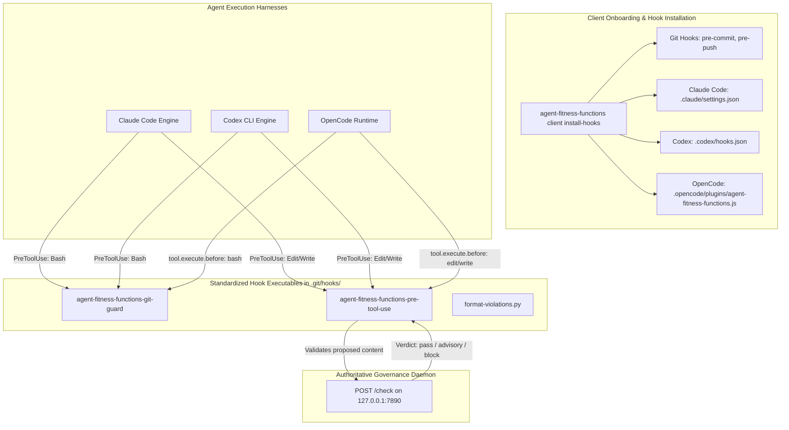

# Codex and OpenCode Multi-Agent Tool-Use Hook Integration Implementation Plan

> **For Orchestration:** This plan MUST be executed by **`peters-bdd-orchestrator`** through strict native BDD Red-Green-Refactor cycles, independent review gates, and durable ledger completion under `.bdd-orchestrator/`.

**Goal:** Extend `agent-fitness-functions client install-hooks` and `client onboard` to automatically configure, verify, and document tool-use validation hooks for OpenAI Codex (`.codex/hooks.json`) and OpenCode (`.opencode/plugins/agent-fitness-functions.js`), alongside existing Claude Code and Git hook integration.

**Architecture:** A unified multi-agent tool-interception model where `client install-hooks` provisions portable hook scripts in the Git hooks directory, idempotently upserts `PreToolUse` configurations into `.claude/settings.json` and `.codex/hooks.json`, and writes an OpenCode native lifecycle plugin into `.opencode/plugins/`. Hook script parsers are generalized to accept snake_case and camelCase parameters across all harnesses, and `client doctor` checks all three agent environments.

**Tech Stack:** Go 1.22+, Bash, Python 3.10+ (posix shlex & JSON), OpenCode Plugin API (JavaScript/ESM), MADR (Architecture Decision Records).

---

## Execution Handoff

```text
Accepted plan: /Users/poconnor/peter_code/agent-fitness-functions/docs/superpowers/plans/2026-09-04-codex-opencode-integration.md
Commit policy: commits authorized
Transport: native
```

### Invocations by Harness

- **Claude Code:** `@peters-bdd-orchestrator /Users/poconnor/peter_code/agent-fitness-functions/docs/superpowers/plans/2026-09-04-codex-opencode-integration.md`
- **OpenCode:** Press `Tab` to switch the primary agent to `peters-bdd-orchestrator`, then provide the accepted plan path with commit policy.
- **Codex:** `Use the peters-bdd-orchestrator agent with the accepted plan at /Users/poconnor/peter_code/agent-fitness-functions/docs/superpowers/plans/2026-09-04-codex-opencode-integration.md.`

---

## Baseline Quality Gate

Before starting any task, the orchestrator verifies the baseline test suite is clean:

```bash
GOCACHE=$(pwd)/.tmp/go-build GOMODCACHE=$(pwd)/.tmp/go-mod go test . ./configs ./cmd/agent-fitness-functions ./internal/server ./internal/client ./hooks
```

---

## Architecture and Flow



---

## File Structure & Module Map

| File Path | Purpose |
|---|---|
| `hooks/pre-tool-use.sh` | Tracked source twin: validates proposed file content before write; supports Claude, Codex, OpenCode payloads |
| `hooks/git-guard.sh` | Tracked source twin: blocks bypass git commands (`commit -n`, `push -f`, etc.) across all harness payload schemas |
| `internal/client/hookassets/pre-tool-use.sh` | Embedded binary asset twin for `pre-tool-use.sh` |
| `internal/client/hookassets/git-guard.sh` | Embedded binary asset twin for `git-guard.sh` |
| `internal/client/hookassets/opencode-plugin.js` | Embedded OpenCode plugin template for lifecycle interception |
| `internal/client/client.go` | Hook installation engine: adds `applyCodexHook` and `installOpenCodePlugin` |
| `internal/client/doctor.go` | Diagnostic engine: verifies Git, Claude Code, Codex, and OpenCode hook installations |
| `internal/client/client_test.go` | Unit tests for hook installation across all agent environments |
| `internal/client/doctor_test.go` | Unit tests for doctor health diagnostics across all agent environments |
| `hooks/twin_drift_test.go` | Guard test ensuring embedded hook assets match tracked source twins |
| `docs/adr/0008-codex-opencode-tool-use-hooks.md` | MADR architectural decision record for multi-agent hook composition |
| `docs/spec/engineering-spec.md` | Engineering specification update for Codex/OpenCode integration |
| `docs/runbooks/onboard-new-repository.md` | Runbook update for multi-agent governance workflow |

---

### Scenario 1: Multi-Harness Payload Parsing Normalization in `pre-tool-use.sh` and `git-guard.sh`

**BDD Contract:**
- **Given** a hook payload dispatched from Claude Code (`tool_name`, `tool_input` with snake_case keys), Codex (`tool_input` with raw `content`), or OpenCode (`tool`, `args` with camelCase keys `filePath`, `oldString`, `newString`, `replaceAll`),
- **When** the payload is piped to `agent-fitness-functions-pre-tool-use` or `agent-fitness-functions-git-guard`,
- **Then** the scripts extract the target file path, accurately reconstruct proposed edits without JSON parsing failures, extract commands to guard, and preserve exact parity between `hooks/` and `internal/client/hookassets/`.

**Files:**
- Modify: `hooks/pre-tool-use.sh:130-240`
- Modify: `hooks/git-guard.sh:90-110`
- Modify: `internal/client/hookassets/pre-tool-use.sh:130-240`
- Modify: `internal/client/hookassets/git-guard.sh:90-110`
- Create: `hooks/payload_normalization_test.go`
- Test: `hooks/twin_drift_test.go`

- [ ] **RED Step 1: Write failing test in `hooks/payload_normalization_test.go`**

```go
package hooks_test

import (
	"bytes"
	"os/exec"
	"path/filepath"
	"testing"
)

func TestPreToolUsePayloadNormalization(t *testing.T) {
	scriptPath := filepath.Join("..", "hooks", "pre-tool-use.sh")
	
	tests := []struct {
		name    string
		payload string
	}{
		{
			name:    "Claude Code payload format",
			payload: `{"tool_name":"Edit","tool_input":{"file_path":"test.py","old_string":"foo","new_string":"bar"}}`,
		},
		{
			name:    "Codex payload format",
			payload: `{"tool_name":"Edit","tool_input":{"file_path":"test.py","content":"def bar(): pass\n"}}`,
		},
		{
			name:    "OpenCode payload format with camelCase",
			payload: `{"tool":"edit","args":{"filePath":"test.py","oldString":"foo","newString":"bar"}}`,
		},
	}

	for _, tc := range tests {
		t.Run(tc.name, func(t *testing.T) {
			cmd := exec.Command("bash", scriptPath)
			cmd.Stdin = bytes.NewReader([]byte(tc.payload))
			cmd.Env = append(cmd.Environ(), "AGENT_FITNESS_FUNCTIONS_ON_ERROR=advisory")
			out, _ := cmd.CombinedOutput()
			if bytes.Contains(out, []byte("invalid JSON payload")) || bytes.Contains(out, []byte("missing file_path")) {
				t.Fatalf("unexpected payload parsing failure for %s: %s", tc.name, string(out))
			}
		})
	}
}
```

- [ ] **RED Step 2: Run test to observe expected failure**

Run:
```bash
GOCACHE=$(pwd)/.tmp/go-build GOMODCACHE=$(pwd)/.tmp/go-mod go test -run TestPreToolUsePayloadNormalization ./hooks
```
Expected: FAIL on OpenCode payload format ("missing file_path").

- [ ] **GREEN Step 3: Implement normalized payload extraction in `hooks/` and `internal/client/hookassets/`**

In `hooks/pre-tool-use.sh` and `internal/client/hookassets/pre-tool-use.sh`:
```python
try:
    with open(sys.argv[1], encoding="utf-8") as handle:
        payload = json.load(handle)
    tool_input = payload.get("tool_input") or payload.get("args") or payload
    file_path = tool_input.get("file_path") or tool_input.get("filePath") or tool_input.get("path", "")
    if not file_path:
        print(json.dumps({"error": "missing file_path"}))
    else:
        print(json.dumps({"file_path": file_path}))
except Exception as exc:
    print(json.dumps({"error": f"invalid JSON payload: {exc}"}))
```

Support `old_string`/`oldString`, `new_string`/`newString`, `replace_all`/`replaceAll`, and `content`:
```python
if "content" in tool_input:
    content = tool_input["content"]
elif "new_string" in tool_input or "newString" in tool_input:
    old_string = tool_input.get("old_string") if "old_string" in tool_input else tool_input.get("oldString")
    new_string = tool_input.get("new_string") if "new_string" in tool_input else tool_input.get("newString")
    if old_string is None:
        print(json.dumps({"error": "missing old_string for Edit"}))
        sys.exit(0)
    absolute_file = os.path.join(sys.argv[3], sys.argv[4])
    with open(absolute_file, encoding="utf-8", newline="") as source_file:
        current_content = source_file.read()
    occurrences = current_content.count(old_string)
    replace_all = bool(tool_input.get("replace_all", tool_input.get("replaceAll", False)))
    if occurrences == 0:
        print(json.dumps({"error": "old_string not found in current file"}))
        sys.exit(0)
    if not replace_all and occurrences > 1:
        print(json.dumps({"error": "old_string matched multiple locations"}))
        sys.exit(0)
    count = -1 if replace_all else 1
    content = current_content.replace(old_string, new_string, count)
```

In `hooks/git-guard.sh` and `internal/client/hookassets/git-guard.sh`:
```python
tool_input = parsed.get("tool_input") or parsed.get("args") or parsed
command = tool_input.get("command") or tool_input.get("cmd", "")
```

- [ ] **GREEN Step 4: Run tests to verify all payload shapes and twin parity**

Run:
```bash
GOCACHE=$(pwd)/.tmp/go-build GOMODCACHE=$(pwd)/.tmp/go-mod go test ./hooks
```
Expected: PASS with 0 drift.

- [ ] **REFACTOR Step 5: Check and clean code formatting, then commit**

```bash
git add hooks/ internal/client/hookassets/
git commit -m "feat(hooks): generalize pre-tool-use and git-guard payload normalization"
```

---

### Scenario 2: Idempotent Codex PreToolUse Hook Composition (`.codex/hooks.json`)

**BDD Contract:**
- **Given** a governed git repository with or without an existing `.codex/hooks.json` (such as `PreCompact` bd prime hooks),
- **When** `agent-fitness-functions client install-hooks` is executed,
- **Then** `PreToolUse` entries for `agent-fitness-functions-git-guard` (matching `Bash`) and `agent-fitness-functions-pre-tool-use` (matching `Edit|Write`) are idempotently upserted using portable `$(git rev-parse --git-path hooks/...)` commands without clobbering existing non-product hooks.

**Files:**
- Modify: `internal/client/client.go:540-620`
- Create: `internal/client/codex_composition_test.go`

- [ ] **RED Step 1: Write failing test in `internal/client/codex_composition_test.go`**

```go
package client

import (
	"encoding/json"
	"os"
	"path/filepath"
	"testing"
)

func TestInstallHooksUpsertsCodexHooks(t *testing.T) {
	repo := t.TempDir()
	initGitRepoForTest(t, repo)

	codexDir := filepath.Join(repo, ".codex")
	if err := os.MkdirAll(codexDir, 0o755); err != nil {
		t.Fatalf("mkdir .codex: %v", err)
	}

	initialContent := `{
  "hooks": {
    "PreCompact": [
      {
        "matcher": "",
        "hooks": [
          {
            "type": "command",
            "command": "bd prime"
          }
        ]
      }
    ]
  }
}`
	if err := os.WriteFile(filepath.Join(codexDir, "hooks.json"), []byte(initialContent), 0o644); err != nil {
		t.Fatalf("write hooks.json: %v", err)
	}

	installer := hookInstaller{repoRoot: repo, stdout: os.Stdout}
	if err := installer.installGitGuard(); err != nil {
		t.Fatalf("installGitGuard: %v", err)
	}
	if err := installer.installAgentHook(); err != nil {
		t.Fatalf("installAgentHook: %v", err)
	}

	content, err := os.ReadFile(filepath.Join(codexDir, "hooks.json"))
	if err != nil {
		t.Fatalf("read hooks.json: %v", err)
	}

	var parsed struct {
		Hooks struct {
			PreCompact []json.RawMessage `json:"PreCompact"`
			PreToolUse []struct {
				Matcher string `json:"matcher"`
				Hooks   []struct {
					Type    string `json:"type"`
					Command string `json:"command"`
				} `json:"hooks"`
			} `json:"PreToolUse"`
		} `json:"hooks"`
	}
	if err := json.Unmarshal(content, &parsed); err != nil {
		t.Fatalf("unmarshal hooks.json: %v\ncontent:\n%s", err, string(content))
	}

	if len(parsed.Hooks.PreCompact) != 1 {
		t.Errorf("PreCompact hook was clobbered, got %d entries", len(parsed.Hooks.PreCompact))
	}
	if len(parsed.Hooks.PreToolUse) != 2 {
		t.Fatalf("PreToolUse hooks count = %d, want 2 (Bash + Edit|Write)", len(parsed.Hooks.PreToolUse))
	}
}
```

- [ ] **RED Step 2: Run test to observe expected failure**

Run:
```bash
GOCACHE=$(pwd)/.tmp/go-build GOMODCACHE=$(pwd)/.tmp/go-mod go test -run TestInstallHooksUpsertsCodexHooks ./internal/client
```
Expected: FAIL (Codex hooks not yet upserted).

- [ ] **GREEN Step 3: Implement `applyCodexHook` and invoke in installer**

In `internal/client/client.go`:
```go
func (installer hookInstaller) applyCodexHook(spec claudeHookSpec) error {
	hooksJSONPath := filepath.Join(installer.repoRoot, ".codex", "hooks.json")
	if err := os.MkdirAll(filepath.Dir(hooksJSONPath), 0o755); err != nil {
		return fmt.Errorf("creating .codex directory: %w", err)
	}
	settings, err := loadClaudeSettings(hooksJSONPath)
	if err != nil {
		return fmt.Errorf("reading .codex/hooks.json: %w", err)
	}
	message := upsertClaudeHook(settings, spec)
	if err := writeClaudeSettings(hooksJSONPath, settings); err != nil {
		return fmt.Errorf("writing .codex/hooks.json: %w", err)
	}
	_, _ = fmt.Fprintf(installer.stdout, "%s in %s\n", message, hooksJSONPath)
	return nil
}
```

Hook `applyCodexHook` into `installGitGuard` and `installAgentHook`.

- [ ] **GREEN Step 4: Run tests to verify pass**

Run:
```bash
GOCACHE=$(pwd)/.tmp/go-build GOMODCACHE=$(pwd)/.tmp/go-mod go test -run TestInstallHooksUpsertsCodexHooks ./internal/client
```
Expected: PASS.

- [ ] **REFACTOR Step 5: Check and clean code, then commit**

```bash
git add internal/client/
git commit -m "feat(client): add codex hooks.json PreToolUse composition"
```

---

### Scenario 3: Native OpenCode Tool Execution Interception Plugin (`.opencode/plugins/agent-fitness-functions.js`)

**BDD Contract:**
- **Given** a governed git repository,
- **When** `agent-fitness-functions client install-hooks` is executed,
- **Then** `.opencode/plugins/agent-fitness-functions.js` is generated from an embedded asset, registering a `"tool.execute.before"` listener that routes `bash` tool execution to `agent-fitness-functions-git-guard` and `edit`/`write` tool execution to `agent-fitness-functions-pre-tool-use`, synchronously throwing an error if the hook blocks.

**Files:**
- Create: `internal/client/hookassets/opencode-plugin.js`
- Modify: `internal/client/client.go`
- Create: `internal/client/opencode_plugin_test.go`

- [ ] **RED Step 1: Write failing test in `internal/client/opencode_plugin_test.go`**

```go
package client

import (
	"os"
	"path/filepath"
	"strings"
	"testing"
)

func TestInstallHooksGeneratesOpenCodePlugin(t *testing.T) {
	repo := t.TempDir()
	initGitRepoForTest(t, repo)

	installer := hookInstaller{repoRoot: repo, stdout: os.Stdout}
	if err := installer.installAgentHook(); err != nil {
		t.Fatalf("installAgentHook: %v", err)
	}

	pluginPath := filepath.Join(repo, ".opencode", "plugins", "agent-fitness-functions.js")
	content, err := os.ReadFile(pluginPath)
	if err != nil {
		t.Fatalf("read plugin: %v", err)
	}

	str := string(content)
	if !strings.Contains(str, "tool.execute.before") {
		t.Errorf("plugin missing 'tool.execute.before' hook listener")
	}
	if !strings.Contains(str, "agent-fitness-functions-git-guard") {
		t.Errorf("plugin missing git-guard hook reference")
	}
	if !strings.Contains(str, "agent-fitness-functions-pre-tool-use") {
		t.Errorf("plugin missing pre-tool-use hook reference")
	}
}
```

- [ ] **RED Step 2: Run test to observe expected failure**

Run:
```bash
GOCACHE=$(pwd)/.tmp/go-build GOMODCACHE=$(pwd)/.tmp/go-mod go test -run TestInstallHooksGeneratesOpenCodePlugin ./internal/client
```
Expected: FAIL (file `.opencode/plugins/agent-fitness-functions.js` does not exist).

- [ ] **GREEN Step 3: Create `opencode-plugin.js` embedded asset and `installOpenCodePlugin` implementation**

Create `internal/client/hookassets/opencode-plugin.js`:
```javascript
// agent-fitness-functions-opencode-plugin: managed by agent-fitness-functions client install-hooks
import { spawnSync } from "child_process";

export const AgentFitnessFunctionsPlugin = async () => {
  return {
    "tool.execute.before": async (input, output) => {
      if (!input || !input.tool) return;
      const tool = input.tool.toLowerCase();
      
      let hookName = "";
      let payload = null;
      
      if (tool === "bash") {
        hookName = "agent-fitness-functions-git-guard";
        const command = output?.args?.command || input?.args?.command || "";
        if (!command) return;
        payload = { tool_name: "Bash", tool_input: { command } };
      } else if (tool === "edit" || tool === "write") {
        hookName = "agent-fitness-functions-pre-tool-use";
        const args = output?.args || input?.args || {};
        payload = { tool_name: input.tool, tool_input: args };
      } else {
        return;
      }

      const gitPathProc = spawnSync("git", ["rev-parse", "--git-path", `hooks/${hookName}`], {
        encoding: "utf-8",
      });
      if (gitPathProc.status !== 0 || !gitPathProc.stdout.trim()) {
        return;
      }
      const hookPath = gitPathProc.stdout.trim();

      const proc = spawnSync(hookPath, [], {
        input: JSON.stringify(payload),
        encoding: "utf-8",
        env: { ...process.env },
      });

      if (proc.status !== 0) {
        const errorMsg = (proc.stderr || proc.stdout || "Blocked by agent-fitness-functions").trim();
        throw new Error(errorMsg);
      }
    },
  };
};
```

In `internal/client/client.go`:
```go
func (installer hookInstaller) installOpenCodePlugin() error {
	pluginDir := filepath.Join(installer.repoRoot, ".opencode", "plugins")
	if err := os.MkdirAll(pluginDir, 0o755); err != nil {
		return fmt.Errorf("creating .opencode/plugins directory: %w", err)
	}
	pluginPath := filepath.Join(pluginDir, "agent-fitness-functions.js")
	if err := installer.writeEmbeddedExecutable("hookassets/opencode-plugin.js", pluginPath); err != nil {
		return err
	}
	_, _ = fmt.Fprintf(installer.stdout, "installed %s\n", pluginPath)
	return nil
}
```

- [ ] **GREEN Step 4: Run tests to verify pass**

Run:
```bash
GOCACHE=$(pwd)/.tmp/go-build GOMODCACHE=$(pwd)/.tmp/go-mod go test -run TestInstallHooksGeneratesOpenCodePlugin ./internal/client
```
Expected: PASS.

- [ ] **REFACTOR Step 5: Clean code formatting and commit**

```bash
git add internal/client/
git commit -m "feat(client): generate opencode lifecycle plugin for tool interception"
```

---

### Scenario 4: Diagnostic Health Checks for Codex & OpenCode in `doctor.go`

**BDD Contract:**
- **Given** a governed repository running `agent-fitness-functions client doctor`,
- **When** the doctor suite inspects agent hook installations,
- **Then** it validates the existence and configuration of `.codex/hooks.json` and `.opencode/plugins/agent-fitness-functions.js` alongside `.claude/settings.json`, outputting actionable remediation instructions if any harness hook is missing or misconfigured.

**Files:**
- Modify: `internal/client/doctor.go:635-820`
- Modify: `internal/client/doctor_test.go`

- [ ] **RED Step 1: Write failing test in `internal/client/doctor_test.go`**

```go
func TestDoctorChecksCodexAndOpenCodeHooks(t *testing.T) {
	repo := t.TempDir()
	initGitRepoForTest(t, repo)

	cfg := doctorConfig{repoRoot: repo}
	results := checkHooksInstalled(cfg)

	names := make(map[string]bool)
	for _, res := range results {
		names[res.name] = res.passed
	}

	if _, ok := names["Codex hooks"]; !ok {
		t.Errorf("missing 'Codex hooks' check in doctor results")
	}
	if _, ok := names["OpenCode plugin"]; !ok {
		t.Errorf("missing 'OpenCode plugin' check in doctor results")
	}
}
```

- [ ] **RED Step 2: Run test to observe expected failure**

Run:
```bash
GOCACHE=$(pwd)/.tmp/go-build GOMODCACHE=$(pwd)/.tmp/go-mod go test -run TestDoctorChecksCodexAndOpenCodeHooks ./internal/client
```
Expected: FAIL (missing "Codex hooks" and "OpenCode plugin" checks).

- [ ] **GREEN Step 3: Implement `codexHookResult` and `openCodePluginResult` in `doctor.go`**

In `internal/client/doctor.go`:
```go
func checkHooksInstalled(cfg doctorConfig) []checkResult {
	if cfg.repoRoot == "" {
		return []checkResult{{
			name:        "hooks installed",
			detail:      "not inside a git working tree",
			remediation: "run doctor from within the governed repository",
		}}
	}
	return []checkResult{
		gitHookResult(cfg.repoRoot, "pre-commit"),
		gitHookResult(cfg.repoRoot, "pre-push"),
		gitGuardSettingsResult(cfg.repoRoot),
		editWriteHookResult(cfg.repoRoot),
		codexHookResult(cfg.repoRoot),
		openCodePluginResult(cfg.repoRoot),
	}
}

func codexHookResult(repoRoot string) checkResult {
	name := "Codex hooks"
	hooksPath := filepath.Join(repoRoot, ".codex", "hooks.json")
	if _, err := os.Stat(hooksPath); os.IsNotExist(err) {
		return checkResult{
			name:        name,
			detail:      "not configured (missing .codex/hooks.json)",
			remediation: "agent-fitness-functions client install-hooks",
		}
	}
	settings, err := loadClaudeSettings(hooksPath)
	if err != nil {
		return checkResult{name: name, detail: "malformed .codex/hooks.json: " + err.Error(), remediation: "re-run install-hooks"}
	}
	entries := preToolUseEntries(ensureHooksSection(settings))
	if _, _, ok := findClaudeHookEntry(entries, gitGuardNameHistory); !ok {
		return checkResult{name: name, detail: "missing git-guard in .codex/hooks.json", remediation: "agent-fitness-functions client install-hooks"}
	}
	return checkResult{name: name, detail: ".codex/hooks.json", passed: true}
}

func openCodePluginResult(repoRoot string) checkResult {
	name := "OpenCode plugin"
	pluginPath := filepath.Join(repoRoot, ".opencode", "plugins", "agent-fitness-functions.js")
	if _, err := os.Stat(pluginPath); os.IsNotExist(err) {
		return checkResult{
			name:        name,
			detail:      "not installed (missing .opencode/plugins/agent-fitness-functions.js)",
			remediation: "agent-fitness-functions client install-hooks",
		}
	}
	return checkResult{name: name, detail: ".opencode/plugins/agent-fitness-functions.js", passed: true}
}
```

- [ ] **GREEN Step 4: Run doctor tests to verify pass**

Run:
```bash
GOCACHE=$(pwd)/.tmp/go-build GOMODCACHE=$(pwd)/.tmp/go-mod go test ./internal/client
```
Expected: PASS.

- [ ] **REFACTOR Step 5: Check code quality and commit**

```bash
git add internal/client/
git commit -m "feat(doctor): report codex and opencode hook installation health"
```

---

### Scenario 5: Multi-Agent Hook Architecture Decision Record (ADR-0008) and Specifications

**BDD Contract:**
- **Given** the resolution of ADR-0006 Open Question on Codex and OpenCode integration,
- **When** documentation and specifications are generated,
- **Then** ADR-0008 is recorded in MADR format, `docs/spec/engineering-spec.md`, `docs/runbooks/onboard-new-repository.md`, `CONTEXT.md`, and `README.md` are updated, and the entire verification test suite passes cleanly.

**Files:**
- Create: `docs/adr/0008-codex-opencode-tool-use-hooks.md`
- Modify: `docs/spec/engineering-spec.md`
- Modify: `docs/runbooks/onboard-new-repository.md`
- Modify: `CONTEXT.md`
- Modify: `README.md`

- [ ] **RED Step 1: Write ADR-0008 in MADR format**

Create `docs/adr/0008-codex-opencode-tool-use-hooks.md` documenting context, decision drivers, considered options, decision outcome, and RFC 2119 conformance clauses.

- [ ] **GREEN Step 2: Update engineering specifications and runbooks**

Update `docs/spec/engineering-spec.md` §5 and `docs/runbooks/onboard-new-repository.md` to reflect multi-agent hook provisioning across Claude Code, OpenAI Codex, and OpenCode.

- [ ] **GREEN Step 3: Run full verification suite across all packages**

Run:
```bash
GOCACHE=$(pwd)/.tmp/go-build GOMODCACHE=$(pwd)/.tmp/go-mod go test ./...
```
Expected: PASS across all packages.

- [ ] **REFACTOR Step 4: Commit documentation**

```bash
git add docs/ CONTEXT.md README.md
git commit -m "docs(adr): record ADR-0008 multi-agent tool-use hook composition"
```

---

## Final Whole-Plan Review Gate

The orchestrator completes execution with an independent final whole-plan review:
1. Verify unchanged accepted plan digest.
2. Confirm all 5 scenarios have clean RED and GREEN evidence in `.bdd-orchestrator/` ledger.
3. Verify no lingering uncommitted files or unauthorized changes.
4. Run full test suite:
   ```bash
   GOCACHE=$(pwd)/.tmp/go-build GOMODCACHE=$(pwd)/.tmp/go-mod go test ./...
   ```
5. Report final execution summary with changed files and commit ranges.
