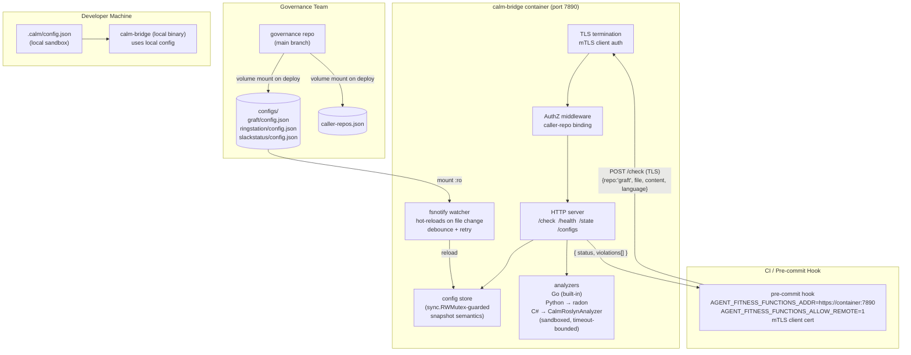

# calm-bridge Container Design

**Date:** 2026-05-29
**Status:** Approved
**Author:** Peter O'Connor
**Revision:** 2 — incorporates consolidated review findings (docker, dependency-management, design-patterns, safety, security)

---

## Problem

`calm-bridge serve` runs today as a local daemon on each developer's machine. This means:

- Each developer installs and maintains the binary locally.
- Governance thresholds live in per-repo `.calm/config.json` files that developers can edit freely.
- There is no shared enforcement point across teams.

The goal is a single containerized `calm-bridge` daemon that the governance team operates, enforces organization-wide fitness function rules, and exposes over the internal network. Pre-commit hooks and CI pipelines point at it. Developers cannot bypass its config.

---

## Design Decisions

### Governance config lives in the server, not the client

The container mounts a `configs/` directory at runtime. Each subdirectory names a logical repository:

```
configs/
  graft/
    config.json
  ringstation/
    config.json
  slackstatus/
    config.json
```

When `POST /check` arrives with `repo: "graft"`, the server looks up `configs/graft/config.json` from the mounted volume. It ignores the developer's local `.calm/config.json` entirely.

Changing governance thresholds requires a PR to this repository. The git history is the audit trail. A developer who edits their local config and points their hook at the container gets the governance team's config regardless.

**Local `.calm/config.json` remains** as a developer sandbox. The local `calm-bridge` binary (without `AGENT_FITNESS_FUNCTIONS_ADDR` set) still reads it for fast local iteration. The container is the enforcement point; local config is a DX affordance.

### Runtime-mounted config, hot-reloaded

The governance team does not restart the container to activate a threshold change. An `fsnotify` watcher monitors `AGENT_FITNESS_FUNCTIONS_CONFIGS_DIR`. Any file change triggers an in-memory reload within ~1 second. The next `/check` request uses the new config.

| Event | Server response |
|---|---|
| Container starts | Loads all `configs/*/config.json` into memory; **fails closed if mount is missing/unreadable** |
| File modified | Reloads that repo's config within ~1s |
| File added | New repo config becomes available immediately |
| File deleted | **Marks repo as invalid; returns explicit error on subsequent `/check` requests until repaired** |
| File is invalid JSON | Logs a warning; **marks repo config invalid and returns explicit error. Does not crash.** |
| `AGENT_FITNESS_FUNCTIONS_CONFIGS_DIR` not set | Defaults to `/app/configs` (container-safe path) |

#### Hot-reload semantics

- **Atomic writes:** The watcher expects config files to be written atomically (write-to-temp + rename). Editors and CI that write in-place MUST use `rename(2)` semantics. The watcher treats a `RENAME` followed by `CREATE` on the same path as a single update event.
- **Debounce:** File events within a 500ms window are coalesced into a single reload. This prevents thrashing during multi-file updates.
- **Retry on transient failure:** If a valid file cannot be read on event (e.g., mid-write), the watcher retries up to 3 times with 200ms backoff before marking the config as invalid.

### `repo` field becomes a logical name

**Before:**
```json
{ "repo": "/home/user/projects/graft", "file": "cmd/api/main.go", ... }
```

**After:**
```json
{ "repo": "graft", "file": "cmd/api/main.go", ... }
```

The server maps the logical name to its config store. The filesystem path no longer crosses the network boundary.

#### Repo name validation

Repo names MUST match the pattern `^[a-z][a-z0-9_-]{0,63}$`. The server normalizes input to lowercase before lookup. Invalid identifiers are rejected with HTTP 400.

### Unknown repo handling

**Decision:** Reject unknown repo names by default (no silent fallback to `defaultConfig()`).

When a `/check` request arrives with a `repo` value that has no corresponding `configs/{repo}/config.json`, the server returns:

```json
{ "status": "error", "message": "unknown repo: no config registered for 'foo'" }
```

HTTP status: `404 Not Found`.

This prevents typo-driven or spoofed policy routing and surfaces boundary failures immediately. Repos MUST be explicitly registered in the config volume before enforcement applies.

### Single multi-runtime image (Approach A)

All analysis runs server-side. The container must include all three language runtimes: Go (built-in), Python + radon, and .NET 8 (`CalmRoslynAnalyzer`). Dropping a language from the image means the container rejects commits from that language.

A sidecar approach was considered and rejected. The operational complexity — three containers, inter-container networking, coordinated health checks — does not pay off at this stage.

---

## Security

### Authentication and authorization

All endpoints except `GET /health` require authentication. The service uses mTLS client certificates for service-to-service authentication.

| Endpoint | Access control |
|---|---|
| `GET /health` | Unauthenticated (load balancer probes) |
| `POST /check` | Authenticated clients with valid mTLS cert; repo access governed by allowlist |
| `GET /state` | Authenticated clients; repo access governed by allowlist |
| `GET /configs` | Admin-only (governance team cert CN or role claim) |

#### Caller-to-repo binding

The server maintains a `caller-repos.json` mapping that binds authenticated client identities (cert CN or service account) to the repos they may submit checks for:

```json
{
  "ci-runner-graft": ["graft"],
  "ci-runner-all": ["graft", "ringstation", "slackstatus"],
  "dev-hook-pool": ["graft", "ringstation", "slackstatus"]
}
```

A request from `ci-runner-graft` with `repo: "ringstation"` is rejected with HTTP 403.

### Transport security

All governance traffic MUST use TLS in transit. The deployment provides two options:

1. **mTLS termination at the service** (preferred for direct client-to-service): The container terminates TLS using certs mounted at `/app/certs/`.
2. **Authenticated trusted proxy** (for environments behind an ingress controller): The proxy terminates TLS, injects authenticated identity headers (`X-Client-CN`), and the container binds to localhost only.

Cleartext HTTP is disabled in production. The `--tls-cert`, `--tls-key`, and `--tls-ca` flags configure certificate paths.

### Analyzer sandbox boundaries

Analyzers execute within the following constraints:

| Constraint | Enforcement |
|---|---|
| No network egress | `iptables` rules in container + `no-new-privileges` |
| Temp workspace isolation | Each analysis writes to an ephemeral tmpfs directory, removed after response |
| Process limits | `ulimit -u 64` per analyzer invocation |
| Execution timeout | Per-analyzer timeout (default 30s); hard-killed on expiry |
| Filesystem access | Read-only bind of source content; no access to config volume or certs |

---

## Architecture



---

## API

### `POST /check` — unchanged shape, `repo` is now a logical name

```json
{ "repo": "graft", "file": "cmd/api/main.go", "proposed_content": "...", "language": "go" }
```

**Constraints:**
- Max request body: 5 MB
- Per-client rate limit: 100 requests/minute (configurable via `AGENT_FITNESS_FUNCTIONS_RATE_LIMIT`)
- Per-repo concurrency cap: 10 concurrent analyses
- Analyzer timeout: 30s per file (configurable via `AGENT_FITNESS_FUNCTIONS_ANALYZER_TIMEOUT`)

**Response:**

Success: `{ "status": "pass|block|advisory", "violations": [...] }` — HTTP 200

Error cases:
| Condition | HTTP Status | Response |
|---|---|---|
| Unknown repo | 404 | `{ "status": "error", "message": "unknown repo: ..." }` |
| Repo config invalid (broken JSON, deleted file) | 503 | `{ "status": "error", "message": "repo config unavailable: ..." }` |
| Unauthorized caller | 403 | `{ "status": "error", "message": "caller not authorized for repo" }` |
| Request too large | 413 | `{ "status": "error", "message": "request body exceeds 5MB limit" }` |
| Rate limited | 429 | `{ "status": "error", "message": "rate limit exceeded" }` |
| Analyzer timeout | 504 | `{ "status": "error", "message": "analysis timed out" }` |
| Analyzer error | 500 | `{ "status": "error", "message": "analyzer failed: ..." }` |
| Invalid repo name | 400 | `{ "status": "error", "message": "invalid repo name: must match ..." }` |

### `GET /configs` — admin-only endpoint

**Access:** Restricted to authenticated admin identities (governance team cert CN).

Returns the currently loaded config set with operational metadata:

```json
{
  "version": "sha256:abcdef...",
  "loaded_at": "2026-05-29T14:30:00Z",
  "repos": {
    "graft":       { "status": "valid", "enforcement-mode": "block",    "fitness-functions": { "cyclomatic-complexity": true, ... } },
    "ringstation": { "status": "valid", "enforcement-mode": "advisory", "fitness-functions": { ... } },
    "broken-repo": { "status": "invalid", "error": "parse error at line 5", "last_valid_at": "2026-05-29T12:00:00Z" }
  }
}
```

No write endpoint. Config changes go through git → volume mount → hot-reload only.

### `GET /health` — unauthenticated

Returns `200 OK` with `{"status": "healthy", "config_store": "ready"}`.

Returns `503 Service Unavailable` if:
- The config store failed to initialize on startup
- The fsnotify watcher is not running
- Zero valid repo configs are loaded

### `GET /state` — `repo` param becomes a logical name

`?repo=graft` instead of `?repo=/home/user/projects/graft`. Return shape is unchanged. Subject to caller-repo authorization.

---

## Config Store Design

### Concurrency model

The config store uses `sync.RWMutex` with snapshot semantics:

```go
type ConfigStore struct {
    mu       sync.RWMutex
    configs  map[string]*RepoConfig  // keyed by logical repo name
    watcher  *fsnotify.Watcher
    ctx      context.Context
    cancel   context.CancelFunc
    dir      string
}
```

- **Reads** (`/check`, `/configs`, `/state`): Acquire read lock, copy the pointer to the relevant `*RepoConfig`, release lock. Request processing uses the snapshot — no lock held during analysis.
- **Writes** (hot-reload): Acquire write lock, replace the map entry, release lock.
- **No concurrent map iteration and write:** The `/configs` endpoint serializes a snapshot taken under read lock.

### Lifecycle contract

```go
// NewConfigStore creates the store, loads initial configs, and starts the watcher.
// Returns error if:
//   - dir does not exist or is not readable
//   - zero valid configs are found on initial load
//   - fsnotify watcher cannot be created
func NewConfigStore(ctx context.Context, dir string) (*ConfigStore, error)

// Close stops the watcher, cancels the context, and releases resources.
// Must be called on server shutdown (defer in main, or signal handler).
func (cs *ConfigStore) Close() error
```

The `context.Context` passed to `NewConfigStore` governs the watcher goroutine's lifetime. On context cancellation, the watcher exits cleanly, file descriptors are closed, and no goroutines leak.

### Startup behavior (fail-closed)

If the config directory is missing, unreadable, or contains zero parseable configs at startup, `NewConfigStore` returns an error. The server MUST NOT start. This prevents a misconfigured deployment from silently operating with no governance rules.

---

## Dockerfile

Multi-stage build. No build toolchains in the final image.

```dockerfile
# Stage 1: go-build
FROM golang:1.22.4-alpine3.20 AS go-build
RUN apk add --no-cache git
WORKDIR /src
COPY go.mod go.sum ./
RUN go mod download
COPY . .
RUN CGO_ENABLED=0 GOOS=linux GOARCH=amd64 go build -ldflags="-w -s" \
    -o /out/calm-bridge ./cmd/calm-bridge

# Stage 2: dotnet-build
FROM mcr.microsoft.com/dotnet/sdk:8.0.301 AS dotnet-build
WORKDIR /src
COPY tools/roslyn-analyzer/ .
RUN dotnet publish --self-contained true -r linux-x64 -o /app/publish

# Stage 3: final
FROM mcr.microsoft.com/dotnet/runtime-deps:8.0.6

ARG GIT_SHA=dev
ARG BUILD_DATE=unknown
LABEL org.opencontainers.image.revision=$GIT_SHA \
      org.opencontainers.image.created=$BUILD_DATE \
      org.opencontainers.image.source="https://github.com/org/calm-bridge"

WORKDIR /app

# Create non-root user BEFORE copying files
RUN groupadd -g 1001 appuser && \
    useradd -u 1001 -g appuser -s /usr/sbin/nologin -M appuser

# Install Python + radon in a single layer
COPY requirements.txt /tmp/requirements.txt
RUN apt-get update && \
    apt-get install --no-install-recommends -y \
      python3 python3-pip curl ca-certificates && \
    rm -rf /var/lib/apt/lists/* && \
    pip install --no-cache-dir --break-system-packages -r /tmp/requirements.txt && \
    rm /tmp/requirements.txt

# Copy built artifacts (user already exists)
COPY --from=go-build --chown=appuser:appuser /out/calm-bridge /app/calm-bridge
COPY --from=dotnet-build --chown=appuser:appuser /app/publish/ /app/roslyn/

VOLUME ["/app/configs"]
EXPOSE 7890

HEALTHCHECK --interval=30s --timeout=5s --start-period=15s --retries=3 \
    CMD curl -f http://localhost:7890/health || exit 1

USER appuser
ENTRYPOINT ["/app/calm-bridge", "serve"]
CMD ["--addr", "0.0.0.0:7890"]
```

**Image size estimate:** ~810 MB. `runtime-deps` instead of `runtime` saves ~140 MB by avoiding a second copy of .NET assemblies already included in the self-contained publish.

### Security decisions

| Decision | Rationale |
|---|---|
| `runtime-deps` base | Self-contained publish includes assemblies; avoids duplicate ~140 MB |
| `CGO_ENABLED=0` static binary | Final image is glibc (Debian); Alpine build is musl — static binary avoids mismatch |
| Non-root `appuser` (uid 1001) | Prevents kernel capability abuse if a subprocess is exploited |
| User created before `COPY --chown` | Ensures `--chown=appuser:appuser` resolves correctly during build |
| `WORKDIR /app` before `ENTRYPOINT` | Ensures relative paths resolve; `ENTRYPOINT` uses absolute path for clarity |
| `ENTRYPOINT` + `CMD` split | `CMD` is overridable; operators can pass `--addr` without rebuilding |
| Pinned base image tags | Reproducible builds; update on a documented monthly cadence |
| `radon==6.0.1` in `requirements.txt` | Output format stability — unpinned upgrade would silently break analysis |
| Merged apt+pip `RUN`, `--no-install-recommends` | Single layer, no stale apt lists, minimal package surface |
| `COPY --chown` (BuildKit) | Avoids a separate `RUN chown` that doubles copied file size in layer graph |
| OCI `LABEL` with `GIT_SHA` + `BUILD_DATE` | Links running container to source commit for audit |
| `no-new-privileges` (runtime) | Prevents privilege escalation via setuid binaries |

### `.dockerignore`

```
.git
.calm
*.md
tools/roslyn-analyzer/obj/
tools/roslyn-analyzer/bin/
tmp/
*.log
.env*
```

---

## Deployment

### Docker Compose

```yaml
services:
  calm-bridge:
    image: calm-bridge:${GIT_SHA:-latest}
    build:
      context: .
      args:
        GIT_SHA: ${GIT_SHA:-dev}
        BUILD_DATE: ${BUILD_DATE:-unknown}
    ports:
      - "7890:7890"
    volumes:
      - ./configs:/app/configs:ro
      - ./certs:/app/certs:ro
      - ./caller-repos.json:/app/caller-repos.json:ro
    environment:
      AGENT_FITNESS_FUNCTIONS_CONFIGS_DIR: /app/configs
      AGENT_FITNESS_FUNCTIONS_TLS_CERT: /app/certs/server.crt
      AGENT_FITNESS_FUNCTIONS_TLS_KEY: /app/certs/server.key
      AGENT_FITNESS_FUNCTIONS_TLS_CA: /app/certs/ca.crt
      AGENT_FITNESS_FUNCTIONS_RATE_LIMIT: "100"
      AGENT_FITNESS_FUNCTIONS_ANALYZER_TIMEOUT: "30s"
    healthcheck:
      test: ["CMD", "curl", "-f", "http://localhost:7890/health"]
      interval: 30s
      timeout: 5s
      retries: 3
      start_period: 15s
    restart: unless-stopped
    security_opt:
      - no-new-privileges:true
    read_only: true
    tmpfs:
      - /tmp:size=256m
    cap_drop:
      - ALL
    deploy:
      resources:
        limits:
          memory: 1g
          cpus: "1.0"
```

The `configs/` mount is read-only (`:ro`). A compromise of any subprocess cannot modify governance rules.

#### Runtime environment notes

- **Docker Compose (local/staging):** `deploy.resources.limits` is advisory without Swarm mode. For enforcement, use `--memory` and `--cpus` flags directly, or deploy under Swarm/Kubernetes.
- **Kubernetes (production):** Use a `Deployment` with explicit `resources.limits` in the pod spec. The Compose file serves as reference; the Helm chart is authoritative for production.
- **Swarm:** `deploy.resources.limits` are enforced natively. Use the Compose file as-is.

### Developer machine hook configuration

```bash
export AGENT_FITNESS_FUNCTIONS_ADDR=https://calm-governance.internal:7890
export AGENT_FITNESS_FUNCTIONS_ALLOW_REMOTE=1
export AGENT_FITNESS_FUNCTIONS_CLIENT_CERT=/path/to/client.crt
export AGENT_FITNESS_FUNCTIONS_CLIENT_KEY=/path/to/client.key

# Optional: override logical repo name (defaults to directory basename)
export AGENT_FITNESS_FUNCTIONS_REPO_NAME=graft
```

Developers who want local iteration omit these vars. The hook falls back to `localhost:7890` and uses their local `.calm/config.json`.

### What requires a restart vs. what does not

| Change | Restart required? |
|---|---|
| Governance threshold in `configs/*/config.json` | No — hot-reloaded |
| Adding a new repo config | No — hot-reloaded |
| Updating `caller-repos.json` | No — hot-reloaded |
| Upgrading Go, Python, radon, or .NET runtime | Yes — rebuild and redeploy |
| Changes to fitness function logic in `calm-bridge` | Yes — rebuild and redeploy |
| Changes to `patterns/governance.json` (compiled-in schema) | Yes — rebuild and redeploy |
| TLS certificate rotation | Yes — restart (or implement cert watcher in future) |

---

## Dependency Governance

### Go modules

New dependencies (`fsnotify`, rate-limiter, etc.) MUST:

1. Be added via `go get` with explicit version pins in `go.mod`.
2. Have `go.sum` committed alongside `go.mod` changes.
3. Pass `go mod verify` in CI before merge.
4. Be reviewed for license compatibility (MIT, BSD, Apache-2.0 accepted; GPL rejected without exception).
5. Be scanned by `govulncheck` in CI — builds fail on known vulnerabilities.

### Python

`requirements.txt` pins top-level dependencies. A `requirements.lock` file pins transitive dependencies with hashes:

```
radon==6.0.1 \
    --hash=sha256:abc123...
mando==0.7.1 \
    --hash=sha256:def456...
```

The Dockerfile installs with `pip install --require-hashes -r requirements.lock`.

### .NET

The `CalmRoslynAnalyzer.csproj` pins NuGet package versions. `dotnet restore --locked-mode` enforces the lock file in CI.

### Vulnerability and upgrade policy

| Component | Scan tool | CI gate | Update cadence |
|---|---|---|---|
| Go dependencies | `govulncheck` | Build fails on HIGH+ | Monthly + immediate for CRITICAL |
| Python dependencies | `pip-audit` | Build fails on HIGH+ | Monthly + immediate for CRITICAL |
| .NET dependencies | `dotnet list package --vulnerable` | Build fails on HIGH+ | Monthly + immediate for CRITICAL |
| Base image OS packages | Trivy | Build fails on CRITICAL | Monthly + immediate for CRITICAL |
| Base image tags | Dependabot/Renovate | PR auto-created | Monthly |

OS package patching ownership: the governance team operates the container and is responsible for CVE response within 72 hours for CRITICAL, 2 weeks for HIGH.

---

## Multi-architecture support

The initial deployment targets `linux/amd64` only. The build supports future multi-arch via:

- Go: `GOARCH` build arg (already parameterized)
- .NET: `-r` RID parameter (`linux-x64`, `linux-arm64`)
- Docker: `docker buildx build --platform linux/amd64,linux/arm64`

The supported platform matrix is:

| Platform | Status | Notes |
|---|---|---|
| `linux/amd64` | Supported (primary) | All CI and production |
| `linux/arm64` | Planned | Requires ARM .NET publish + testing |

---

## SBOM and build provenance

Each image build produces:

- An SBOM in SPDX format via `docker buildx build --sbom=true`
- Build provenance attestation via `--provenance=true`
- Artifacts stored alongside the image in the registry

These support audit, incident response, and supply-chain verification.

---

## Go Code Changes Required

1. **`internal/bridge/config.go`** — replace `loadConfig(repo string)` filesystem path logic with a lookup against the `ConfigStore` by logical repo name.
2. **`internal/bridge/server.go`** — wire the config store into `NewHandler`; add `GET /configs` route (admin-only); add auth middleware; add rate-limiting middleware.
3. **New: `internal/bridge/configstore.go`** — thread-safe in-memory store with `fsnotify` watcher; `sync.RWMutex` snapshot semantics; `NewConfigStore(ctx, dir)` constructor; `Close()` shutdown; debounced reload; fail-closed startup.
4. **New: `internal/bridge/auth.go`** — mTLS client cert extraction; caller-repo allowlist enforcement; admin role check for `/configs`.
5. **`cmd/calm-bridge/main.go`** — initialize config store on `serve`; pass store into handler; wire graceful shutdown (context cancellation → `ConfigStore.Close()`); fail startup if config store init fails.
6. **`hooks/pre-commit.sh`** — pass `--repo` as logical name (basename or `AGENT_FITNESS_FUNCTIONS_REPO_NAME`); remove filesystem path validation for remote addr case; support mTLS client cert env vars.
7. **New: `Dockerfile`** — multi-stage build as specified above.
8. **New: `docker-compose.yml`** — deployment definition as specified above.
9. **New: `.dockerignore`** — as specified above.
10. **New: `requirements.txt`** — `radon==6.0.1`.
11. **New: `requirements.lock`** — pinned transitive deps with hashes.
12. **New: `configs/` directory** — with `graft/config.json`, `ringstation/config.json`, `slackstatus/config.json` migrated from their respective repo `.calm/config.json` files.
13. **New: `caller-repos.json`** — initial caller-to-repo binding for CI runners and developer hooks.

---

## Deterministic analyzer-failure mapping

When an analyzer fails (timeout, crash, invalid output), the server maps the failure to a deterministic enforcement response:

| Failure mode | Mapped status | Rationale |
|---|---|---|
| Timeout (>30s) | `block` | Unbounded code likely violates complexity thresholds |
| Analyzer crash (non-zero exit) | `block` | Cannot confirm compliance; fail closed |
| Invalid output (unparseable) | `block` | Cannot confirm compliance; fail closed |
| Analyzer not available for language | `block` + log warning | Missing runtime is a deployment error |

The `enforcement-on-error` behavior is configurable per-repo in `config.json`:

```json
{
  "enforcement-mode": "block",
  "enforcement-on-error": "block",
  "fitness-functions": { ... }
}
```

Valid values: `"block"` (default, fail-closed), `"advisory"` (log and pass), `"pass"` (silent pass — NOT recommended).

---

*Authored By Peter O'Connor with Assistance from Claude Code (databricks-claude-opus-4-6) · 2026-05-29 · calm-bridge containerization design — revision 2 incorporating review findings*
