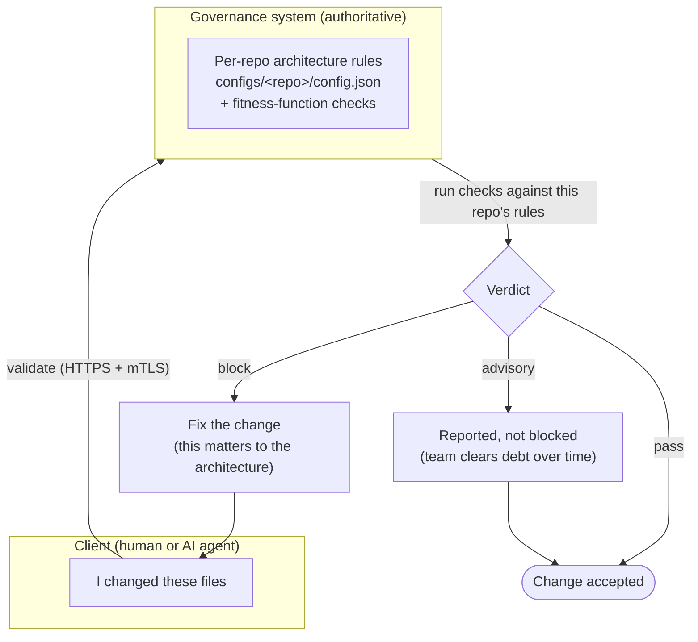

# System Overview

*What is this, and why does it exist? Start here before onboarding any repository.*

## The one-sentence version

Every repository gets its own architecture **fitness functions** — automated
checks that, whether you like it or not, become part of working in that repo.
They guide humans and AI agents toward the architectural states we want, and
keep us there.

## Why this exists

Architecture decisions decay. A team agrees on a shape — bounded complexity,
narrow interfaces, disciplined dependencies — and then a hundred small commits
quietly erode it. Code review catches some of it; most slips through.

`stack-fitness-functions` makes the desired architecture **executable**. Instead
of an architecture being a document people remember (or don't), it becomes a set
of checks that run on every change. The repo's intended shape is governed
centrally, and every commit — by a person or an agent — is measured against it.

The goal is twofold:

- **Guidance for new contributors.** A developer or agent new to a repo doesn't
  have to absorb its architectural rules by osmosis. The checks tell them, at the
  moment they make a change, whether they're moving with the grain or against it.
- **Org-level assurance.** As an organization, we can be confident we're
  continuously achieving the architectural states we've decided we want — not
  just at review time, but on every change, everywhere.

## How it works — the core loop

The system separates **what the rules are** (governed centrally) from **who is
changing code** (the client). A client says "I changed these files"; the
governance system resolves that repo's rules, runs the checks, and returns a
verdict. If it's a `block`, the contributor fixes the issue and tries again —
until the change moves with the architecture, not against it.

What the verdict means:

| Verdict | What happens | When you'd use it |
|---------|--------------|-------------------|
| **block** | The change is rejected until fixed. | Greenfield repos, or rules the team has fully adopted. Fail-closed. |
| **advisory** | The violation is reported but the change proceeds. | Existing repos with known debt — surface issues without halting work while the backlog is cleared. |
| **pass / off** | Check is satisfied or disabled. | Clean changes, or checks not yet enabled for this repo. |

The important property: the **rules live with the governance system, not the
client**. A contributor can't quietly weaken them locally. A local sandbox config
is for experimentation only; when a change is validated against the container,
governance is resolved exclusively from the authoritative server-side config.

## What gets checked

The fitness functions measure architectural health rather than style. Each can be
enabled or disabled per repo:

- **cyclomatic-complexity** — how branchy a unit of code is.
- **interface-width** — how large/sprawling an interface surface is.
- **implementation-depth** — how deep implementation nesting runs.
- **logic-density** — how much logic is packed into a unit.
- **dependency-discipline** — whether dependencies respect intended boundaries.

These run inside one audited container image across Go, Python, and C#, so the
same governance applies regardless of a repo's language.

## Where it plugs in

Two entry points carry the same governance to both kinds of contributor:

- **`pre-commit.sh`** — runs at a developer's `git commit`.
- **`pre-tool-use.sh`** — runs when an AI agent is about to act, enforcing the
  same rules on automated changes.

Whether the change comes from a person or an agent, it passes through the same
loop and meets the same bar.

## Where to go next

- **[Onboarding a New Repository](runbooks/onboard-new-repository.md)** — the
  step-by-step runbook for bringing a repo under governance.
- **[README](../README.md)** — hook installation and remote-mode configuration.

*Authored By Peter O'Connor with Assistance from Claude Code (databricks-claude-opus-4-8[1m]) · 2026-06-19 · stack-fitness-functions system overview*
