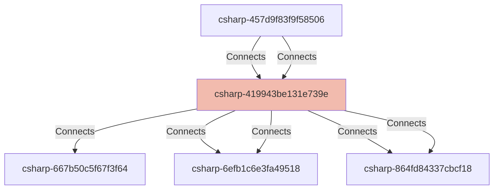

# GetContributorHandler

## Details

    <table>
        <tbody>
        <tr>
            <th>Unique Id</th>
            <td>csharp-419943be131e739e</td>
        </tr>
        <tr>
            <th>Name</th>
            <td>GetContributorHandler</td>
        </tr>
        <tr>
            <th>Description</th>
            <td>Observed C# class GetContributorHandler</td>
        </tr>
        <tr>
            <th>Node Type</th>
            <td>service</td>
        </tr>
        </tbody>
    </table>

## Interfaces

No interfaces defined.

## Related Nodes

## Controls
_No controls defined._

## Metadata

    <table>
        <thead>
        <tr>
            <th>Key</th>
            <th>Value</th>
        </tr>
        </thead>
        <tbody>
        <tr>
            <th>Fitness</th>
            <td>
                <table class="nested-table">
                        <tbody>
                        <tr>
                            <td><b>Cyclomatic Complexity</b></td>
                            <td>
                                1
                                    </td>
                        </tr>
                        <tr>
                            <td><b>Dependency Discipline</b></td>
                            <td>
                                1
                                    </td>
                        </tr>
                        <tr>
                            <td><b>Implementation Depth</b></td>
                            <td>
                                1
                                    </td>
                        </tr>
                        <tr>
                            <td><b>Interface Width</b></td>
                            <td>
                                1
                                    </td>
                        </tr>
                        <tr>
                            <td><b>Logic Density</b></td>
                            <td>
                                1
                                    </td>
                        </tr>
                        </tbody>
                    </table>        </td>
        </tr>
        <tr>
            <th>Kind</th>
            <td>class</td>
        </tr>
        <tr>
            <th>Project</th>
            <td>NimblePros.SampleToDo.UseCases</td>
        </tr>
        </tbody>
    </table>

